# SQP QM：最终检验 CO01 & QA32

> 原文： [https://www.guru99.com/final-inspection-production-sap-qm.html](https://www.guru99.com/final-inspection-production-sap-qm.html)

针对生产 GR 的检查-此检查将基于针对生产订单的生产确认。

将在收货时根据生产订单创建检验批（检验类型为 04）。

SAP 系统将生成唯一的检验批，其中将包含生产订单，检验规格和抽样的信息。

确认中将为每个 GR 订单项（批次）生成一个单独的批次。

库存将保留在质量检验库存中，直到检验完成（已做出使用决策）。

生产后的最终检查在 SAP 系统中具有以下流程步骤，例如

*   **生产订单的创建和确认**

采购过程中会在采购过程中产生良好的收货。 收货通常是根据采购订单或计划协议达成的。

针对每个 GR 订单项，SAP 系统将自动生成一个检验批，其中包含采购的详细信息，例如供应商，采购日期，检验规格和抽样明细。

*   **检验批清单**

要列出检验批，您可以使用事务代码 QA33。 搜索条件可以是

1.  材料
2.  检验批创建日期
3.  检验日期
4.  厂
5.  检验类型“ 04”
6.  批量

*   **附加检验计划并下达检验批**

SAP 系统自动将检验计划分配给任务列表类型为'05'的物料（收货检验）。 如果针对该物料存在多个检验计划，我们必须

1.  为物料分配适当的检验计划
2.  计算样本
3.  释放批次以进行检查处理。

*   **样本计算**

如果抽样程序附有检验计划/材料/特征，则 SAP 系统将自动计算样本，否则将手动转到批次并计算样本。

*   **结果记录**

结果记录将针对收货时创建的检验批进行。

所有特性将显示在 SAP 记录屏幕中以供输入。 SAP 系统将进行 f4 搜索以获取用于属性检查的代码值。

对于定量数据，基于公差极限（上下限），SAP 系统将提出评估。 在这两种情况下，检查员都可以接受或拒绝建议（手动）。

*   **使用决策**

当我们做出使用决策时，您将根据检查结果决定是接受还是拒绝检验批中的货物。 做出使用决策后，检查便完成了。

*   **库存过帐**

在生产后的最终检查中，在使用决策时就进行了库存管理，我们可以将“质量库存”转移到相关的库存类别中，例如，

1.  不受限制的使用
2.  受阻
3.  废料
4.  材质不同
5.  样品
6.  返回供应商

## 如何创建和确认生产订单

在此步骤中，我们将创建并确认生产订单，这将触发自动收货，因此将生成检验批。

**步骤 1）**从 SAP 轻松访问菜单中，打开事务代码 CO01，然后输入以下详细信息。

1.  输入要为其创建生产订单的物料代码。

2.  输入您的生产工厂代码。

3.  输入生产订单类型。

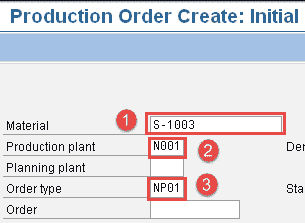

填写所有字段后，单击  或按 Enter 键转到下一个 SAP 屏幕。

**步骤 2）**在此 SAP 屏幕中，我们将创建生产订单。

1.  输入生产订单数量。

2.  从下拉框中选择“当前日期”，然后按键盘上的 Enter。

3.  从顶部按“发布”按钮以释放订单。

4.  按“收货”选项卡检查质量检查是否已激活。

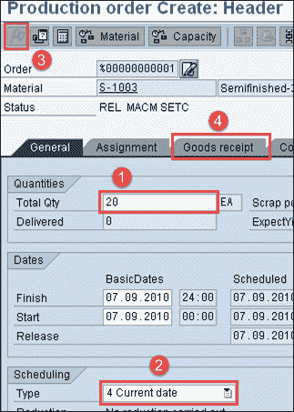

如果已激活，则将在下一步中根据库存类型填充“质量检验”库存。

**步骤 3）**在此 SAP 屏幕中，我们将检查生产订单中的质量检验标记。

1.  您可以看到库存类型为“质量检验”，这意味着在确认并收到生产订单的收货后，将触发检验批，并且库存将达到质量检验库存。

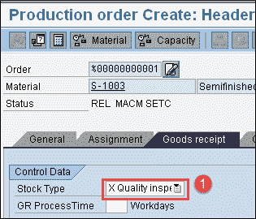

单击保存按钮保存屏幕后，将创建生产订单。

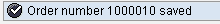 。

**步骤 4）**从 SAP 轻松访问菜单中，打开事务代码 CO11N。

在这里，我们将确认并根据生产订单过帐收货。

输入以下详细信息

1.  输入在上一步中创建的生产订单编号。 输入订单号后，所有详细信息将自动填充。

2.  按“货物移动”选项卡移动到下一个屏幕，我们将在其中过帐收货和组件的发货。

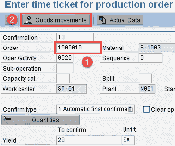

**步骤 5）**在此 SAP 屏幕中，

1.  您会看到物料 S-1003 的收货将过帐 20 EA，这将触发检验批。

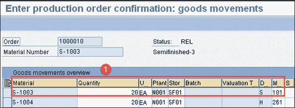

点击保存按钮保存订单。 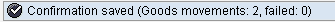

在 SAP 系统中针对生产订单过帐确认和收货后，下一步是质量结果记录。

## 如何在 SAP 系统中进行结果记录

**步骤 1）**从 SAP Easy 访问菜单中，打开事务代码 QA32。

在这里，我们将检查材料并根据检查规范记录结果。

1.  在 SAP 屏幕中输入工厂代码。

2.  输入检验批原点“ 04”，这是用于原材料检验的标准 SAP 检验类型。

3.  按执行以显示检验批清单。

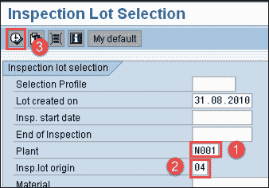

**步骤 2）**在此 SAP 屏幕中，

1.  您可以看到先前步骤中生成的检验批以及物料

2.  将 SAP 系统状态检查为 REL CALC SPRQ。 此状态是对以下活动的确认：

*   检验计划复制到检验批中
*   计算了样本数量，并要求从优质库存到非限制或任何其他库存类别的库存过账。

3.  按下“结果”按钮，然后移至下一个 SAP 屏幕以进行结果记录。

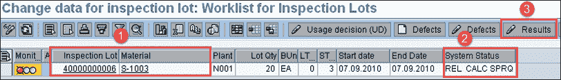

**步骤 3）**在此 SAP 屏幕中，您将看到检验批的结果

1.  您可以看到“主检验”特征的简短文本以及诸如长度，表面，外观等规格。

2.  如果在检查计划中指定了抽样程序，则可以看到系统自动计算的样本数量为 5。

3.  根据检验规范手动输入实际结果。

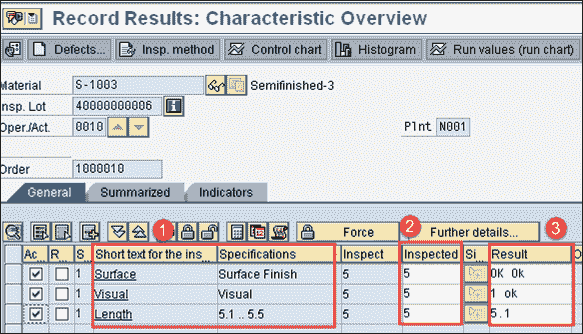

按保存按钮保存检查结果。

## 如何进行使用决策

**步骤 1）**在 SAP Easy 访问屏幕中，打开与我们在上一步中完成结果记录的事务 QA32。

在这里，我们将针对检验批进行使用决策。 检验批被接受或被拒绝，如果被接受，它将从质量检验转移到库存过帐。

1.  输入工厂代码。

2.  输入检验批原点“ 04”，这是生产后用于最终检验的标准 SAP 检验类型。

3.  按下执行按钮以显示检验批清单以及批号。

**Step 2)** In this SAP screen,

1.  按使用决策按钮移至下一个屏幕

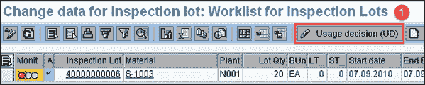

**步骤 3）**在此 SAP 屏幕中，

1.  将 UD 代码选择为“ A”以接受该批次，基于使用决策代码，您可以看到质量得分为“ 100”。

2.  选择检验批库存 TAB 在下一个 SAP 屏幕中进行库存过账。

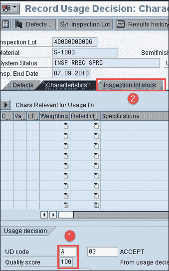

**步骤 4）**在此 SAP 屏幕中，我们将从优质库存到任何其他库存类别进行库存过账。

1.  如果质量结果在预期的规格范围内，则可以将 20 的质量库存移动到非限制库存（即用库存），这将在后台达到移动类型 321。 （移动类型 321 表示质量库存到非限制库存的移动）。

按保存按钮保存使用决策。

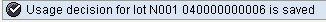

因此，如上所述，从质量检验到非限制库存类别的库存移动表示生产后检验已完成。

在下一个教程中，我们将看到如何创建质量通知。

**故障排除**

*   检验计划必须复制到检验批中，否则我们将无法进行结果记录和使用决策。
*   如果在检验批之后创建检验计划，则检验批将获得 CRTD 状态。 我们需要手动分配检查计划，以将状态从已创建（CRTD）更改为已发布（REL）。 检验批下达后，我们可以执行结果记录和使用决策。
*   如果您需要手动计算检验批中的样品，则必须在检验计划中指定抽样程序以进行任何结果记录和使用决策。