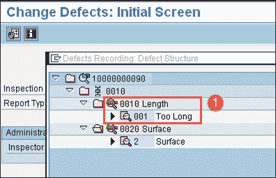
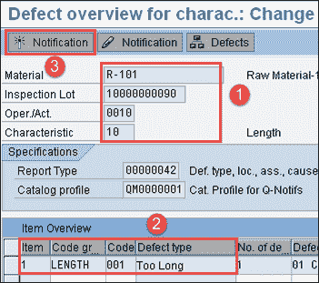
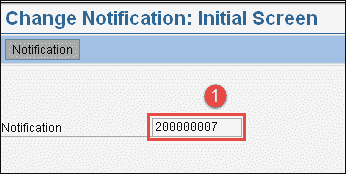
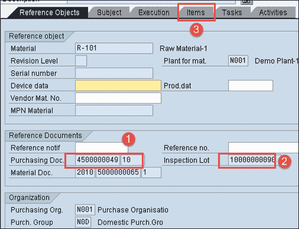
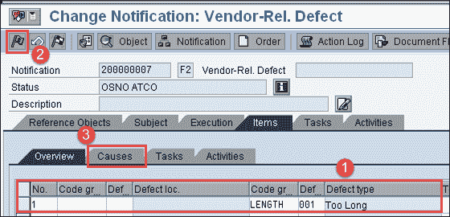
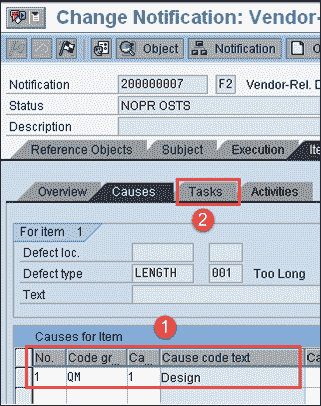
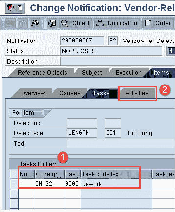
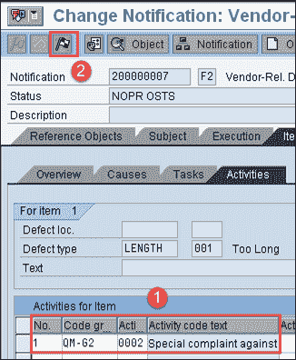

# SAP QM 中的质量通知：QM02

> 原文： [https://www.guru99.com/quality-notification-sap-qm.html](https://www.guru99.com/quality-notification-sap-qm.html)

SAP QM 质量通知包含用于捕获和处理在检查过程中发现的各种类型的问题或缺陷（例如，由于劣质商品导致的缺陷）的功能。

*   SAP QM 质量通知用于分析记录的缺陷并执行这些问题的根本原因分析。

特别是，SAP QM 通知可以帮助您处理内部和外部问题，例如：

*   **客户提出的外部投诉**

这是标准的 SAP 质量通知类型 Q1，用于处理与交付给客户的商品质量相关的问题。 这用于记录客户投诉并针对客户报告的问题采取措施。

*   **对供应商的外部投诉**

这是标准的 SAP QM 质量通知类型 Q2，用于处理与供应商交付的商品质量相关的问题。 这用于记录对供应商的投诉，并针对进来的材料质量检查期间发现的问题采取措施。

*   **公司内部的问题**

这是标准的 SAP QM 质量通知类型 Q3，用于处理与公司内部产生的商品质量相关的问题。 这用于记录内部问题，这些内部问题是在车间进行过程中质量检查时发现的。

SAP QM 质量通知包含各种功能。

通常，SAP 质量通知可用于：

*   阐述问题并确定受影响的参考对象（例如，物料，供应商，制造商和客户）
*   记录并存储与缺陷直接相关的所有人员（伙伴）的姓名。
*   定义 SAP QM 质量通知的处理规范（例如，提及应修复缺陷的时间范围，并为通知分配优先级）
*   捕获与该问题相关的单个[缺陷](/defect-management-process.html)项目，并分析缺陷的根本原因。
*   提及要采取的纠正措施（例如，立即执行的任务或对缺陷进行深入分析之后执行的纠正活动）
*   通过通知的状态管理功能跟踪纠正措施的实施。 它具有各种状态，例如发布，正在处理和已完成。
*   捕获为纠正问题而执行的所有活动和任务。
*   记录分析和解决问题期间产生的不合格成本。
*   可以打印，传真和导出与该问题有关的各种类型的报告。

## 如何记录缺陷和创建质量通知

在此步骤中，我们将在 SAP 系统中进行分析后，当质量结果超出公差范围时，将记录缺陷。

**步骤 1）**从 SAP 轻松访问菜单中，打开事务代码 QA32，然后输入以下详细信息。

1.  选择记录结果的检验批，并使 SAP 系统状态为“ RREC”。

2.  按 SAP 屏幕顶部的“缺陷”按钮。

按下缺陷按钮后，我们将移至下一个 SAP 屏幕。

**步骤 2）**在此 SAP 屏幕中，

1.  选择代码组“ Length”和代码“ Too Long”，这是我们在分析后发现的缺陷。

**步骤 3）**在此 SAP 屏幕中，

1.  您可以看到我们根据其创建缺陷的物料代码和检验批。

2.  您会看到缺陷代码长度“太长”。

3.  按顶部的“通知按钮”以创建质量通知。

您将收到“创建质量通知”消息。

## 如何释放&完整通知

**步骤 1）**在 SAP 轻松访问屏幕中打开事务 QM02。

在这里，我们将发布并记录任务&活动以完成质量通知。

1.  输入我们在上一步中创建的质量通知编号。

按键盘上的 Enter 键以移至下一个 SAP 屏幕。

**步骤 2）**在此 SAP 屏幕中，

1.  您可以看到我们收到有缺陷的货物的采购订单号。

2.  您可以看到与采购订单编号关联的检验批。

3.  按下“项目”选项卡以移动到下一个 SAP 屏幕。

**步骤 3）**在此 SAP 屏幕中，

1.  您会看到我们在前面的步骤中输入的缺陷代码“太长”。

2.  按下释放按钮以释放通知。

3.  按“原因”按钮定义问题原因，然后移至下一个 SAP 子屏幕。

**步骤 4）**在此 SAP 屏幕中，我们需要提及所标识缺陷的原因。

1.  Here, select code group "QM" for the cause which means it is a design fault.

    这些代码组是根据业务需求配置的。

2.  按“任务”按钮移至下一个 SAP 子屏幕。

**步骤 5）**在此 SAP 屏幕中，我们需要提及在识别出缺陷之后要执行的任务。

1.  在这里，为任务选择代码组“ QM-G2”，这意味着需要进行返工。 这些代码组是根据业务需求配置的。

2.  按“活动”标签以移动到下一个 SAP 子屏幕。

**步骤 6）**在此 SAP 屏幕中，我们需要提及在识别缺陷之后要执行的活动。

1.  在此，为活动选择代码组“ QM-G2”，这意味着要对供应商进行特殊投诉。 这些代码组是根据业务需求配置的。

2.  按“完成”按钮完成通知过程。

**故障排除**

*   检验计划必须复制到检验批中，否则我们将无法进行结果记录和使用决策。
*   如果在检验批之后创建检验计划，则检验批将获得 CRTD 状态。 并且我们需要手动分配检验计划，以将状态从 SAP 系统中的已创建（CRTD）更改为已发布（REL）。 只有在下达检验批之后，我们才能执行结果记录和使用决策。
*   必须在检验计划中指定抽样程序以进行任何结果记录和使用决策，否则我们需要手动计算检验批中的样本。
*   需要配置代码组和代码，具体取决于业务需要以处理质量通知。

*   [下一个](/sap-training-hub.html)