# SAP HANA 体系结构，LandScape，规模调整：完整教程

> 原文： [https://www.guru99.com/sap-hana-architecture.html](https://www.guru99.com/sap-hana-architecture.html)

SAP HANA 数据库是以主内存为中心的数据管理平台。 SAP HANA 数据库在 SUSE [Linux](/unix-linux-tutorial.html) Enterprises Server 上运行，并基于 C ++语言构建。

SAP HANA 数据库可以分发到多台计算机。

SAP HANA 的优势如下所述-

*   SAP HANA 非常有用，因为它非常快，因为所有数据都已加载到内存中，而无需从磁盘加载数据。
*   SAP HANA 可以用于单个数据库上的 OLAP（在线分析）和 OLTP（在线事务）。

SAP HANA 数据库由一组内存处理引擎组成。 计算引擎是 SAP HANA 中主要的内存处理引擎。 它与其他处理引擎（例如关系数据库引擎（行和列引擎），OLAP 引擎等）一起使用。

关系数据库表驻留在列或行存储中。

SAP HANA 表有两种存储类型。

1.  **行类型存储（用于行表）。**
2.  **列类型存储（用于列表）。**

文本数据和图形数据分别位于文本引擎和图形引擎中。 SAP HANA 数据库中还有更多引擎。 只要有足够的空间，数据就可以存储在这些引擎中。

在本教程中，您将学习-

*   [SAP HANA 体系结构](#1)
*   [SAP HANA 景观](#2)
*   [SAP HANA 调整大小](#3)

## SAP HANA 体系结构

通过 SAP HANA 列存储中的不同压缩技术（例如，字典编码，游程长度编码，稀疏编码，群集编码，间接编码）压缩数据。

在 SAP HANA 中达到主内存限制时，将从未使用的整个数据库对象（表，视图等）中卸载并将其保存到磁盘中。

这些对象名称由应用程序语义定义，并在再次需要时从磁盘重新加载到主存储器中。 在正常情况下，SAP HANA 数据库会自动管理数据的卸载和加载。

但是，用户可以通过在相应架构中的 SAP HANA studio 中选择一个表来手动从单个表中加载和卸载数据-右键单击并选择“卸载/加载”选项。

**SAP HANA 服务器由**组成

1.  索引服务器
2.  预处理服务器
3.  名称服务器
4.  统计服务器
5.  XS Engine

    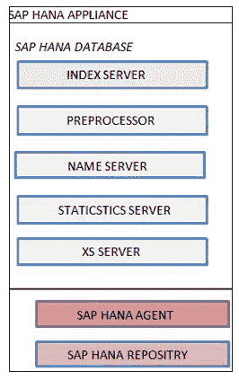

1.  **SAP HANA Index Server**

    SAP HANA 数据库主服务器是索引服务器。 每个服务器的详细信息如下-

*   这是 SAP HANA 的主要数据库组件
*   它包含实际的数据存储和用于处理数据的引擎。
*   索引服务器处理传入的 [SQL](/sql.html) 或 MDX 语句。

以下是索引服务器的体系结构。

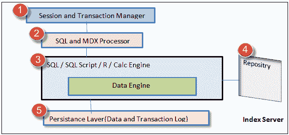

SAP HANA Index Server 概述

*   **会话和事务管理器**：会话组件管理 SAP HANA 数据库的会话和连接。 事务管理器协调和控制事务。*   **SQL 和 MDX 处理器**： SQL 处理器组件查询数据并将其发送到查询处理引擎（即 SQL / SQL 脚本/ R / Calc 引擎）中。 MDX 处理器查询和处理多维数据（例如，SAP HANA 中的分析视图）。*   **SQL / SQL 脚本/ R / Calc 引擎**：该组件执行 SQL / SQL 脚本，并在计算模型中转换计算数据。*   **存储库**：存储库维护 SAP HANA 元数据对象的版本控制，例如（属性视图，分析视图，存储过程）。*   **持久层**：该层使用 SAP HANA 数据库的内置功能“灾难恢复”。 将备份保存在其中作为数据卷中的保存点。

2.  **预处理服务器**

该服务器用于“文本分析”，并在使用搜索功能时从文本中提取数据。

3.  **名称服务器**

该服务器包含有关系统格局的所有信息。 在分布式服务器中，名称服务器包含有关每个正在运行的组件以及数据在服务器上的位置的信息。 该服务器包含有关存在数据的服务器的信息。

4.  **统计服务器**

统计服务器负责收集与 SAP HANA 系统的状态，资源分配/消耗和性能有关的数据。

5.  **XS 服务器**

XS 服务器包含 XS 引擎。 它允许外部应用程序和开发人员通过 XS Engine 客户端使用 SAP HANA 数据库。 外部客户端应用程序可以使用 HTTP 通过 XS 引擎为 HTTP 服务器传输数据。

## SAP HANA 景观

“ HANA”表示**高性能分析设备**是硬件和软件平台的组合。

*   由于计算机体系结构的变化，因此在 CPU，RAM 和硬盘方面可以使用功能更强大的计算机。
*   SAP HANA 是解决性能瓶颈的解决方案，其中所有数据都存储在主内存中，而无需频繁地将数据从磁盘 I / O 传输到主内存。

以下是硬件/软件领域中的 SAP HANA 创新。

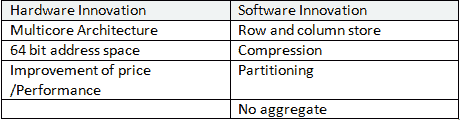

SAP HANA 中有两种关系数据存储类型：行存储和列存储。

**行存储**

*   与传统数据库相同，例如 （Oracle，SQL Server）。 唯一的区别是，所有数据都存储在 SAP HANA 内存中的行存储区中，这与传统数据库不同，传统数据库中数据存储在硬盘中。

**列存储**

*   列存储是 SAP HANA 数据库的一部分，并以列方式管理 SAP HANA 内存中的数据。 列表存储在列存储区域中。 列存储为写入操作提供了良好的性能，同时优化了读取操作。

通过以下两种数据结构优化了读写操作性能。

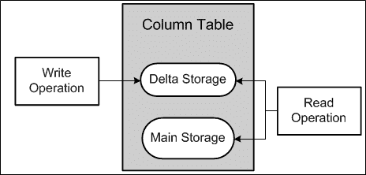

**主存储器**

主存储器包含数据的主要部分。 在主存储中，采用了合适的数据压缩方法（字典编码，簇编码，稀疏编码，游程长度编码等）来压缩数据，以节省内存并加快搜索速度。

*   在主存储器中，对压缩数据的写操作将非常昂贵，因此写操作不会直接修改主存储器中的压缩数据。 而是将所有更改写入称为“增量存储”的列存储中的单独区域中。
*   增量存储针对写操作进行了优化，并使用常规压缩。 主存储上不允许写操作，但增量存储上允许写操作。 两个存储都允许进行读取操作。

我们可以通过“加载到内存”选项在主内存中手动加载数据，并通过“从内存卸载”选项从主内存中卸载数据，如下所示。

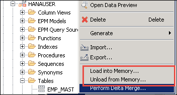

**增量存储**

增量存储用于写操作，并使用基本压缩。 增量存储中存储的列表数据中所有未提交的修改。

当我们要将这些更改移至主存储中时，如下使用 SAP HANA studio 中的“增量合并操作” –

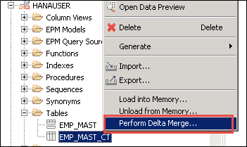

*   增量合并操作的目的是将在增量存储中收集的更改移动到主存储。
*   在 sap 列表上执行 Delta Merge 操作后，主存储器的内容将保存到磁盘并重新计算压缩率。

**在增量合并期间将数据从增量移动到主存储的过程**

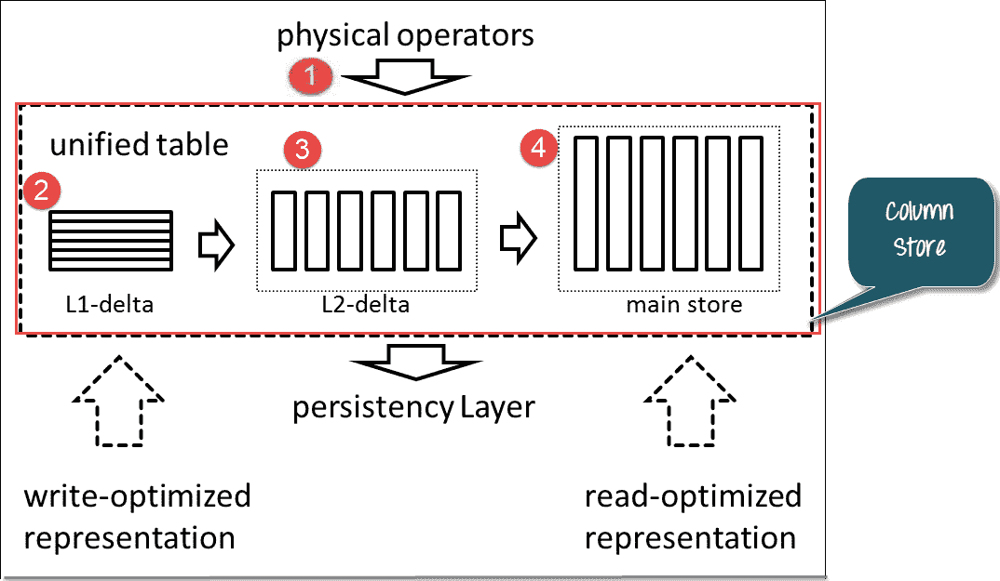

有一个缓冲区存储（L1-Delta），它是行存储。 因此，在 SAP HANA 中，由于 L1-delta，列表的行为类似于行存储。

1.  用户在表上运行更新/插入查询（物理运算符是 SQL 语句。）。
2.  数据首先进入 L1。 当 L1 进一步移动数据时（L1-未提交的数据）
3.  然后，数据进入面向列的 L2-delta 缓冲区。 （L2-提交的数据）
4.  L2 增量过程完成后，数据将进入主存储器。

因此，列存储分别由于 L1-Delta 和主存储而同时进行了写优化和读优化。 L1-Delta 包含所有未提交的数据。 提交的数据通过 L2-Delta 移至 Main Store。 数据从主存储转到持久层（此处指示的箭头是在列存储中发送 SQL 语句的物理运算符）。 在“列存储”中处理 SQL 语句后，数据将转到持久层。

例如。 下面是基于行的表

表数据以线性格式存储在磁盘上，因此以下是行和列表的数据存储在磁盘上的格式-

在 SAP HANA 内存中，该表以以下格式存储在磁盘上的行存储中–

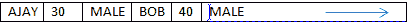 内存地址

在“列”中，数据按以下方式存储在磁盘上：

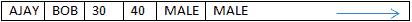 内存地址

数据以线性格式按列存储在磁盘上。 数据可以通过压缩技术进行压缩。

因此，列存储具有节省内存的优势。

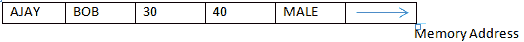

## SAP HANA 调整大小

大小调整是一个术语，用于确定 SAP HANA 系统的硬件要求，例如 RAM，硬盘和 CPU 等。

主要的重要调整组件是内存，第二重要的调整组件是 CPU。 第三个主要组件是磁盘，但是大小完全取决于内存和 CPU。

在 SAP HANA 实施中，一项关键任务是根据业务需求确定服务器的正确大小。

SAP HANA DB 与普通 DBMS 的大小不同之处在于–

*   SAP HANA 的主内存要求（内存大小由 SAP HANA 中的元数据和事务数据确定）
*   SAP HANA 的 CPU 要求（预测的 CPU 估计不准确）。
*   SAP HANA 的磁盘空间要求（为数据持久性和记录数据而计算）

应用程序服务器 CPU 和应用程序服务器内存保持不变。

为了进行规模计算，SAP 提供了各种准则和方法来计算正确的大小。

我们可以使用以下方法-

1.  使用 ABAP 报告调整大小。
2.  使用 DB 脚本调整大小。
3.  使用 Quicksizer 工具调整大小。

通过使用 Quicksizer 工具，需求将以以下格式显示-

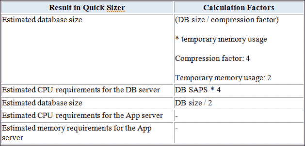