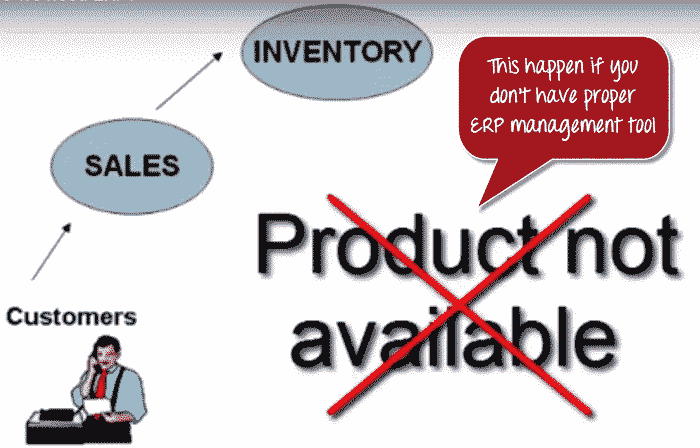
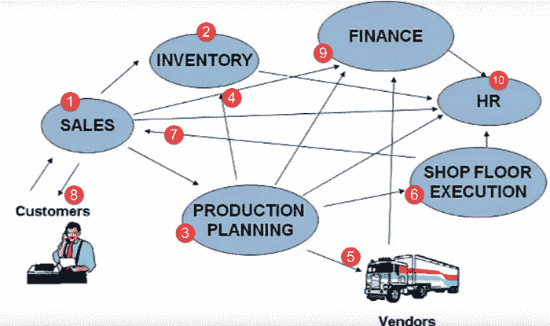
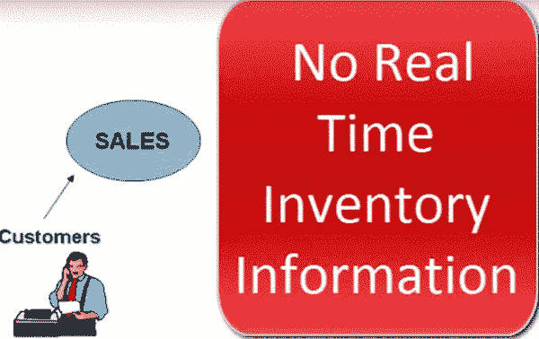
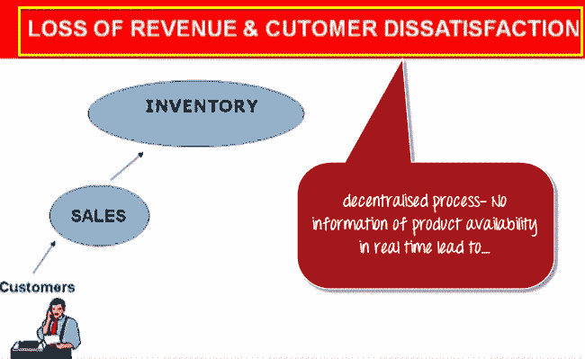
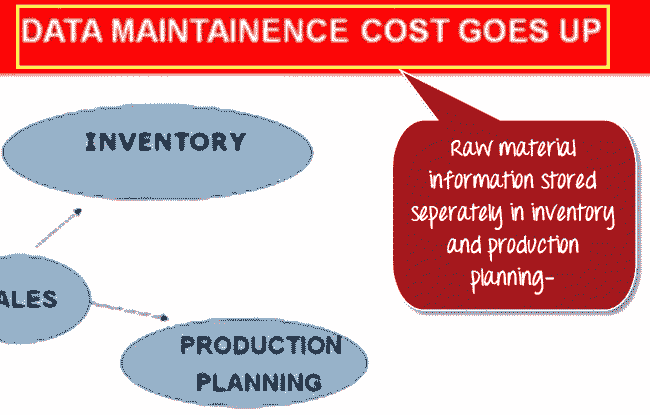
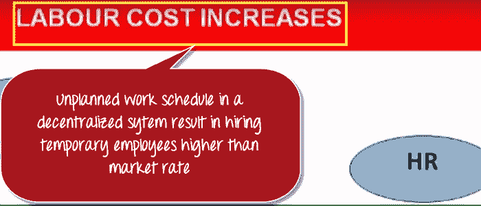
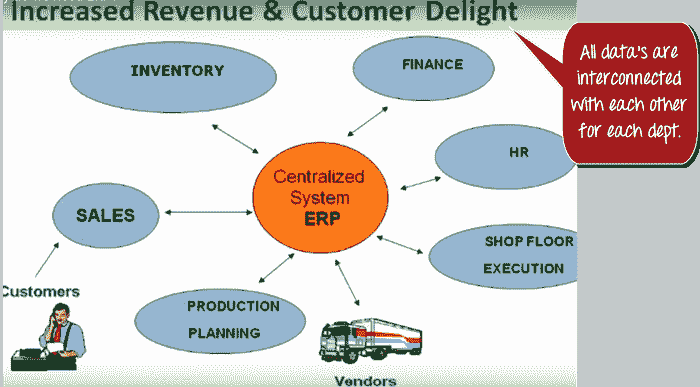

# 什么是 SAP？ SAP ERP 软件的定义

> 原文： [https://www.guru99.com/what-is-sap-definition-of-sap-erp-software.html](https://www.guru99.com/what-is-sap-definition-of-sap-erp-software.html)

## 什么是 SAP？

**SAP** 代表数据处理中的系统应用程序和产品。 顾名思义，SAP 也是 ERP（企业资源计划）软件的名称，也是公司的名称。 SAP Software 是一家欧洲跨国公司，由 Wellenreuther，Hopp，Hector，Plattner 和 Tschira 于 1972 年成立。 他们开发用于管理业务运营和客户关系的软件解决方案。

SAP 系统由许多完全集成的模块组成，这些模块几乎涵盖了业务管理的各个方面。

SAP 在 ERP 市场上排名第一。 截至 2010 年，SAP 在全球范围内已安装了 140,000 多个安装程序，超过 25 个行业特定的业务解决方案以及在 120 个国家/地区的 75,000 多个客户

市场上 SAP 软件的其他竞争产品是 Oracle，Microsoft Dynamics 等。

## 什么是 SAP ERP？ 为什么需要它？

以下视频将说明企业中对诸如 SAP 之类的 ERP 软件的需求

The very fundamental question for any beginners is why Enterprise Resource Planning also called ERP, is required? To answer this, let’s examine this typical business scenario.

假设客户联系销售团队索要特定产品。 销售团队联系库存部门以检查产品的可用性。 令他们惊讶的是，销售团队发现该产品缺货。 因此，下次这种情况不会发生时，他们必须引入 SAP ERP 工具。

在我们真正详细了解什么是 ERP 以及 ERP 如何为您的业务流程提供帮助之前，我们将了解不同部门如何参与整个业务流程，从原材料的订购到制造商品再到最终交付。 产品给客户。

**这是任何业务部门遵循的整个过程。**

1.  客户联系销售团队以检查产品的可用性
2.  销售团队联系库存部门以检查产品的可用性
3.  如果产品缺货，销售团队会与生产计划部联系以制造产品
4.  生产计划团队向库存部门检查原材料的可用性
5.  如果原材料没有库存，生产计划团队将从供应商那里购买原材料
6.  然后，生产计划将原材料转发到车间执行以进行实际生产
7.  准备就绪后，车间团队将货物发送给销售团队
8.  销售团队将其交付给客户
9.  销售团队使用产品销售产生的收入来更新财务。 生产计划团队通过向不同供应商支付原材料付款来更新财务。
10.  所有部门均会就任何人力资源相关问题与人力资源部门联系。

这是任何制造公司的典型业务流程。 从场景中可以得出一些关键的推断。

*   它有许多部门或业务部门
*   这些部门或业务部门之间不断进行通信和交换数据
*   任何组织的成功都取决于这些部门以及相关的第三方（例如供应商，外包商和客户）内部的有效通信和数据交换。

基于管理通信和数据交换的方式。 企业系统可以大致分为

**1）[分散系统](#1)**

**2）[集中式系统，也称为 ERP。](#2)**

## 分散系统

首先，让我们看一下去中心化系统，这是一家拥有去中心化数据管理系统的公司。 有两个主要问题–

*   **数据在各个部门本地保存**
*   **部门无法访问其他部门的信息或数据**

为了确定由于分散的企业管理系统而引起的问题，让我们再次查看同一业务流程。 客户与销售团队联系以寻求产品，但是这次，他急需产品。

由于这是一个分散的过程，因此销售团队没有对产品 可用性的任何实时信息访问。 因此，他们与库存部门联系以检查产品的可用性。 此过程需要时间，并且客户选择其他供应商会导致收入损失和客户不满。

现在，假设产品缺货，并且销售团队与生产计划团队联系，以生产该产品以备将来使用。 生产计划团队检查所需原材料的可用性。

在分散系统中，原料信息是由生产计划部和库存部门分别存储的  信息。 因此，数据维护成本（在这种情况下为原材料）增加。

可以在两个不同部门的库存和生产计划中获得原材料信息。 当销售团队检查制造产品所需的特定原材料时，它显示了按库存可用的原材料，但是根据生产计划团队的数据库，该原材料缺货。

因此，他们继续购买原材料。 因此，材料以及库存成本均上升。

一旦获得了原材料，车间部门就会突然意识到他们缺少工人。 他们与人力资源部门接洽，后者又以高于市场价格的价格雇用临时员工。 因此劳动成本增加。

生产计划部门无法向财务部门更新他们购买的物料。 财务部门拖欠卖方设定的付款期限，这会导致公司声誉受损，甚至可能提起诉讼。

这些只是去中心化系统中许多问题中的几个。

分散系统的一些主要问题是–

*   随着时间的流逝，单独创建的众多异构信息系统难以维护
*   集成数据既费时又费钱
*   数据不一致和重复
*   缺乏及时的信息会导致客户不满意，收入和声誉损失
*   库存，材料和人力资源成本高。

这些是我们需要解决的一些主要缺点。 嗯，解决方案在于**集中式系统，即 ERP。**

## 集中式系统

在一家公司中，具有集中化的信息和数据管理系统。

**1）数据保存在中央位置，并与各个部门共享**

**2）部门可以访问其他部门的信息或数据**

让我们再次看一下相同的业务流程，以了解集中式企业系统如何帮助克服分散式企业系统带来的问题。

在这种情况下，所有部门都将更新中央信息系统。

*   当客户联系销售团队紧急购买产品时。 销售团队可以实时访问库存中的产品，该信息由集中系统中的库存部门更新
*   销售团队会及时响应客户的要求，从而增加收入并提高客户满意度。
*   如果需要制造，销售团队将更新集中式数据库，以便所有部门随时了解产品状态。
*   生产计划部门已根据要求由中央数据库自动更新了**。 生产计划团队通过中央数据库检查所需原材料的可用性，该数据库由库存部门更新。**
*   因此，避免了数据重复，并提供了准确的数据。 车间团队会定期在中央数据库中更新其人力状态，人力资源部门可以访问。
*   在劳动力短缺的情况下，人力资源团队将以大量的准备时间开始招聘过程，以市场价格聘用合适的候选人。 因此，人工成本下降了。
*   供应商可以将发票直接提交给中央企业系统，中央财务系统可以访问该系统。 因此，按时付款，避免了可能的法律诉讼
*   SAP 软件是一种集中式系统。 SAP 系统是 ERP 软件中使用最广泛的。

### 集中式系统的主要优点是：

*   它消除了数据中的重复，不连续和冗余
*   实时提供跨部门的信息。
*   SAP System 提供对各种业务流程的控制
*   提高生产率，更好的库存管理，提高质量，降低材料成本，有效的人力资源管理，减少的间接费用提高利润
*   更好的客户互动和更高的吞吐量。 它还可以改善客户服务
*   因此，需要集中的企业管理系统。
*   SAP 软件是集中式企业管理系统，也称为企业资源计划。
*   首字母缩写词 SAP 的含义是 **S** 系统 **A** pplications 和 **P** 产品