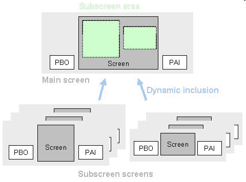

# ABAP 子屏幕教程：SAP 中的呼叫子屏幕

> 原文： [https://www.guru99.com/abap-subscreens.html](https://www.guru99.com/abap-subscreens.html)

在阅读本教程之前，请确保您是什么对话框程序...

## 通话订阅

*   子屏幕是一个独立的屏幕，显示在另一个（“主”）屏幕的区域中。
*   子屏幕允许您在运行时将一个屏幕嵌入另一个屏幕。 您可以在主屏幕上包括多个子屏幕。
*   子屏幕一词既适用于您嵌入的屏幕，也适用于您将其放置在主屏幕上的区域。 本教程是关于子屏幕区域的。 如果在屏幕属性中定义，则通过 SE51 事务创建的实际屏幕称为子屏幕屏幕。
*   使用子屏幕时，嵌入式屏幕的流逻辑也嵌入在主屏幕的流逻辑中。因此，在屏幕上使用子屏幕就像在 ABAP 程序中使用 include 一样。

要使用子屏幕，您必须遵循三个简单步骤

1.  在屏幕上定义子屏幕区域
2.  定义合适的子屏幕屏幕
3.  将子屏幕屏幕包括在子屏幕区域中。

另外，您需要调整子屏幕和主屏幕的框架。 您需要在字段名称字段中对其进行命名。

此外，您还需要调整子屏幕中的字段以使它们出现在主屏幕中。 如果子屏幕被定义为大于主屏幕中的可用区域，则只有部分子屏幕可见，该部分适合于可用区域。 面积总是从屏幕的左上角开始测量。 因此，在定义子屏幕区域和创建子屏幕时应格外小心。

**示例**

例如，此处我们在主屏幕上定义了两个子屏幕区域，并将两个不同的子屏幕附加到相应区域。 每当调用主屏幕时，就会调用主屏幕的 PBO。 但是在显示之前，每个屏幕的 PBO 都被称为主屏幕上的子屏幕区域。



您可以在主屏幕的流程逻辑中使用 CALL SUBSCREEN 语句包括一个子屏幕屏幕。

要将子屏幕屏幕包含在主屏幕的子屏幕区域中并调用其 PBO 流逻辑，请在主屏幕的 PBO 事件中使用以下语句：

```
PROCESS BEFORE OUTPUT.

CALL SUBSCREEN <area> INCLUDING [<prog>] <dynp>.
```

该语句将编号为< dynp >的子屏幕屏幕分配给称为<区域>的子屏幕区域。 您还可以指定定义子屏幕屏幕的程序（可选）。 如果未明确指定程序，系统将在与主程序相同的 ABAP 程序中查找子屏幕屏幕。 如果找不到相应的子屏幕屏幕，则会发生运行时错误。 子屏幕屏幕的 PBO 流程逻辑也包含在同一位置。 这可以调用 ABAP 程序的 PBO 模块，其中定义了子屏幕屏幕。 在子屏幕 PBO 的末尾，程序的全局字段将传递到子屏幕屏幕中任何名称相同的屏幕字段。 子屏幕屏幕的 PBO 流逻辑本身可以包含其他子屏幕。

子屏幕区域的名称<区域>必须直接输入，不要用逗号隔开。 您可以将名称< prog >和< dynp >指定为文字或变量。 如果使用变量，则必须在 ABAP 程序中声明并填充名称相同的变量。 屏幕号< dynp >必须长 4 个字符。 如果未将子屏幕屏幕分配给某个区域，则该屏幕将保持空白。

要调用子屏幕屏幕的 PAI 流逻辑，请在主屏幕的 PAI 流逻辑中使用以下语句：

```
PROCESS AFTER INPUT.

CALL SUBSCREEN <area>.
```

该语句包括在 PBO 事件中包含在子屏幕区域<区域>中的子屏幕屏幕的 PAI 流逻辑。 这可以调用 ABAP 程序的 PAI 模块，其中定义了子屏幕屏幕。 当触发 PAI 事件时，或在子屏幕屏幕的 PAI 流逻辑中的相应 FIELD 语句处，在子屏幕屏幕和 ABAP 程序中的同名字段之间传输数据。

***要记住的要点***

*   屏幕内子屏幕元素的名称应唯一
*   子屏幕上不应附带 OK_CODE 或 FCODE。 主屏幕本身的 OK_CODE 是子屏幕的 OK_CODE
*   子屏幕不能有任何包含 SET TITLEBAR，SET PF-STATUS，SET SCREEN，LEAVE SCREEN 或 LEAVE TO SCREEN 的对话框模块。 这将导致运行时错误。
*   您需要在主屏幕的流程逻辑（PBO 和 PAI）中调用它。
*   CHAIN..ENDCHAIN 和 LOOP ENDLOOP 语句中不允许使用 CALL SUBSCREEN
*   不能有 AT EXIT-COMMAND 模块
*   您使用的字段是全局字段。 必须在顶部包括中声明它们
*   如果使用另一个对话框程序的子屏幕，则除非添加特定代码，否则不会进行数据传输。