# 如何下载&安装 SAP HANA Studio

> 原文： [https://www.guru99.com/sap-hana-studio.html](https://www.guru99.com/sap-hana-studio.html)

### 什么是 SAP HANA Studio？

SAP HANA Studio 是一个基于 Eclipse 的集成开发环境（IDE），用于以 GUI 工具的形式开发和管理 SAP HANA 数据库。

SAP HANA Studio 在客户端/开发人员计算机上运行，​​并连接到 SAP HANA 服务器。 SAP HANA Studio 可以访问本地或远程 SAP HANA 数据库。

通过使用 SAP HANA Studio，我们可以–

*   使用户能够管理 SAP HANA 数据库。
*   创建和管理用户授权。
*   创建新的或修改现有的数据模型。

在本教程中，您将学习-

*   [SAP HANA Studio](#1) 的必备条件
*   [支持的平台](#2)
*   [下载&安装 SAP HANA Studio](#3)
*   [在 SAP HANA Studio 中添加系统](#12)
*   [使用 SAP HANA Studio](#13)

## SAP HANA Studio 的必备条件

## 支持的平台

SAP HANA Studio 在以下平台上运行–

Microsoft Windows x32 和 x64 版本-

*   视窗 XP
*   视窗远景
*   视窗 7
*   视窗 8

*   SUSE [Linux](/unix-linux-tutorial.html) 企业服务器：x86 64 位版本，红帽企业 Linux（6.5）。
*   Mac OS 10.9 或更高版本。

**系统要求**

*   JAVA JVM –在安装和更新 SAP HANA Studio 的过程中，将安装或更新 JVM。
*   SAP HANA 客户端–它是软件，通过它您可以连接任何其他数据库，应用程序。
    *   SAP HANA 客户端可以在服务器安装期间安装在 [Unix](/unix-linux-tutorial.html) / Linux 和 Microsoft Windows 上，也可以安装在 SAP HANA Server 主机上。 SAP HANA 客户端与 SAP HANA Studio 分开安装。

## 下载&安装 SAP HANA Studio

### 安装路径

根据操作系统及其版本在系统路径上的默认安装如下所示–

*   Microsoft 视窗（32 & 64 位）-C：\ Program 档案\ sap \ hdbstudio。
*   Linux x86，64 位-/ user / sap / hdbstudio。
*   Mac OS，64 位-/ Applications / sap / hdbstudio.app

### 软件下载

您可以在上从[下载 SAP HANA Studio 和 SAP HANA Client。](https://store.sap.com/sap/cpa/ui/resources/store/html/SolutionDetails.html?pid=0000012950&catID=&pcntry=US&sap-language=EN&_cp_id=id-1446242664166-0)

根据您的操作系统选择要下载的文件–


### 在 Microsoft Window 上的安装

将 SAP HANA Studio 安装在具有管理特权的默认目录中，或者将用户目录安装在没有管理特权的用户主文件夹中。

单击 hdbsetup.exe 以安装 SAP HANA studio。

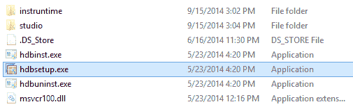

出现“ SAP HANA 生命周期管理”屏幕。

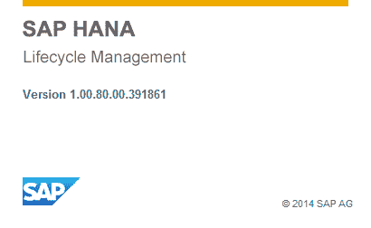

默认安装文件夹为 C：/ Program Files / SAP / hdbstudio。

**步骤 1）**定义 Studio 属性

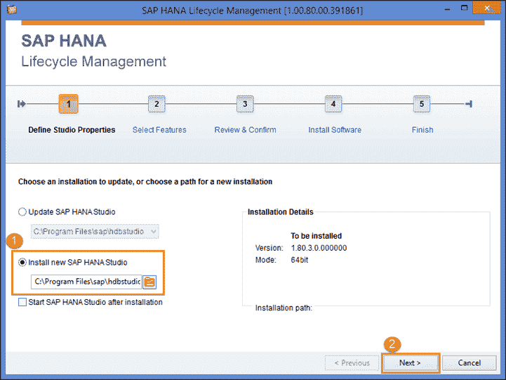

1.  选择安装新的 SAP HANA Studio。
2.  单击  按钮。

选择功能屏幕如下所示–

**步骤 2）**选择功能

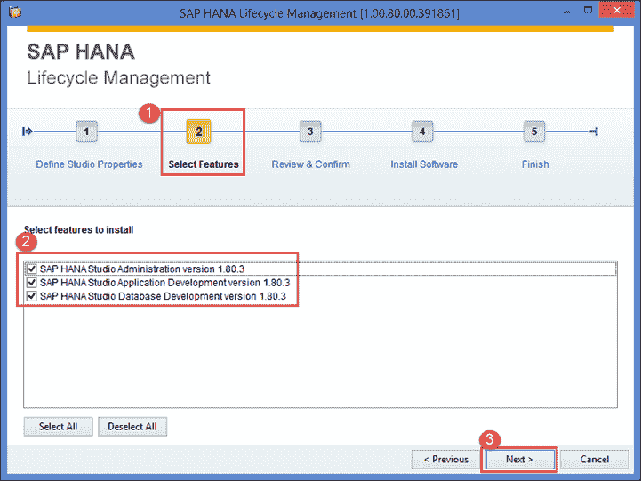

1.  选择功能屏幕用于选择功能。
2.  选择功能，如下所示-

*   SAP HANA Studio 管理–用于各种管理任务的工具集，不包括运输。
*   SAP HANA Studio 应用程序开发-用于开发 SAP HANA 本机应用程序的工具集（XS 和 UI5 工具（不包括 SAPUI5））。
*   SAP HANA Studio 数据库开发–用于内容开发的工具集。

3.  单击  按钮。

**步骤 3）**审核并确认

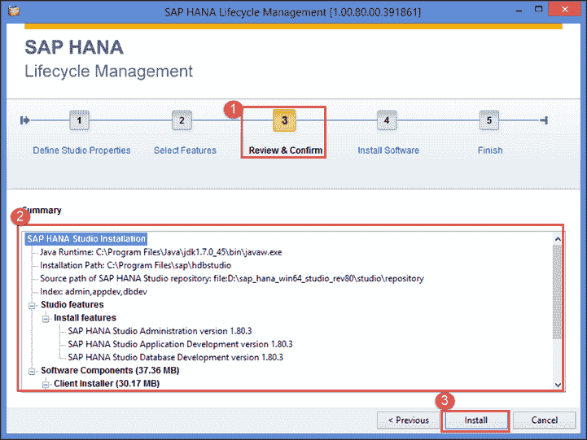

1.  复查&符合屏幕出现。
2.  SAP HANA Studio 安装显示摘要。
3.  单击  按钮。

**步骤 4 & 5）**安装软件并完成。

1.  Installation Progress screen appear and after it goes to finish page.

    

2.  一条消息“您已经成功安装了 SAP HANA Studio”。
3.  单击  按钮。

### 运行 SAP HANA Studio

现在，转到“默认安装文件夹”为“ C：/ Program Files / SAP / hdbstudio”。

有 hdbstudio.exe 文件，通过右键单击它，可以在桌面上创建快捷方式。


当您单击“ hdbstudio.exe”文件时，它将打开下面显示的 Workspace Launcher 屏幕。

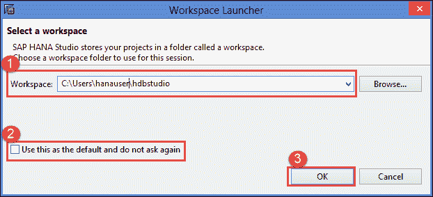

1.  默认情况下选择工作区。 我们可以通过浏览选项更改工作区位置。 工作区用于存储 Studio 配置设置和开发工件。
2.  选择“将其用作默认值，而不再询问”选项，以防止每次打开 SAP HANA Studio 时都弹出此屏幕以供选择工作区。
3.  单击  按钮。

出现 SAP HANA Studio 欢迎屏幕- 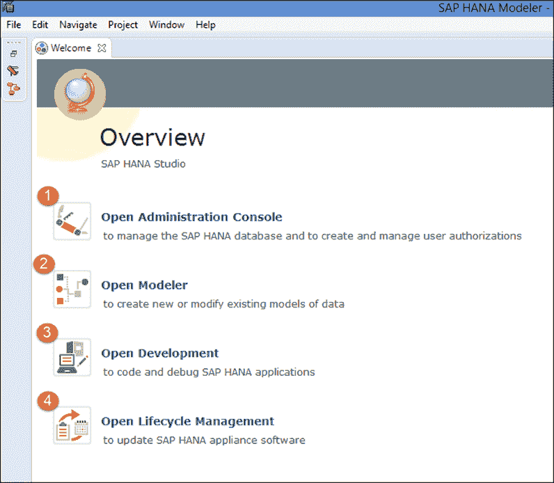

在“欢迎”屏幕中，显示不同的透视图，每个透视图的详细信息如下所示–

1.  ### 管理控制台透视图

    该屏幕用于配置，管理和监视 SAP HANA 数据库。 SAP HANA 管理控制台中提供了几个视图和编辑器。

    系统视图工具栏用于管理； 如下图所示–

    

    下表显示了 SAP HANA 管理控制台中可用的系统级编辑器和视图。

| **查看/编辑器** | **详情** | **路径** | **图片** |
| **系统** | 系统视图提供了在 SAP HANA Studio 中管理的所有 SAP HANA 系统及其内容（目录，内容等）的分层视图。 | 窗口->显示视图->系统 |  |
| **系统监视器** | System Monitor 是一个编辑器，可通过一个屏幕快照概述所有 SAP HANA 数据库。 通过向下钻取，我们可以在 System Monitor 中查看各个系统的详细信息。 | 系统视图工具栏上的  按钮。 |  |
| **管理** | 这用于执行管理和监视任务。 | 1.从系统工具栏。 2.双击系统。 |  |
| **管理诊断模式** | 紧急情况下使用此编辑器在没有可用的 SQL 连接或 [SQL](/sql.html) 连接过载的系统上执行监视和操作。 | 1.从单击管理工具列表图标。 2.Ctrl + Shift + O | 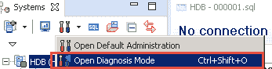 |
| **备用** | 用于执行备份和管理。 | 展开系统，然后选择备份。 |  |
| **安全性** | 该编辑器用于管理以下主题：1.密码策略 2.数据卷加密 | 系统“安全性”视图中的“安全性”选项。 |  |
| **SQL 控制台** | 用于在 SQL Console 中输入，执行和分析 SQL 语句。 | 在系统工具栏中，选择 SQL |  |

2.  ### 建模者观点

    该透视图用于创建建模对象，SAP HANA System 中的数据库对象管理。 建模人员将这种观点用于以下活动–

*   创建/修改表，函数，索引，视图，序列，同义词，触发器，视图。
*   创建建模对象，例如属性视图，分析视图，计算视图，分析特权，过程和决策表。
*   通过 SLT，BODS，DXC 从 SAP / NonSAP 源向 SAP HANA 数据库提供数据。

3.  ### 发展前景

    该视角用于在 HANA 上针对 Web 环境开发应用程序。 在此 Perspective 中使用编程语言-Java Script，J Query，ODATA 等。

4.  ### 生命周期管理的观点

    该屏幕用于安装和更新有关 SAP HANA 数据库和 SAP HANA Studio 的软件。 生命周期管理还用于将对象从一个 HANA 系统传输到另一个 HANA 系统。

## 在 SAP HANA Studio 中添加系统

要使用 SAP HANA 数据库，需要将用户与 SAP HANA Studio 中的 SAP HANA 数据库连接。 因此，我们建立了与 SAP HANA DATABASE 的连接，如下所示–

**步骤 1）**从系统工具栏中单击“添加系统”图标，如下所示-

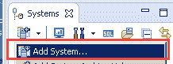

**步骤 2）**提供以下详细信息-

1.  主机名–在此处输入 SAP HANA 数据库。
2.  实例号–两位数的实例号。
3.  描述-系统描述，以更好地理解
4.  单击  按钮。

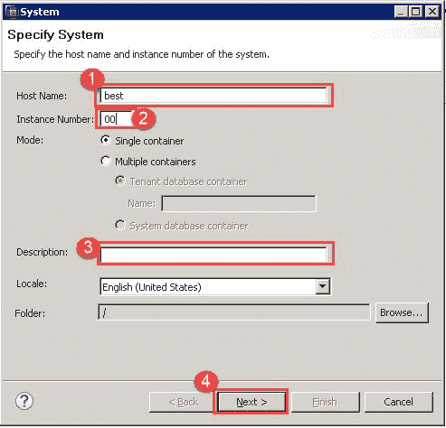

出现连接属性屏幕，我们需要在其中输入 SAP HANA 数据库用户和密码。

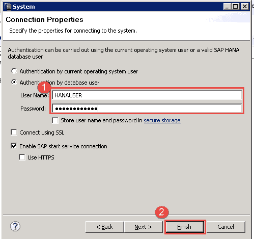

1.  输入 SAP HANA 数据库的用户名和密码，以从 SAP HANA Studio 进行访问。
2.  Click  button.

    如果没有错误，则说明连接成功，并且在 SAP HANA Studio 中“系统节点”下添加了系统名称。

## 与 SAP HANA Studio 一起使用

要通过 SAP HANA Studio 登录 SAP HANA 数据库，请执行以下步骤-

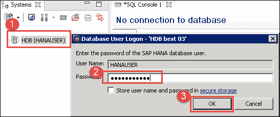

1.  单击添加的系统。 这里是“ DB（HANAUSER）”。
2.  用户名/密码的弹出屏幕。 输入 HANA 数据库的用户名和密码。
3.  单击确定按钮。

登录到 SAP HANA Studio 后，我们将在以下屏幕上看到选定的 HANA 系统。

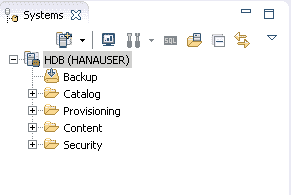

在 HANA 系统下的 Hana Studio 中，以下子节点退出-

*   ### 目录

SAP HANA Studio 目录节点表示 SAP HANA 数据字典，其中数据库对象（表，视图，过程，索引，触发器，同义词等）存储在模式文件夹中。 在 SAP HANA 中创建用户时，默认情况下将在 SAP HANA 数据库中创建同名架构。 当用户创建任何数据库对象时，这是用户的默认架构。 模式用于对数据库对象进行分组。

模式定义了一个容器，用于保存数据库对象，例如表，视图，触发器，过程，序列，函数，索引，同义词等。

可以在 SQL 编辑器中通过以下 SQL-

```
CREATE SCHEMA "SCHEMA_NAME" OWNED BY "USERNAME".
```

此处“ SCHEMA_NAME”和“ USERNAME”应根据要求进行更改。 在刷新目录节点后，将显示新创建的架构。

我已经在前端 SQL 中创建了架构“ DHK_SCHEMA”。

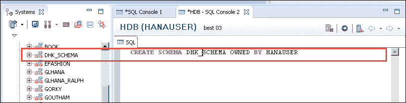

所有数据库对象都存储在架构的相应文件夹中，如下所示–

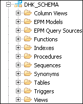

*   ### 设置

供应用于选择源元数据并将元数据和数据导入 SAP HANA。

配置分为两类，它们是-

1.  SAP HANA 内置工具（平面文件，智能数据访问，智能数据流等）
2.  外部工具（SLT，BODS，DXC 等）

在 SAP HANA Studio Provisioning 节点中，SAP 使用称为“智能数据访问”的新功能，该功能是内置工具。

智能数据访问结合了来自异构数据源（如 Hadoop，Teradata，Oracle 和 Sybase）的数据。


来自不同来源的数据将作为“虚拟表”存储在 SAP HANA 数据库中。 虚拟表的限制是，它只能用于在 SAP HANA 中构建计算视图。

*   ### 内容

内容节点是设计时间存储库，其中包含包中数据模型的所有信息。 所有信息视图（例如属性视图，分析视图，计算视图等）都将在``内容节点''下的``包''中创建。

该包用于以结构化方式对相关信息对象进行分组。 可以通过右键单击内容节点->新建->包来创建该包。


*   ### 安全

SAP HANA Studio 中的安全节点包含 3 个子节点，它们是–

1.  安全性–用于创建用户审核策略，密码策略等。
2.  用户–用于创建/修改/删除用户。 角色和特权也将从该屏幕授予用户。
3.  角色–用于创建/修改/删除角色。 特权从此处添加/删除到角色。