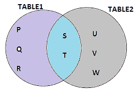
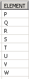
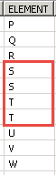
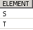
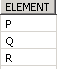

# SAP HANA 操作员：联盟&联盟全部

> 原文： [https://www.guru99.com/sap-hana-operator.html](https://www.guru99.com/sap-hana-operator.html)

SAP HANA Operator 可以用于计算，值比较或分配值。 SAP HANA 包含以下运营商-

一元和二元运算符

算术运算符

字符串运算符

比较运算符

逻辑运算符

设置运算符

**一元和二元运算符**

| **运算符** | **操作** | **说明** |
| 一元 | 一元运算符适用于一个操作数 | 一元加运算符（+）一元否定运算符（-）逻辑求反（NOT） |
| 二元 | 二元运算符适用于两个操作数 | 乘法运算符（*，/）加法运算符（+，-）比较运算符（=，！=，<，>，< =，> =）逻辑运算符（AND，OR） |

**算术运算符**

*   加法（+）
*   减法（-）
*   乘法（*）
*   部门（/）

**字符串运算符**

字符串运算符是将两个项（例如字符串，表达式或常量）组合为一个的串联运算符。

两个竖线“ ||” 用作串联运算符。

**比较运算符**

比较运算符用于比较两个操作数。 以下是比较运算符的列表-

*   等于（=）
*   大于（>）
*   少于（<）
*   大于或等于（> =）
*   小于或等于（< =）
*   不等于（！=，< >）

**逻辑运算符**

搜索条件中使用逻辑运算符。

例如。 条件 1 AND / OR /非条件 2

以下是逻辑运算符的列表–

*   AND - (e.g. WHERE condition1 AND condition2)

    如果 Condition1 AND Condition2 均为 true，则 Combine 条件为 true，否则它将为 false。

*   OR – (e.g. WHERE condition1 OR condition2)

    如果 Condition1 或 Condition2 为 true，则两个条件均为 false 时，组合条件为 true 或 false。

*   NOT - (e.g. WHERE NOT condition)

    NOT 条件为 true 如果 Condition 为 false。

**设置运算符**

*   UNION-组合两个或多个选择语句或查询，但不重复。
*   UNION ALL-组合两个或多个选择语句或查询，包括所有重复的行。
*   INTERSECT-组合两个或多个 select 语句或查询，并返回所有公共行。
*   EXCEPT-从第一个查询获取输出，并删除第二个查询选择的行。

例如。

我有两个表（table1，table2），其中一些值是公用的。



我们在以下 [SQL](/sql.html) 中为这两个表使用 Set 运算符（Union，Union ALL，Intersect 除外），如下所示–

**创建 Table1- SQL 脚本**

```
CREATE	 COLUMN TABLE DHK_SCHEMA.TABLE1
(        ELEMENT CHAR(1),			
       PRIMARY KEY (ELEMENT)
);			
INSERT INTO DHK_SCHEMA.TABLE1 VALUES ('P');
INSERT INTO DHK_SCHEMA.TABLE1 VALUES ('Q');			
INSERT INTO DHK_SCHEMA.TABLE1 VALUES ('R');			
INSERT	INTO DHK_SCHEMA.TABLE1 VALUES ('S');			
INSERT	INTO DHK_SCHEMA.TABLE1 VALUES ('T');

```

**创建 Table2- SQL 脚本**

```
CREATE	COLUMN TABLE DHK_SCHEMA.TABLE2
(        ELEMENT CHAR(1),			
       PRIMARY KEY (ELEMENT)
);			
INSERT INTO DHK_SCHEMA.TABLE2 VALUES ('S');			
INSERT INTO DHK_SCHEMA.TABLE2 VALUES ('T');			
INSERT INTO DHK_SCHEMA.TABLE2 VALUES ('U');			
INSERT INTO DHK_SCHEMA.TABLE2 VALUES ('V');			
INSERT INTO DHK_SCHEMA.TABLE2 VALUES ('W');

```

**注意**：这里的“ DHK_SCHEMA”是架构名称，用户可以在 [SQL](/sql.html) 中相应地更改架构名称。

设置运算符示例如下-

|  **<center>运算符</center>**  | **SQL 查询** |  **<center>输出</center>**  |  **<center>使用</center>**  |
| 联盟 | **从**

**中选择** *

**（**

**选择** ELEMENT

**来自** DHK_SCHEMA.TABLE1

**UNION**

**选择**元素

**从** DHK_SCHEMA.TABLE2

**）** **订单**，以元素为单位；

 |  | 合并两个或多个查询的结果，没有重复项。 |
| 全联盟 | **从**

中选择 *

**（

**选择**元素

**从** DHK_SCHEMA.TABLE1

**UNION ALL**

**ELEMENT

**.TABLE2

）

**订单** **，以**元素；****** |  | 将两个或多个查询的结果与所有重复项合并。 |
| 相交 | **从**

中选择 *

**（

**选择**元素

**从** DHK_SCHEMA.TABLE1

**相交**

**要素

**从** DHK_SCHEMA。 表 2

）

**订单** **按**元素的顺序；**** |  | 将两个或多个查询的结果与所有常见行合并。 |
| 除 | **从**

中选择 *

**（

**选择**元素

[HTG14** DHK_SCHEMA.TABLE1 中的

**除外**

**元素

**从** DHK_SCHEMA 中选择。 表 2

）

**订单** **以**元素排序；** |  | 从第一个查询获取输出并删除第二个查询选择的行 |