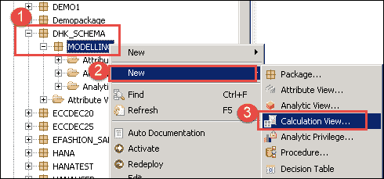
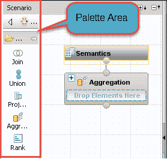
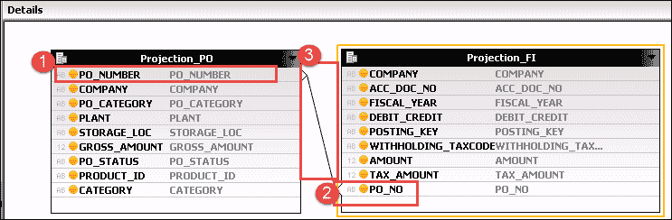
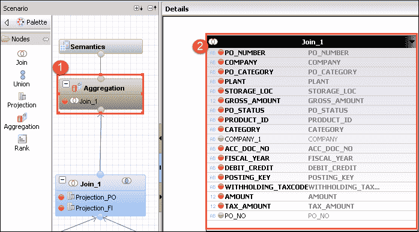
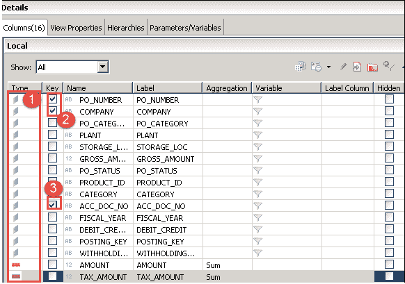
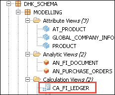
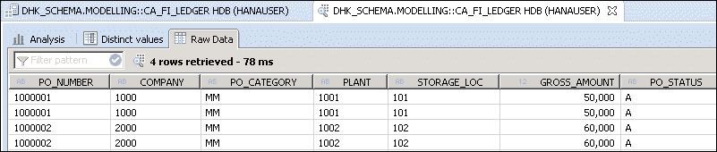

# SAP HANA 计算视图教程

> 原文： [https://www.guru99.com/sap-hana-calculation-view.html](https://www.guru99.com/sap-hana-calculation-view.html)

**什么是计算视图？**

SAP HANA Calculation 视图是功能强大的信息视图。

只能从一个事实表中选择 SAP HANA Analytic 视图度量。 当信息视图中需要更多事实表时，图片中便会出现计算视图。 计算视图支持复杂的计算。

计算视图的数据基础可以包括表，列视图，分析视图和计算视图。

我们可以在数据源上创建联接，并集，聚合和投影。

计算视图可以包含多个度量，并且可以用于多维报告，也可以不用于列表类型报告。

SAP HANA 计算视图的特征如下：

*   支持复杂计算。
*   支持 OLTP 和 OLAP 模型。
*   支持客户处理，语言，货币转换。
*   支持联盟，投影，聚合，等级等

SAP HANA 计算视图有两种类型–

1.  SAP HANA 图形计算视图（由 SAP HANA Studio 图形编辑器创建）。
2.  基于 SAP HANA 脚本的计算视图（由 SAP HANA Studio 的 SQL 脚本创建）。

### SAP HANA 图形计算视图

在 SAP HANA Analytic 视图中，我们只能从一个表中选择一个度量。

因此，当需要包含来自不同表的度量的视图时，则无法通过解析视图来实现，而只能通过计算视图来实现。

因此，在这种情况下，我们可以为每个表使用两个不同的分析视图，并将它们加入计算视图中。

我们将通过结合两个分析视图“ AN_PUR​​CHASE_ORDER”和“ AN_FI_DOCUMENT”来创建图形计算视图“ CA_FI_LEDGER”。

CA_FI_LEDGER 将显示与采购订单相关的财务凭证明细。

**步骤 1）**在此步骤中，

1.  转到包（此处建模），然后单击鼠标右键。
2.  选择新选项。
3.  选择计算视图。

将显示“计算视图编辑器”，其中“方案面板”显示如下：

“方案”面板的详细信息如下所示–

*   **面板**：本节包含以下节点，这些节点可用作构建我们的计算视图的源。

我们有 5 种不同类型的节点，它们是

1.  **联接**：该节点用于联接两个源对象，并将结果传递到下一个节点。 连接类型可以是内部，左外部，右外部和文本连接。 **注意**：我们只能将两个源对象添加到联接节点。
2.  **联合**：用于在多个源之间执行联合所有操作。 源可以是 n 个对象。
3.  **Projection:** This is used to select columns, filter the data and create additional columns before we use it in next nodes like a union, aggregation and rank.

    **注意**：我们只能在一个 Projection 节点中添加一个源对象。

4.  **聚合**：用于基于所选属性对特定列执行聚合。
5.  **等级**：这是 SQL 中 RANK 函数的完全替代。 我们可以根据需求定义分区和 order by 子句。

**步骤 2）**

1.  单击面板中的“投影”节点，然后从“采购订单分析”视图中将其拖放到方案区域。 将其重命名为“ Projection_PO”。
2.  单击面板中的“投影”节点，然后将其拖放到“方案”区域以进行 FI Document 分析视图。 将其重命名为“ Projection_FI”。
3.  将分析视图“ AN_PUCHASE_ORDER”和“ AN_FI_DOCUMENT”拖放到“内容”文件夹中，分别到“投影”节点和“ Projection_FI”。
4.  单击“组件面板中的加入节点”，然后将其拖放到场景区域。
5.  将 Projection_PO 节点加入到 Join_1 节点。
6.  将 Projection_FI 节点加入到 Join_1 节点。
7.  单击面板中的“聚合”节点，然后将其拖放到方案区域。
8.  将 Join_1 节点加入到 Aggregation 节点。

我们添加了两个分析视图，用于创建计算视图。

**STEP 3）**单击聚合下的 Join_1 节点，可以看到显示了详细信息部分。

1.  从 Projection_PO 节点中选择所有列以进行输出。
2.  从 Projection_FI 节点中选择所有列以进行输出。
3.  Join Projection_PO Node to Projection_FI node on column

    Projection_PO。 PO_Number = Projection_FI.PO_NO。

**步骤 4）**在此步骤中，

1.  单击“聚合”节点，“详细信息”将显示在窗格的右侧。
2.  从详细信息窗口右侧显示的 Join_1 中选择要输出的列。

**STEP 5）**现在，单击语义节点。

详细画面将显示如下。 定义列的属性和度量类型，并为此输出标记键。

1.  定义属性和度量。
2.  将 PO_Number 和 COMPANY 标记为密钥。
3.  将 ACC_DOC_NO 标记为密钥。

**STEP 6）**验证并激活窗口顶部的计算视图。

1.  单击验证图标。
2.  单击激活图标。

计算视图将被激活，并显示在“建模包”下，如下所示–

选择计算视图并右键单击->数据预览

我们添加了两个分析视图，并从两个分析视图中选择了度量（TAX_AMOUNT，GROSS_AMOUNT）。

数据预览屏幕将显示如下-

**CE 函数（也称为计算引擎计划运算符（CE Operators））是 SQL 语句的替代方法。**

CE 功能有两种-

**数据源访问功能**

此函数将列表或列视图绑定到表变量。

以下是一些数据源访问功能列表–

*   CE_COLUMN_TABLE
*   CE_JOIN_VIEW
*   CE_OLAP_VIEW
*   CE_CALC_VIEW

**关系运算符函数**

通过使用关系运算符，用户可以在评估期间绕过 [SQL](/sql.html) 处理器，并直接与计算引擎进行通信。

以下是一些关系运算符功能列表–

*   CE_JOIN (It is used to perform inner join between two sources and

    阅读所需的列/数据。）

*   CE_RIGHT_OUTER_JOIN(It is used to perform right outer join between the two sources

    并在输出中显示查询的列。）

*   CE_LEFT_OUTER_JOIN (It is used to perform left outer join between the sources and

    将查询的列显示到输出）。

*   CE_PROJECTION (This function display the specific columns from the source and apply

    过滤器以限制数据。 它还提供列名别名功能。）

*   CE_CALC (It is used to calculate additional columns based on the business requirement.

    这与图形模型中的计算列相同。）

以下是带有 CE 功能的 [SQL](/sql.html) 的列表，以及一些示例-

| **查询名称** | **SQL 查询** | **CE 内置功能** |
| 选择查询列表 | 从“ COLUMN_TABLE”中选择 C，D。 | CE_COLUMN_TABLE（“ COLUMN_TABLE”，[C，D]） |
| 选择查询属性视图 | 从“ ATTRIBUTE_VIEW”中选择 C，D | CE_JOIN_VIEW（“ ATTRIBUTE_VIEW”，[C，D]） |
| 选择分析视图上的查询 | 从“ ANALYTIC_VIEW”中选择 C，D，SUM（E）。 | CE_OLAP_VIEW（“ ANALYTIC_VIEW”，[C，D]） |
| 选择在计算视图上查询 | 从“ CALCULATION_VIEW”中按 C，D 选择 SELECT C，D，SUM（E） | CE_CALC_VIEW（“ CALCULATION_VIEW”，[C，D]） |
| 哪里有 | 从“ ANALYTIC_VIEW”中选择 C，D，SUM（E），其中 C =“值” | Var1 = CE_COLUMN_TABLE（“ COLUMN_TABLE”）; CE_PROJECTION（：var1，[C，D]，“ C” =“ value” / |