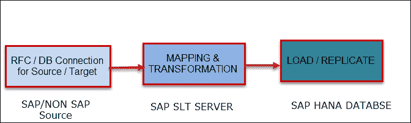

# SAP HANA 中的 DATA Provisioning &复制

> 原文： [https://www.guru99.com/data-provisioning-sap-hana.html](https://www.guru99.com/data-provisioning-sap-hana.html)

### 什么是 DATA Provisioning？

DATA Provisioning 是创建，准备网络并使网络能够向其用户提供数据的过程。 必须先将数据加载到 SAP HANA，然后才能通过前端工具将数据传递给用户。

所有这些过程都称为 ETL（提取，转换和加载），详细信息如下-

*   **提取–** 这是 ETL 的第一个也是有时也是最困难的部分，其中数据是从不同的源系统中提取的。
*   **转换–** 在转换部分中，为从源系统提取的数据定义了一系列规则或功能，用于将数据加载到目标系统中。

*   **加载–** 加载阶段将数据加载到目标系统中。

## SAP HANA 中的复制

SAP HANA 支持两种类型的配置工具–

1.  SAP HANA 内置置备工具
    1.  平面文件
    2.  智能数据流
    3.  智能数据访问（SDA）
    4.  企业信息管理（EIM）
    5.  远程数据
2.  SAP HANA 支持的外部工具
    1.  SAP 格局转型
    2.  SAP Business Objects 数据服务
    3.  SAP Direct Extractor 连接
    4.  Sybase 复制服务器

目前，SAP HANA 的数据供应主要方法有：

| 数据供应方法 | 

说明

 |
| **SLT** | **SLT** （“ SAP 景观转换复制服务器”）在 SAP Net Weaver 平台上运行。 SLT 是用于 SAP 和非 SAP 源系统的实时和计划时间复制的理想解决方案。 |
| **SAP DATA 服务** | **SAP DATA Services** 是一个用于使用图形用户界面设计 ETL 流程的平台。 |
| **DXC** | **DXC** 代表 Direct Extractor Connect 是批处理驱动的 ETL 工具。 |
| **平面文件上传** | 此选项用于将数据（.csv，.xls，.xlsx）上传到 SAP HANA。 |

**SAP HANA SLT 路线图如下–** 数据通过 SLT 进行配置需要 RFC / DB 连接到 SAP / Non-SAP Source System 和 SAP HANA 数据库的 DB 连接。 在 SAP SLT 服务器上，我们定义了映射和转换。 以下是通过 SLT 进行数据配置的路线图。

