# SAP HANA 中的 SLT（SAP Landscape Transformation Replication 服务器）

> 原文： [https://www.guru99.com/slt-sap-landscape-transformation-replication-server-in-sap-hana.html](https://www.guru99.com/slt-sap-landscape-transformation-replication-server-in-sap-hana.html)

### 什么是 SLT（SAP 景观转换复制）？

SLT 是一种 ETL 工具，可让您实时加载和复制数据或将数据从 SAP 源系统或非 SAP 系统调度到 SAP HANA 数据库中。

SAP SLT 服务器使用基于触发器的复制方法将数据从源系统传递到目标系统。

SLT 服务器可以安装在单独的系统上，也可以安装在 SAP ECC 系统上。

SLT 系统的优点如下-

*   允许实时或计划时间数据复制。
*   在实时复制数据期间，我们可以迁移 SAP HANA 格式的数据。
*   SLT 处理群集和池表。
*   这在加载/复制期间自动支持非 Unicode 和 Unicode 转换。 （Unicode 是类似于 ASCII 的字符编码系统。非 Unicode 是比 ASCII 覆盖更多字符的编码系统）。
*   它与 SAP HANA Studio 完全集成。
*   SLT 具有表设置和转换功能。
*   SLT 具有 SAP HANA 解决方案管理器的监视功能。

**具有 SAP /非 SAP 系统的 SAP SLT 服务器的体系结构概述如下-**

### SAP System 与 SAP HANA 之间的 SAP SLT 连接体系结构概述

SAP SLT Replication Server 将所有元数据表定义从 ABAP 源系统转换为 SAP HANA。

对于 SAP 源，SLT 连接具有以下功能-

*   复制表后，SAP SLT Replication 服务器将在源系统中创建日志记录表。
*   读取引擎在 SAP Source System 中创建。
*   SAP SLT 和 SAP Source 之间的连接被建立为 RFC 连接。
*   SAP SLT 和 SAP HANA 之间的连接被建立为数据库连接。

具有与用户“ SYSTEM”相同的授权的数据库用户可以在 SAP SLT 和 SAP HANA 数据库之间创建连接。

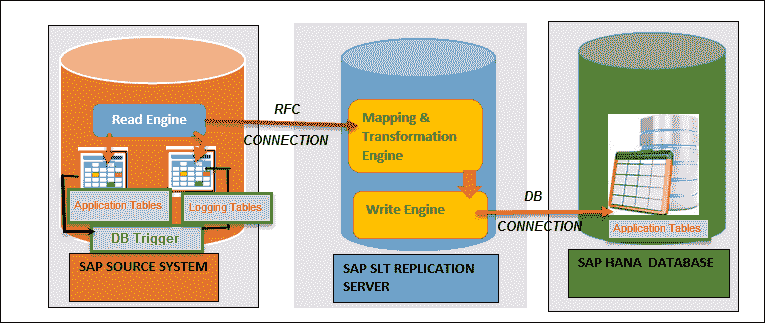

SAP 系统与 SAP HANA 数据库之间的 SAP SLT 连接

SAP SLT Server 自动为 SAP HANA 数据库创建数据库连接（当我们通过事务 LTR 创建新配置时）。 无需手动创建它。

### 为 SAP Source System 配置 SAP SLT Server

首先，我们需要配置 SAP SLT 复制服务器以在 SAP Source 和 SAP HANA 数据库之间建立连接。 T 代码 LTR 用于在 SAP Source 和 SAP SLT 之间创建连接。

**步骤 1）**登录到 SAP SLT 服务器，然后从 **SAP** SLT 复制服务器调用事务**“ LTR”** 。

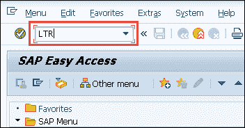

将显示一个 Web-dynpro 弹出屏幕，用于登录到 SAP SLT 服务器。

1.  输入客户/用户名/密码
2.  Click on logon tab

    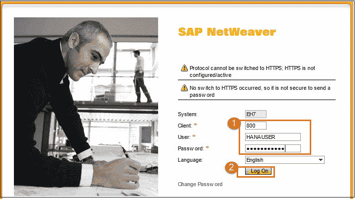

    配置的弹出屏幕将显示如下-

    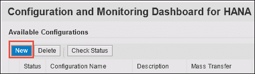

    单击“新建”按钮进行新配置。

**步骤 2）**在此步骤中，

1.  输入配置名称和描述。
2.  选择 SAP System 作为源系统。
3.  输入 SAP 系统的 RFC 连接。
4.  输入用户名/密码/主机名和实例号。
5.  输入作业选项详细信息–

*   数据传输作业数。
*   否。计算工作。

6.  选择复制选项作为实时。
7.  保留所有设置后，单击“确定”以在 SLT 中创建新架构。

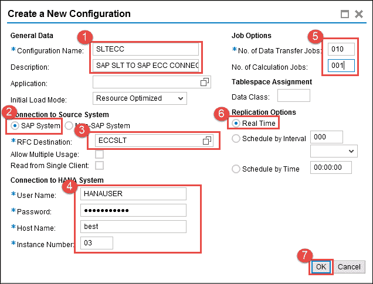

配置名称“ SLTECC”将被添加并处于活动状态。

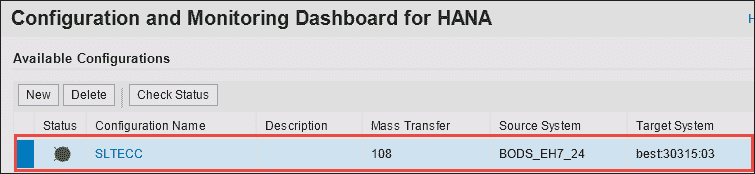

成功配置 SAP SLT 服务器后，SAP SLT 服务器会自动为 SAP HANA 数据库创建数据库连接（当我们通过事务 LTR 创建新配置时）。 无需手动创建它。

下一步，我们将数据从 SAP Source 导入到 SAP HANA。

### 通过 SLT 将 SAP 源数据导入 SAP HANA

成功配置 SAP SLT 服务器后，将在 SAP HANA 数据库中创建以上 SCHEMA 作为 SAP SLT 中的配置名称。

此架构包含以下对象-

1.  **1 方案**-SLTECC。
2.  **1 个用户** – SLTECC。
3.  **1 个特权**
4.  **8 桌** –

*   DD02L（SAP 表名称）
*   DD02T（SAP 表文本）
*   RS_LOG_FILES
*   RS_MESSAGE
*   RS_ORDER
*   RS_ORDER_TEXT
*   RS_SCHEMA_MAP
*   RS_STATUS。

5.  **4 个角色-**

*   SLTECC_DATA_PROV
*   SLTECC_DATA_POWER_USER
*   SLTECC_DATA_USER_ADMIN
*   SLTECC_DATA_SELECT

6.  **2 程序**

*   RS_GRANT_ACCESS
*   RS_REVOKE_ACCESS

所有配置已完成，现在我们从 SAP ECC（ERP 中央组件）加载表。

**步骤 1）**要将表从 SAP ECC 加载到 SAP HANA 数据库，请执行以下步骤-

1.  从“快速查看”转到“数据配置”。
2.  选择“ SAP HANA 系统”。
3.  单击完成按钮。

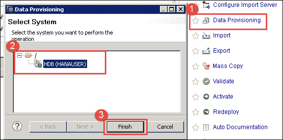

**步骤 2）**将显示基于 SLT 的表数据供应屏幕。 以下是 5 种用于数据供应的选项-

|  **
设置选项
**  |  **
详细信息
**  |
| **负载（满负载）** | 这是一次事件，它会从源系统开始初始加载数据。 |
| **复制** **（满负载+增量负载）** | 它开始初始加载（如果没有更早完成），并考虑 **delta** 的变化。 将为每个表创建数据库触发器和相关的日志记录表。 |
| **停止复制** | 它将停止表的当前复制过程。 它将完全删除数据库触发器和日志记录表。 |
| **暂停** | 它暂停表的运行复制过程。 不会从源系统中删除数据库触发器，并且更改记录将继续。 相关信息存储在源系统中的相关日志记录表中。 |
| **恢复** | 恢复将重新启动挂起的表的复制。 恢复后，暂停的复制过程将恢复。 |

我们使用表**“加载选项”** 中的第一个选项将表（LFBK）数据从源初始加载到 SAP HANA 表。

逐步说明如下-

1.  源和目标系统详细信息是根据 SAP SLT 配置选择的。
2.  单击加载按钮，然后选择我们需要在 SAP Hana 中加载/复制的表（LFBK）。
3.  表（LFBK）将被添加到数据加载管理部分，其操作为“加载”，状态为“已计划”。

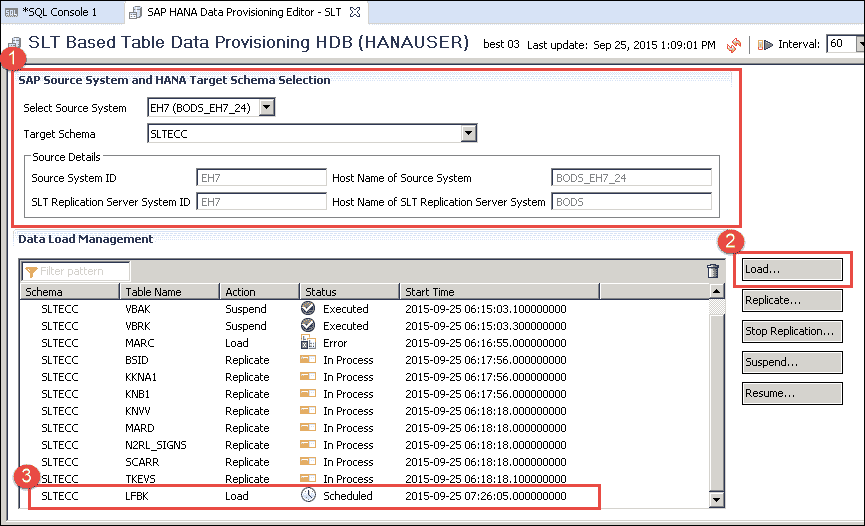

数据加载后，状态将更改为“已执行”。 该表将在“ SLTECC”模式中与数据一起创建。

**步骤 3）**通过“ SLTECC”模式中的数据预览检查表（LFBK）中的数据，如下所示-。

1.  通过 SAP HANA Studio 登录 SAP HANA 数据库，然后选择 SAP HANA 系统 HDB（HANAUSER）。

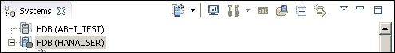

2.  在“表”节点下选择“表（LFBK）”。
3.  右键单击表（LFBK），然后单击打开数据预览选项。
4.  通过 SLT 处理加载的数据将显示在数据预览屏幕中。

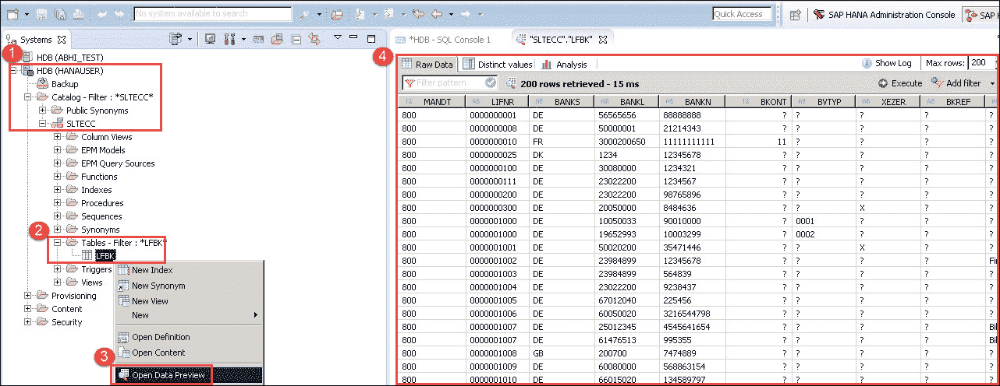

现在，我们已成功将数据加载到表“ LFBK”中。 我们将来将在 Modeling 中使用此表。

### 非 SAP 系统与 SAP HANA 之间的 SAP SLT 连接

SAP SLT Replication Server 将所有元数据表定义从非 ABAP 源系统转换为 SAP HANA。

对于非 SAP 源，SLT 连接具有以下功能-

*   复制表后，SAP SLT Replication 服务器将在源系统中创建日志记录表。
*   读取引擎在 SAP SLT Replication 服务器中创建。
*   The connection between SAP SLT and SAP Source / SAP HANA is established as a DB connection.

    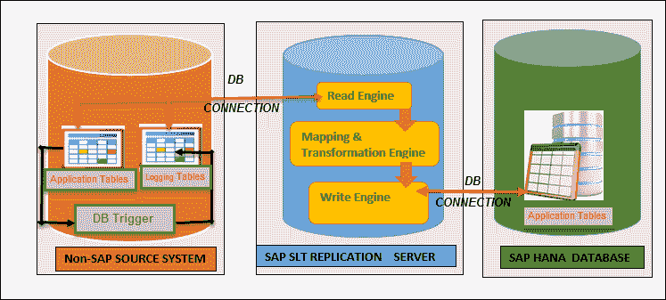

    非 SAP SLT 连接和 SAP HANA 系统/数据库之间的 SAP SLT 连接

    SAP SLT 只能执行最简单的转换，因此对于复杂的转换，我们需要另一个 ETL 工具，例如 SAP Data Services。