# HANA 中的 SAP DS（数据服务）

> 原文： [https://www.guru99.com/sap-ds-sap-data-services-in-sap-hana.html](https://www.guru99.com/sap-ds-sap-data-services-in-sap-hana.html)

### 什么是 SAP 数据服务？

SAP 数据服务是一种 ETL 工具，可为从异构源到目标数据库或数据仓库的数据集成，转换，数据质量，数据分析和文本数据处理提供单一企业级解决方案。

我们可以创建应用程序（作业），在其中可以使用设计器完成数据映射和转换。 （最新版本的 SAP BODS 是 4.2）。

### 数据服务的功能

*   它提供了高性能的并行转换。
*   它具有完善的管理工具和报告工具。
*   它支持多用户。
*   SAP BODS 对于基于 Web 服务的应用程序非常灵活。
*   它允许脚本语言具有丰富的功能集。
*   Data Services can integrate with SAP LT Replication Server (SLT) , with the

    基于触发器的技术。 SLT 向每个 SAP 或非 SAP 源表添加增量功能

    这允许使用数据捕获进行更改并传输的增量数据

    源表。

*   使用仪表板和过程审核进行数据验证。
*   具有计划功能和监视/仪表板的管理工具。
*   调试和内置性能分析以及查看数据。
*   SAP BODS 支持广泛的源和目标。
    *   任何应用程序（例如 SAP）。
    *   任何具有批量加载和更改数据捕获功能的数据库
    *   文件：固定宽度，逗号分隔，COBOL，XML，Excel。

### 数据服务组件

SAP DATA 服务具有以下组件–

1.  **Designer-** It is a development tool by which we can create, test, and execute a job that populates a data warehouse.

    它允许开发人员通过在源到目标流程图中选择一个图标来创建对象并对其进行配置。

    通过指定工作流和数据流，可以将其用于创建应用程序。

    要打开数据服务设计器，请转到**开始菜单->所有程序-> SAP 数据服务（此处为 4.2）->数据服务设计器。**

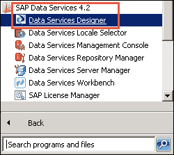

2.  **作业服务器-**这是一个启动数据服务处理引擎并用作引擎和数据服务套件接口的应用程序。
3.  **引擎-**数据服务引擎执行应用程序中定义的单个作业。
4.  **Repository-** Repository is a database that stores designer predefine objects and user defined objects (source and target metadata, transformation rules).

    存储库有两种类型–

*   **本地存储库**（由 Designer 和 Job Server 使用）。
*   **中央存储库**（用于对象共享和版本控制）

5.  **访问服务器-**访问服务器在 Web 应用程序，数据服务作业服务器和引擎之间传递消息。
6.  **管理员-** Web Administrator 提供基于浏览器的数据服务资源管理，详细信息如下-

*   配置，启动和停止实时服务。
*   计划，监视和执行批处理作业。
*   配置作业服务器，访问服务器和存储库使用情况。
*   管理用户。
*   通过 Web 服务发布批处理作业和实时服务
*   配置和管理适配器。

### 数据服务架构–

数据服务架构具有以下组成部分-

*   中央存储库-用于作业服务器的存储库配置，安全管理，版本控制和对象共享
*   设计器–用于创建项目，作业，工作流，数据流和运行。
*   本地存储库（您可以在此处创建更改和启动作业，工作流，数据流）。
*   作业服务器&引擎–它管理作业。
*   Access Server –用于执行开发人员在存储库中创建的实时作业。

在下图中，显示了数据服务和那里的组件关系。

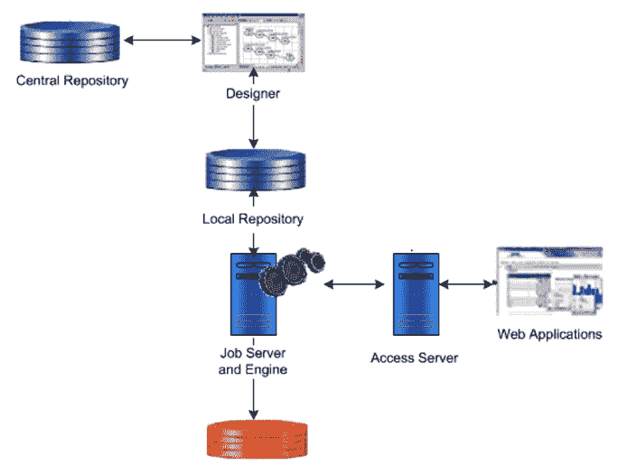

**SAP BODS 体系结构**

**Designer 窗口详细信息**：首先，我们研究 SAP 数据服务的第一个组件-Designer

数据服务设计器各部分的详细信息如下-

1.  **工具栏**（用于打开，保存，返回，验证，执行等）。
2.  **项目区域**（包含当前项目，包括 Job，Workflow 和 Dataflow。在 Data Services 中，所有实体都是对象。
3.  **工作区**（在其中定义，显示和修改对象的“应用程序窗口”区域）。
4.  **本地对象库**（它包含本地存储库对象，例如转换，作业，工作流，数据流等）。
5.  **工具面板**（工具面板上的按钮使您可以向工作空间添加新对象）。

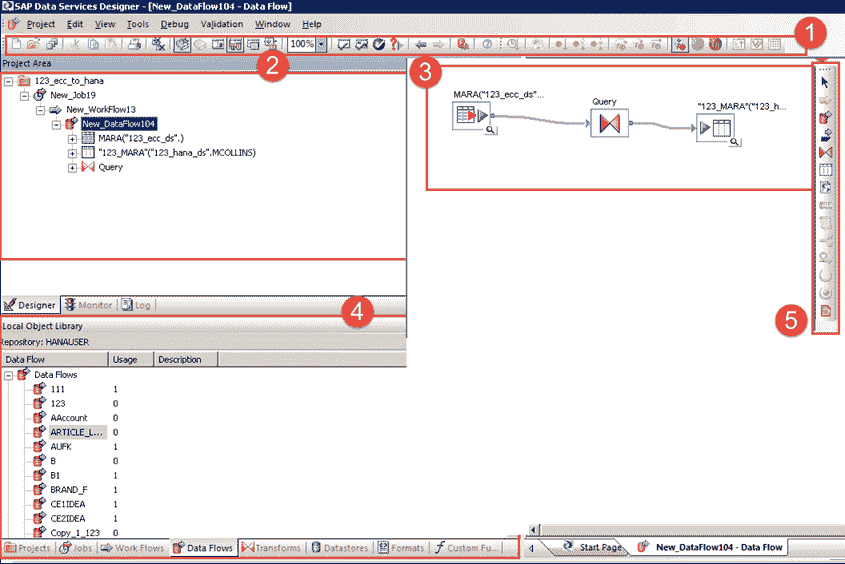

**对象层次结构**

下图显示了数据服务中关键对象类型的层次关系。

[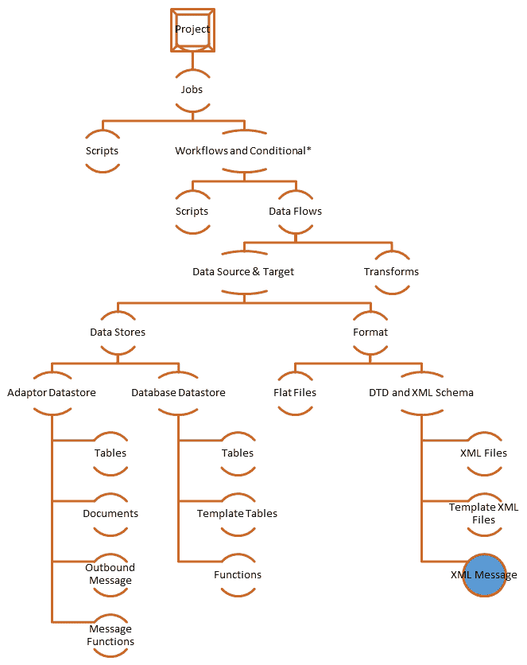 ](/images/sap-hana/030216_0711_DataProvisi16.png) >

**注意**：

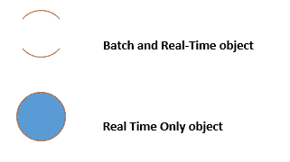

**工作流程和条件*是可选的**

SAP Data Services 详细信息中使用的对象如下-

|  **
对象
**  |  **
说明
**  |
| **项目** | 项目是“设计器”窗口中的最高级别的对象。 项目为您提供了一种组织在 Data Services 中创建的其他对象的方法。一次只能打开一个项目（“打开”表示“在项目区域中可见”）。 |
| **职位** | “工作”是您可以独立安排执行的最小工作单元。 |
| **脚本** | 过程中行的子集。 |
| **工作流程** | “工作流”是将多个数据流合并到整个作业的一致工作流中。 工作流程是可选的。 工作流程是一个过程。

*   调用数据流
*   调用另一个工作流
*   定义要执行的步骤顺序 在您的工作中执行
*   在数据流之间传递参数。
*   指定如何处理执行期间发生的错误。
*   定义执行项目各部分的条件。

 |
| **数据流** | “数据流”是将源数据转换为目标数据的过程。 数据流是可重用的对象。 总是从工作流程或工作中调用它。

*   标识要读取的源数据。
*   定义要对数据执行的转换。
*   标识要向其加载数据的目标表。

 |
| **数据存储区** | 将数据服务连接到源和数据存储目标数据库的逻辑通道。

*   必须为每个源数据库和目标数据库指定。
*   用于将源数据库和目标数据库的元数据导入到存储库中
*   由数据服务用于从源表读取数据并将数据加载到 目标表

 |
| **目标** | 数据服务从中加载数据的表或文件。 |

### 数据服务示例（通过从 SAP Source Table 加载数据）

数据服务中的所有内容都是一个对象。 我们需要为每个源数据库和目标数据库分离数据存储。

从 SAP 源表加载数据的步骤-SAP BODS 有很多步骤，在这些步骤中，我们需要为源和目标创建数据存储并映射到它们。

*   在源和 BODS 之间创建数据存储
*   将元数据（结构）导入到 BODS。
*   配置导入服务器
*   将元数据导入 HANA 系统。
*   在 BODS 和 HANA 之间创建数据存储。
*   创建项目。
*   创建作业（批量/实时）
*   创建工作流程
*   创建数据流
*   在数据流中添加对象
*   执行工作
*   在 HANA 中检查数据预览

**步骤 1）**在 SAP Source 和 BODS 之间创建数据存储

1.  To Load data from SAP Source to SAP HANA through SAP BODS, we need a data Store. So we create a Data store first as shown below –

    项目->新建->数据存储

    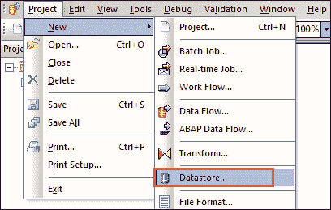

2.  A pop-up for Create new data store will appear, enter detail as below -
    1.  输入数据存储名称“ ds_ecc”。
    2.  选择数据存储类型名称作为“ SAP 应用程序”。
    3.  输入数据库服务器名称
    4.  用户名和密码。
    5.  点击“应用”按钮。
    6.  点击“确定”按钮。

    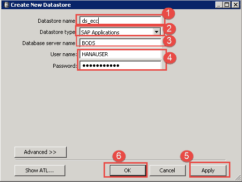

3.  数据存储将被创建，并按以下方式查看创建的数据存储-

1.  转到本地对象库
2.  选择数据存储选项卡。
3.  将显示数据存储“ ds_ecc”。

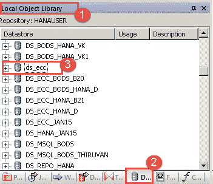

**步骤 2）**将元数据（结构）导入到 BODS 服务器。

我们已经为 ECC 到 BODS 创建了一个数据存储； 现在我们将元数据从 ECC 导入 BODS。 要导入，请执行以下步骤-

1.  选择数据存储“ ds_ecc”，然后单击鼠标右键。
2.  Select Import by Name option.

    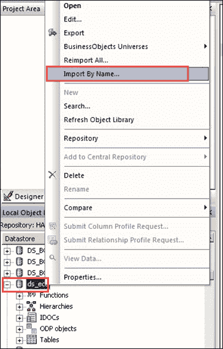

    将显示一个弹出窗口，用于按名称导入。 输入以下详细信息–

    1.  选择“类型”作为表格。
    2.  输入我们要导入的表名。 在这里，我们要导入 KNA1 表。
    3.  单击“导入”按钮。 KNA1 表将出现在“ ds_ecc”数据源的表节点下。

    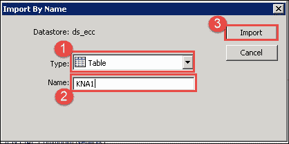

表元数据将被导入到 ds_ecc 数据存储中，如下所示–

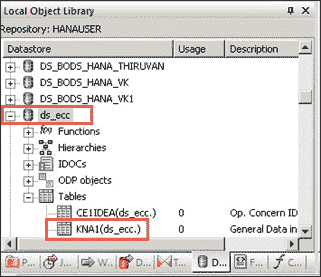

**步骤 3）**配置导入服务器

到目前为止，我们已经将表导入到为 ECC 到 SAP BODS Connection 创建的“ ds_ecc”数据存储中。 要将数据导入 SAP HANA，我们需要配置导入服务器，

1.  To do this go to **Quick View-> Configure Import Server** as below -

    

2.  将显示“选择系统”的弹出窗口，选择“ SAP HANA（此处为 HDB）系统”，如下所示-

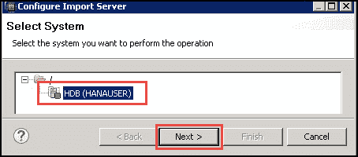

3.  点击“下一步”按钮。 将会出现另一个数据服务凭据弹出窗口，输入以下详细信息

1.  SAP BODS 服务器地址（此处为 BODS：6400）
2.  输入 SAP BODS 存储库名称（HANAUSER 存储库名称）
3.  输入 ODBC 数据源（ZTDS_DS）。
4.  输入 SAP BODS 服务器的默认端口（8080）。

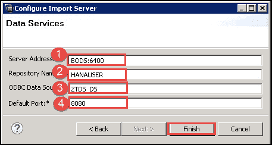

点击“完成”按钮。

**步骤 4）**将元数据导入到 HANA 系统

1.到目前为止，我们已经配置了导入服务器，现在我们将从 SAP BODS 服务器导入元数据。

1.  单击快速查看中的导入选项。
2.  将显示一个弹出的导入选项。 选择“选择性导入元数据”选项。

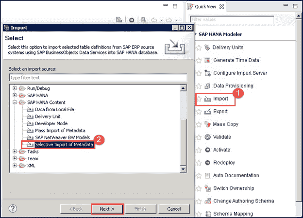

点击“下一步”按钮。

2.将显示“选择性导入元数据”弹出窗口，在其中我们选择目标系统。

1.  选择 SAP HANA 系统（此处为 HDB）。

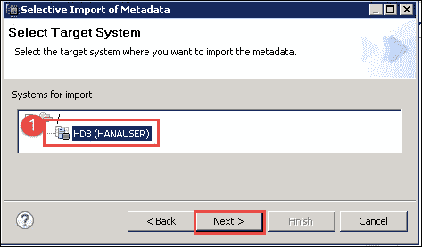

点击“下一步”按钮。

**步骤 5）**在 BODS 和 HANA 之间创建数据存储

众所周知，在 BODS 中，我们需要为源和目标创建一个单独的数据存储。 我们已经为源创建了数据存储，现在我们需要为目标（在 BODS 和 HANA 之间）创建数据存储。 因此，我们创建了一个名称为“ DS_BODS_HANA”的新数据存储。

1.  转到项目->新建->数据存储。

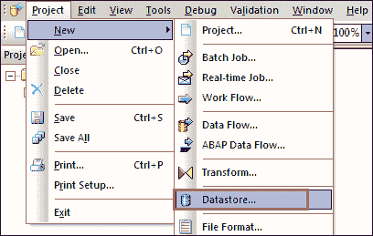

2.  出现创建新数据存储的屏幕，如下所示。
    1.  输入数据存储名称（DS_BODS_HANA）。
    2.  输入数据存储类型作为数据库。
    3.  输入数据库类型作为 SAP HANA。
    4.  选择数据库版本。
    5.  输入 SAP HANA 数据库服务器名称。
    6.  输入 SAP HANA 数据库的端口名。
    7.  输入用户名和密码。
    8.  勾选“启用自动数据传输”。

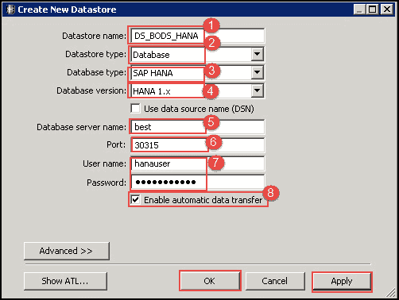

单击“应用”，然后单击“确定”按钮。

数据存储“ DS_BODS_HANA”将在“本地对象库”的数据存储选项卡下显示为

下面-

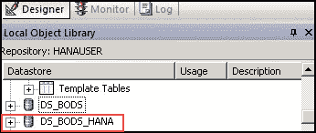

3.  现在，我们将表导入到数据存储“ DS_BODS_HANA”中。
    1.  选择数据存储“ DS_BODS_HANA”，然后单击鼠标右键。
    2.  选择“按名称导入”。

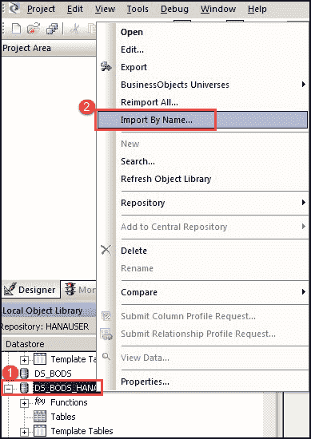

4.  按名称导入的弹出窗口将显示如下-
    1.  选择类型作为表格。
    2.  输入名称作为 KNA1。
    3.  所有者将显示为 Hanauser。
    4.  单击导入按钮。

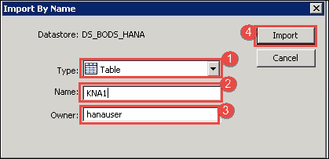

表将被导入“ DS_BOD_HANA”数据存储区中，以按照以下步骤查看表中的数据–

1.  单击数据存储“ DS_BODS_HANA”中的表“ KNA1”。
2.  数据将以 TABULAR 格式显示。

**步骤 6）定义项目**：项目组并组织相关对象。 项目可以包含任意数量的作业，工作流和数据流。

1.  转到 Designer 项目菜单。
2.  选择新选项。
3.  选择项目选项。

[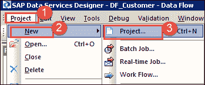 ](/images/sap-hana/030216_0711_DataProvisi37.png) 

出现用于新项目创建的 POP-UP，如下所示。 输入项目名称，然后单击创建按钮。 在我们的案例 BODS_DHK 中，它将创建一个项目文件夹。

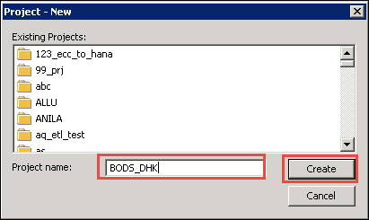

**步骤 7）定义作业**：作业是可重用的对象。 它包含工作流和数据流。 作业可以手动执行，也可以按计划执行。 要执行 BODS 流程，我们需要定义作业。

我们创建一个 Job 为 JOB_Customer。

1.  Select Project (BODS_DHK) created in step 1, Right click and select "New Batch Job".

    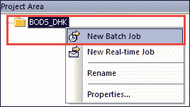

2.  将其重命名为“ JOB_Customer”。

**步骤 8）定义工作流程**：

1.  在项目区域中选择作业“ JOB_Customer”，
2.  单击工具面板上的工作流程按钮。 单击黑色工作区区域。 工作流程图标将出现在工作区中。
3.  将工作流的名称更改为“ WF_Customer”。

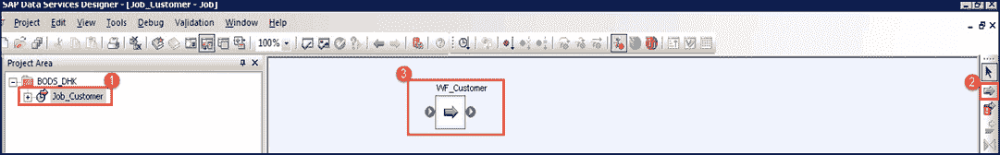

单击工作流程的名称，该工作流程的空白视图将显示在工作空间中。

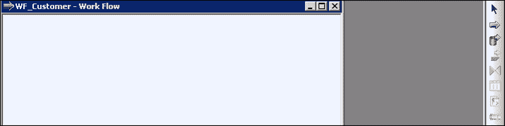

**步骤 9）定义数据流**：

1.  单击工作流“ WF_Customer”。
2.  单击工具面板上的“数据流”按钮。 单击黑色工作区区域。 数据流图标将出现在工作区中。
3.  将数据流的名称更改为“ DF_Customer”。
4.  数据流也显示在作业名称左侧的项目区域中。

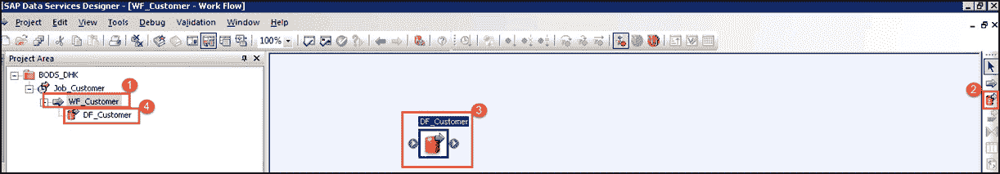

**步骤 10）在数据流中添加对象**：

在数据流内部，我们可以提供指令以将源数据转换为目标表所需的形式。

我们将在下面看到对象–

*   源的对象。
*   目标表的对象。
*   An object for Query transform. (Query transform maps the columns from source to target.)

    在数据流 DF_Customer 上单击。 一个空白的工作区将显示如下-

    

1.  **从源指定对象–** 转到数据存储“ ds_ecc”并选择表 KNA1，然后将其拖放到数据流空白屏幕，如下图所示-
2.  **为目标指定对象-**从存储库中选择数据存储“ DS_BODS_HANA”，然后选择表 KNA1。
3.  拖放到工作区，然后选择“使目标”选项。 源和目标将有两个表。 在这里，我们将表定义为源和目标。

[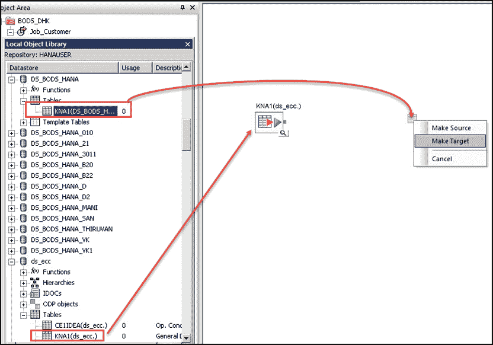 ](/images/sap-hana/030216_0711_DataProvisi44.png) 

4.  **Query Transformation –** This is a tool used to retrieve data based on input schema for user specific condition and for transport data from source to target.
    1.  从工具面板中选择“查询转换”图标，然后将其拖放到工作空间中的源对象和目标对象之间，如下所示-
    2.  将查询对象链接到源。
    3.  将查询对象链接到目标表。

    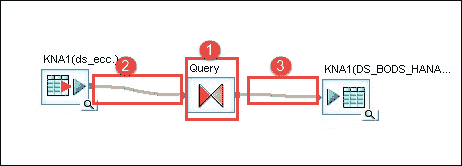

    4.  双击查询图标。 这样，我们将列从输入模式映射到输出模式。

当我们单击“查询”图标时，将出现下一个映射窗口，在该窗口中，我们执行以下步骤-

1.  源表 KNA1 已选择。
2.  从源表中选择所有列，然后右键单击并选择要输出的地图。
3.  选择目标输出作为查询，然后将映射列。

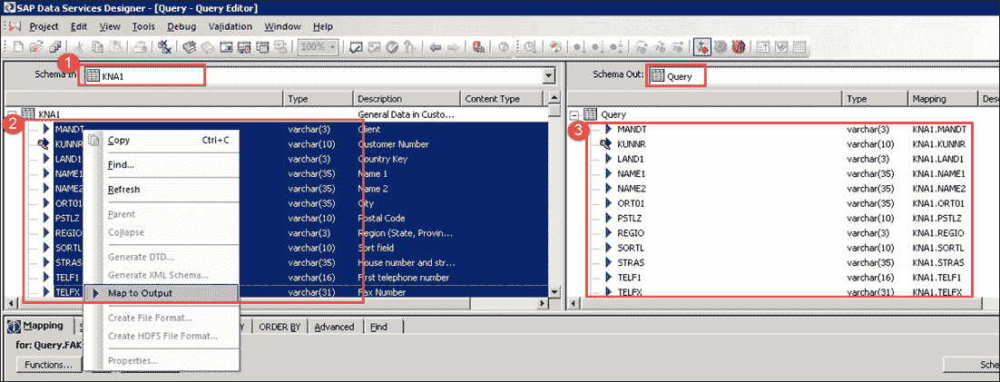

**5.保存并验证项目。**

1.单击验证图标。

2.出现验证成功的弹出窗口。

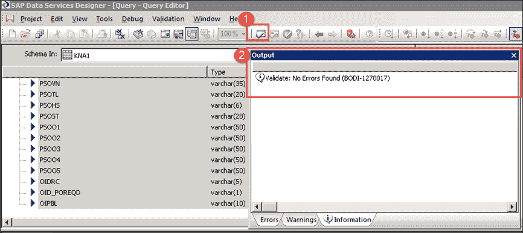

**步骤 11）执行作业–** 要执行作业，请遵循以下路径-

1.  选择项目区域图标以打开项目，然后选择创建的项目。
2.  选择作业，然后单击鼠标右键。
3.  Select Execute option, to execute Job.

    [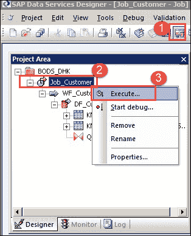 ](/images/sap-hana/030216_0711_DataProvisi48.png) 

    1.  执行作业后，将显示“作业日志”窗口，其中将显示有关作业的所有消息。
    2.  最后一条消息将是作业< >成功完成。

    [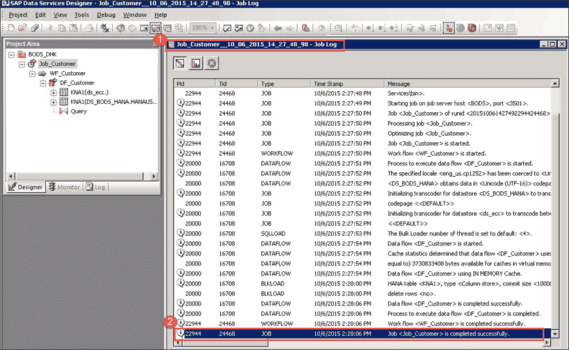 ](/images/sap-hana/030216_0711_DataProvisi49.png) 

    **步骤 12）–验证/检查 SAP HANA 数据库中的数据。**

    1.  通过 SAP HANA Studio 登录到 SAP HANA 数据库，然后选择 HANAUSER 模式。
    2.  在表节点中选择 KNA1 表。
    3.  右键单击表 KNA1，然后选择“打开数据预览”。
    4.  上面的 BODS 进程加载的表（KNA1）数据将显示在数据预览屏幕中。

    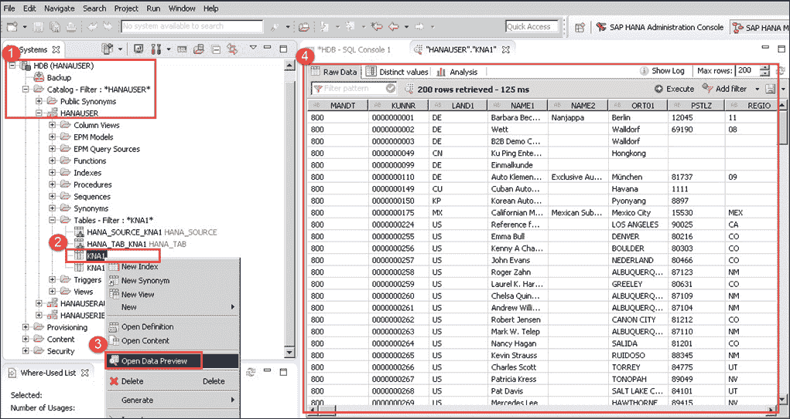