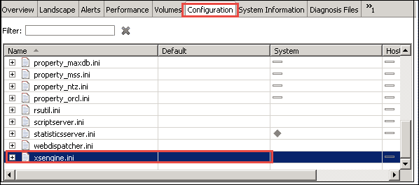
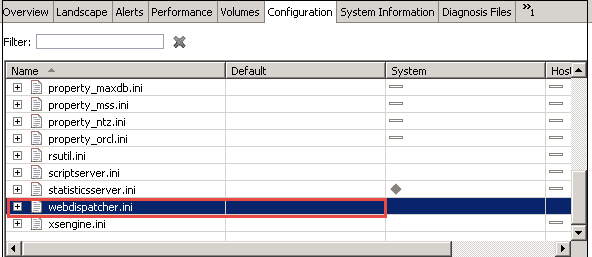
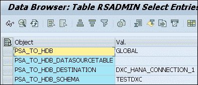

# SAP HANA 直接提取器连接（DXC）教程

> 原文： [https://www.guru99.com/sap-hana-direct-extractor-connection-dxc-in-sap-hana.html](https://www.guru99.com/sap-hana-direct-extractor-connection-dxc-in-sap-hana.html)

### 什么是 SAP HANA DXC？

SAP HANA DXC 是批处理驱动的数据复制技术，即可以在一定时间间隔后执行。

SAP HANA DXC 通过 HTTPS 连接使用 SAP Business Suite 应用程序的现有 ETL（提取，转换和加载）方法。

在 SAP Business Suite 应用程序内容中，数据源提取器可用于 SAP Business Warehouse 的数据建模和数据获取。

SAP DXC 使用这些数据源提取器将数据直接传递到 SAP HANA。

### SAP DXC 的优势

*   SAP DXC 在系统环境中不需要其他服务器或应用程序。
*   在源系统中应用了所有业务提取器逻辑之后，它将数据发送到 SAP HANA，从而降低了 SAP HANA 中数据建模的复杂性。
*   它加快了 SAP HANA 实施时间表。
*   它从 SAP Business 网站提取语义丰富的数据，并提供给 SAP HANA。

### SAP DXC 的局限性

*   数据源必须具有预定义的 ETL 方法，否则，我们需要对其进行定义。
*   SAP DXC 要求使用等于或低于 SP 级别的 Net Weaver 7.0 或更高版本（例如 ECC）的 Business Suite 系统：版本 700 SAPKW70021（SP 堆栈 19，自 2008 年 11 月起）。
*   在数据源中必须存在定义了键字段的过程。

### 配置 SAP DXC 数据复制

**步骤 1）启用 XS 引擎和 ICM 服务**

*   **启用 XS 引擎**

转到 SAP HANA Studio **->** 选择系统->配置-> xsengine.ini。

在默认字段中将实例值设置为 1。

*   **Enabling ICM Web Dispatcher Service -** It enables ICM Web Dispatcher service in HANA system. Web dispatcher uses ICM method for data read and loading in HANA system.

    转到 SAP HANA Studio **->** 选择系统->配置-> webdispatcher.ini

    

    在默认列 1 中将实例值设置为。

**步骤 2）设置 SAP HANA 直接提取器连接**

*   在 SAP HANA 中设置 DXC 连接-要创建 DXC 连接，我们需要在 SAP HANA 中导入交付单位，如下所示-

*   进口交货单位。

您需要将 DXC 交付单元从 SAP 下载到 SAP HANA 数据库中。 您可以

将单位导入到该位置

**“ / usr / sap / HDB / SYS / global / hdb / content”。**

使用 SAP HANA 内容节点中的“导入对话框”导入交货单位？ 配置 XS

使用 DXC 的应用服务器？ 将应用程序容器值更改为 libxsdxc。

*   配置 XS 应用程序服务器以使用 DXC。

将应用程序容器值修改为 libxsdxc（如果存在任何值，则将其附加）。

测试 DXC 连接。

*   确认 DXC 正常工作。

我们可以使用 Internet Explorer 中的以下路径检查 DXC 连接-

**http：//** <主机名>：80 <实例编号> /sap/hana/dxc/dxc.xscfunc

-输入用户名和密码进行连接。

*   用户和架构需要在 HANA Studio 中定义

*   用于 HANA 的 SAP BW 中的 http 连接需要通过 SM59 进行定义，

因此，使用 T 代码 SM59 在 SAP BW 中创建 http 连接。 输入参数将为

-RFC 连接等于 RFC 连接的名称

-目标主机等于 HANA 主机名

-服务编号等于 80 <实例编号>

登录“安全性”选项卡维护在 HANA studio 中创建的具有基本身份验证方法的 DXC 用户。

*   BW 中的数据源需要配置为将结构复制到 HANA 定义的架构。

我们需要使用程序 SAP_RSADMIN_MAINTAIN 在 BW 中设置以下参数

（T 代码 SE38 或 SA38）

程序中的参数列表–参数列表包含 value，该值将值传递到调用屏幕。

PSA_TO_HDB：这三个对象值如下所示-

*   GLOBAL –用于将所有数据源复制到 HANA
*   SYSTEM –指定使用 DXC 的客户端
*   DATASOURCE –It specified Data Source, and only specified can be used.

    **PSA_TO_HDB_DATASOURCETABLE** ：在此，我们需要提供表名，该表名具有用于 DXC 的数据源列表。

    *   在 VALUE 字段中，输入您创建的表的名称。

    **PSA_TO_HDB_DESTINATION**：在此我们需要移动传入数据（在此我们需要提供在 SM59 中创建的值）（此处为 XC_HANA_CONNECTION_HANAS）

    **PSA_TO_HDB_SCHEMA** ：它指定复制数据需要分配哪种架构

**数据源复制**

使用 RSA5 在 ECC 中安装数据源。 我们已经获取了数据源 0FI_AA_20

（FI-AA：交易和折旧）。 首先，我们需要使用指定的应用程序组件来复制元数据（数据源版本需要为 7.0 版本。如果我们具有 3.5 版本的数据源，则需要首先进行迁移。在 SAP BW 中激活数据源。）

在 SAP BW 中加载并激活数据源后，它将在 Defined 模式中创建下表。

*   / BIC / A <数据源> 00 – IMDSO 活动表
*   / BIC / A <数据源> 40 – IMDSO 激活队列
*   / BIC / A <数据源> 70 –记录模式处理表
*   / BIC / A <数据源> 80 –请求和数据包 ID 信息表
*   / BIC / A <数据源> A0 –请求时间戳表
*   RSODSO_IMOLOG-IMDSO 相关表。 存储有关与 DXC 相关的所有数据源的信息。

现在，一旦将数据激活，就可以将其成功加载到表/ BIC / A0FI_AA_2000 中。 我们可以在 SAP HANA Studio 中的表/ BIC / A0FI_AA_2000 中预览数据。