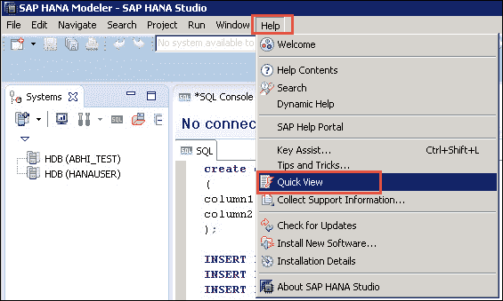
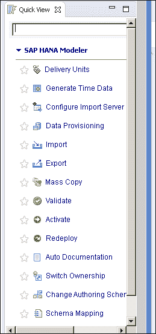
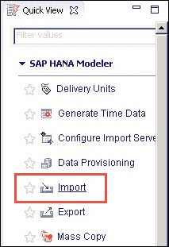
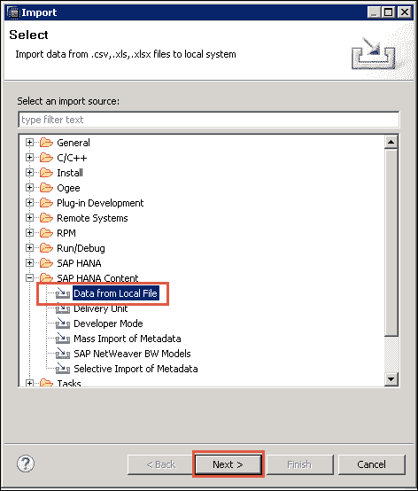
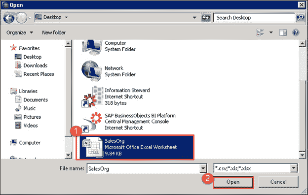
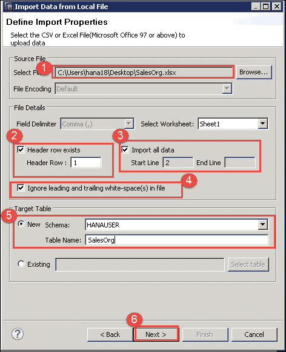
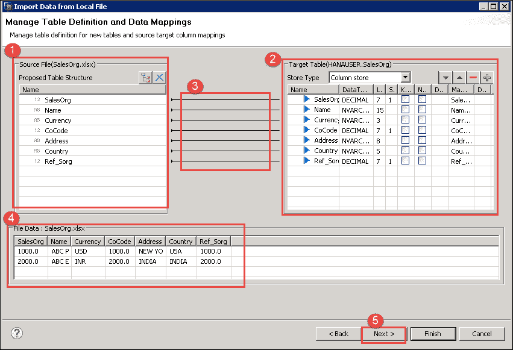
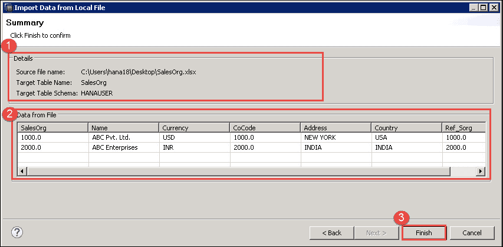
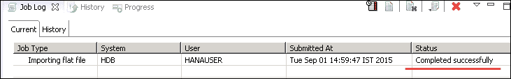
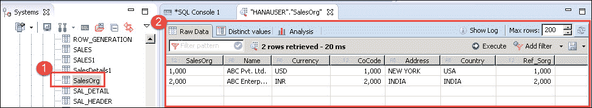

# SAP HANA 平面文件上传教程：CSV，XLS & XLSX

> 原文： [https://www.guru99.com/flat-file-upload-to-sap-hana.html](https://www.guru99.com/flat-file-upload-to-sap-hana.html)

SAP HANA 支持从没有 ETL 工具（SLT，BODS 和 DXC）的文件上传数据。 它是 HANA Studio 修订版 28（SPS04）的新功能。

SAP HANA 支持以下类型的文件，这些文件将在客户端系统上可用，如下所示–

*   .CSV（逗号分隔值文件）
*   .XLS
*   .XLSX

在使用此选项之前，用户需要创建控制文件（.CTL 文件）。 要在 SAP HANA 中上载数据，表必须在 SAP HANA 中存在。 如果表退出，则将在表末尾添加记录，如果表不存在，则需要创建表。

该应用程序建议新表的列名和数据类型。

将数据从平面文件上传到 SAP HANA 的步骤如下-

*   在 SAP HANA 中创建表
*   在我们的本地系统中使用数据创建文件
*   选择文件
*   管理映射
*   加载数据

### 在 SAP HANA 中创建表

如果 SAP HANA 中不存在表，则可以通过 [SQL](/sql.html) 脚本或通过选择**“ NEW”** 选项的此过程来创建表。

我们将使用“ NEW”选项来创建新表。

### 使用我们本地系统中的数据创建文件

我们将上传销售组织主数据。 因此，请在本地系统上为其创建.csv 文件和.xls 文件。

我们将把 SalesOrg.xlsx 文件上传到 SAP HANA，因此我们在本地系统中创建了一个文件 SalesOrg.xlsx。

| 销售组织 | Name | 货币 | 共同代码 | 地址 | 国家 | Ref_Sorg |
| 1000 | ABC 列兵。 有限公司 | 美元 | 1000 | 纽约 | 美国 | 1000 |
| 2000 | ABC 企业 | INR | 2000 | 印度 | INDIA | 2000 |

### 选择文件

**步骤 1）**打开建模器透视图？ '主菜单' ？ '救命' ？ 如下所示的“快速查看”。

快速查看屏幕如下所示-

从快速查看中选择“导入”选项。 将显示一个弹出导入选项。

显示导入弹出窗口。 转到 SAP HANA 内容？ “来自本地文件的数据”。

点击下一步。

将显示一个用于选择文件的弹出窗口，请按照以下步骤选择文件。

1.  选择 SalesOrg.xls 文件。
2.  点击“打开”按钮。

将显示一个用于选择导入文件的屏幕，我们可以在其中选择一个文件以将数据从本地系统加载到 SAP HANA 数据库。

可用选项可分为三个主要区域，它们是

*   源文件部分
*   文件详细信息部分
*   目标表

**步骤 2）**在这一步中，我们必须输入以下详细信息-

1.  **选择文件** –此处将显示所选的文件路径。
2.  **标头行退出** –如果 SalesOrg.xls 文件具有标头（列名）。 所以，我们已经勾选了。
3.  **导入所有数据** –如果要从文件导入所有数据，请勾选此选项，否则请针对从文件中加载特定数据提及起始行和结束行。
4.  **忽略前导和尾随空白**选中此选项可忽略文件中的前导和尾随空白。
5.  **Target Table** – In this section two option –

    **新增** –如果 SAP HANA 中不存在该表，则选择此选项，并提供要创建的退出模式名称和表名称。

    **退出** –如果该表存在于 SAP HANA 中，则选择此选项。 选择模式名称和表。 数据将附加到表的末尾。

6.  点击“下一步”按钮

### 管理映射

映射屏幕将用于执行源列和目标列之间的映射。

可以使用两种不同类型的映射。当我们单击  时，我们得到两个选项，如下所示-

*   **一对一**：通过使用此选项，我们可以根据序列将列映射到列。 如果我们知道所有列都在顺序中，则可以使用此选项。
*   **按名称映射**：通过使用此选项，我们可以根据名称映射源列和目标列。 如果我们知道列名相同，则可以使用此方法。

**源到目标的映射–** 我们将在这里将“源文件”列映射到目标表，而且，我们可以更改目标表的定义。

1.  **源文件中的拟议表结构-**表列名应来自 Excel 文件的列名（标题）。
2.  **目标表结构**：目标表存储类型默认选择为列存储。
3.  单击文件名并拖动到目标字段，将映射文件。 该字段可以一对一自动映射，也可以按名称映射选项。 如果我们的列名无法使用上述选项进行映射，则可以使用拖放选项  手动进行映射。
4.  在同一屏幕的文件数据部分中，我们还可以查看源文件中所有列的数据外观。文件数据部分显示 SalesOrg 文件的数据。
5.  点击“下一步”文件。

将会出现一个从本地文件导入数据的窗口。

### 加载数据

这是我们开始加载过程之前的最终屏幕。 通过此屏幕，将显示表中已经存在的数据，还将显示有关我们要将数据加载到的模式和表的信息。

1.  **详细信息部分**：在此部分中，将显示“选定的源文件名”，“目标表名称”和“目标模式名称”详细信息。
2.  **来自文件的数据**：将显示从文件中提取的数据。
3.  如果已验证“文件中的数据”部分中显示的数据，请单击“完成”以开始将数据加载到表中。

*   成功完成导入选项后，我们应该在作业日志视图中看到状态为“已成功完成”的条目。

*   Once the data importing job is successful,
    1.  我们可以通过选择相应模式的表并右键单击 Table 来查看表中的数据。 “数据预览”如下图所示。
    2.  表的数据将显示在数据预览屏幕中，如下所示-

    