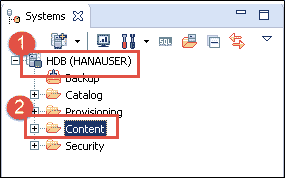
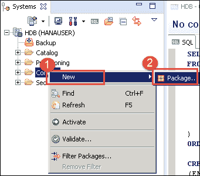
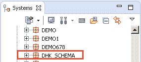
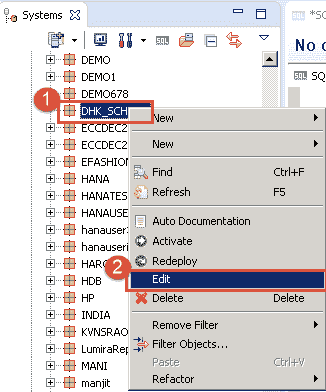
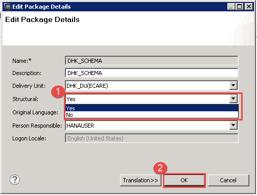
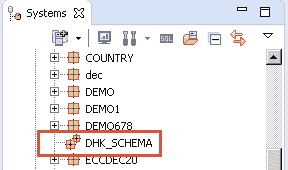
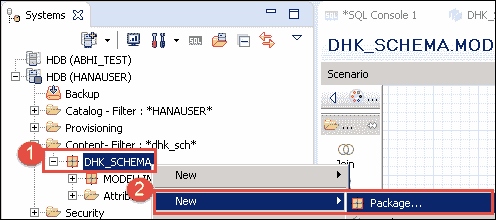
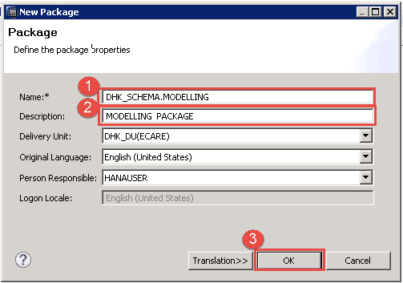

# SAP HANA 建模：完整教程

> 原文： [https://www.guru99.com/sap-hana-modeling.html](https://www.guru99.com/sap-hana-modeling.html)

### 什么是 SAP HANA 建模？

SAP HANA Modeling 是我们用来创建信息视图的活动。 信息视图类似于 BW 的维度，多维数据集或信息提供者。 该信息视图用于创建多维数据模型。

在本教程中，您将学习-

*   [SAP HANA 建模概述](#1)
*   [SAP HANA 创建信息模型的最佳做法](#2)
*   [SAP HANA 性能优化技术](#3)

## SAP HANA 建模概述

建模是一种活动，在该活动中，用户通过基于业务场景创建信息视图来优化或分割数据库表中的数据。 该信息视图可用于报告和决策目的。

信息视图由内容数据的各种组合组成，以创建业务场景的模型。

信息视图中的内容数据有两种类型–

*   **属性**：描述性和不可测量的数据。 例如。 供应商 ID，供应商名称，城市等
*   **度量**：数据可以量化和计算。 例如。 收入，售出数量和柜台。 该度量源自分析和计算视图。 无法在“属性”视图中创建度量。

### 属性类型

SAP HANA 支持三种属性类型-

| **属性类型** | **活动** |
| 

*   **简单属性**

 | 它源自数据基础。 |
| 

*   **计算出的属性**

 | 它是从一个或多个现有属性和常量派生的。 例如。 算术计算或从名字和姓氏得出全名。 |
| 

*   **本地属性**

 | 它在建模视图（分析视图/计算视图）内部使用，用于自定义属性的行为，因此它对于 **Modeling** 视图是本地的，并且不能从 Modeling 视图外部访问。 |

### 度量类型

SAP HANA 支持四种衡量方式–

| **Types of Attributes** | **Activities** |
| 

*   **简单测量**

 | It is derived from data foundation. |
| 

*   **计算量度**

 | 它是从一个或多个现有度量，常量和函数派生的。 例如。 算术计算。 |
| 

*   **限制措施**

 | 它用于根据用户定义的属性值规则过滤值。 |
| 

*   **计数器**

 | 它是列的特殊类型，显示属性列（分析视图/计算视图）的唯一编号。 用于计数一个或多个属性列。 |

信息视图分为以下三种类型–

*   **属性视图**-用于主数据上下文。
*   **Analytic View –** 这用于创建事实表，类似于 BW 的多维数据集。
*   **计算视图–** 用于创建复杂视图，类似于 BW 中的多个 Provide。

为了在 SAP HANA 中工作，用户需要特权，以下是 SAP HANA 建模所需的特权-

### 建模所需的特权

特权为 SAP HANA 数据库提供安全性，授权用户只能通过该安全性访问授权内容。

**对象权限–**

对象特权是 [SQL](/sql.html) 特权，用于提供对数据库对象的读/写访问。 以下是建模所需的对象特权。

*   _SYS_BI 架构上的 SELECT 特权。
*   _SYS_BIC 架构上的 SELECT 特权。
*   对 REPOSITORY_REST（SYS）具有 EXECUTE 特权。
*   表模式的 SELECT 特权。

**封装特权–**

必须具有软件包特权才能授权对单个软件包执行操作。 以下是数据建模所需的程序包特权-

*   根软件包的 REPO.MAINTAIN_NATIVE_PACKAGES 特权。
*   用于内容对象的程序包上的 REPO.READ，REPO.EDIT_NATIVE_OBJECTS & REPO.ACTIVATE_NATIVE_OBJECTS。

**分析特权–**

要访问 SAP HANA 信息视图分析特权，需要-

*   要对 SAP HANA System 中的所有信息视图进行完全数据访问，需要具有“ _SYS_BI_CP_ALL”分析权限。 对于受限的数据访问，需要创建分析特权并将其分配给用户。

**其他特权-**

*   向“ _SYS_REPO”用户提供“对自己的架构的授予”作为“ GRANT SELECT SCHEMA“架构名称”到 _SYS_REPO WITH GRANT OPTION“；
*   REPO.MAINTAIN_DELIVERY_UNITS 用于创建交货单位。
*   REPO.IMPORT，REPO.EXPORT 用于导入/导出交货单位。
*   REPO.WORK_IN_FOREIGN_WORKSPACES 用于外部工作区中的工作。

## 创建信息模型的 SAP HANA 最佳实践

在 SAP HANA 数据库中创建对象时，SAP HANA 最佳实践是标准的。 以下是对象的最佳做法–

**包裹**：

*   创建用于开发工作的顶级程序包，例如“开发”。
*   在每个开发人员的顶级程序包下创建一个子程序包。
*   如果需要，还可以创建更多子包。

**模式**：

*   在开始项目之前设计架构布局。 （DS_SCHEMA，SLT_SCHEMA，FI_SCHEMA，SD_SCHEMA 等）。
*   定制表应位于单独的架构中。

**表格**：

*   将在报表或 OLAP 中使用的表应为列存储类型。
*   在 Transaction 或 OLTP 中将使用的表应作为行存储类型。
*   为了清楚起见，请适当地为表和列名称提供注释/描述。

**命名惯例**：

| **对象** | **格式** | **说明** |
| 属性视图 | **AT** _PRODUCT | AT _...表示属性视图 |
| 分析观点 | **AN** _SALES | AN _.....意味着分析视图 |
| 计算视图 | **CA** _SALES | CA _.....表示计算视图 |
| 分析特权 | **AP** _REST_AT（属性视图） **AP** _REST_AN（分析视图）

**AP** _REST_CA（计算视图）

 | AP _....表示分析特权 |
| 层次结构 | **HI** _BNAME_PC（父级孩子）

**HI** _BNAME_LV（级别） | HI _...表示层次结构 |
| 程序 | **SP** _PROCEDURENAME | SP _...存储过程 |
| 输入参数 | **IP** _PARA_NAME | IP _...表示参数 |
| 变数 | **VA** _VNAME | VA _...表示变量名 |

### 在 SAP HANA Studio 中创建程序包

**程序包**：这是一个容器，其中包含一个组中有关模型的所有信息（属性视图，分析视图，计算视图等）。

**封装类型**：封装有两种类型，如下所示–

| 

**Type**

 | **说明** | 

**Icon**

 |
| **结构性** | 在“结构化程序包”中，只能创建子程序包。 无法在“结构”包中创建“信息”视图（属性视图，分析视图等）。例如。 结构软件包的说明– SAP，系统本地，系统本地。 生成的本地系统。 私人的。 |  |
| **非结构化** | 非结构包可以包含信息对象和子包。 这是默认程序包。 |  |

**程序包的使用**：程序包组都是信息模型，使模型的传输更加容易。 两种包装均可用于运输。

**在 SAP HAN Studio 中创建结构包的步骤-**

**步骤 1）**在此步骤中，

1.  选择 Hana System，这里是 HDB。
2.  转到内容文件夹。

 

**步骤 2）**在此步骤中，

1.  选择新建。
2.  选择包选项。

**步骤 3）**在此步骤中，

1.  输入包名称。 例如。 “ DHK_SCHEMA”。
2.  输入包装说明。
3.  默认情况下，将选择原始语言和负责人。

名称为“ DHK_SCHEMA”的非结构性软件包将在“内容”节点中创建，如下所示：

**STEP 4）**现在，将非结构包转换为结构包。

1.  选择包“ DHK_SCHEMA”，然后右键单击它。
2.  转到软件包的编辑选项。

**步骤 5）**在此步骤中，

1.  在“结构选项”字段中选择“是”。
2.  单击确定按钮。

当我们的“ DHK_SCHEMA”从非结构包更改为结构包时，图标样式将从  更改为  。 这表明非结构化软件包现在已转换为结构化软件包。

**在“结构化包装”下创建非结构化包装作为子包装的步骤。**

程序包默认创建为“非结构”。 在非结构包中，可以创建其他包和信息对象。 最好先创建一个结构包，然后在其中创建一个子结构包。

**STEP 1)** In this step,

1.  选择结构包“ DHK_SCHEMA”，然后右键单击它。
2.  选择新建->程序包。

**步骤 2）**在此步骤中，

1.  在名称字段中输入子包名称。
2.  输入说明。
3.  点击“确定”按钮。

将在 DHK_SCHEMA 包下创建一个新的非结构包作为子包。

## SAP HANA 性能优化技术

性能优化技术有以下规则-

*   所有信息视图和表视图都应与投影节点一起使用。 投影节点通过缩小列集来提高性能。
*   通过在投影节点上应用滤镜。
*   在计算视图中避免使用 JOIN 节点，请使用 UNION 代替它。
*   使用输入参数/变量在分析/计算视图中限制数据集。
*   计算应在汇总之前完成。
*   层次结构需要在“计算”视图中重新定义，属性视图的层次结构在计算视图中不可见。
*   属性视图的层次结构在“分析”视图中可见。
*   在属性视图，分析视图和计算视图中定义的属性标签和度量描述将不会显示在计算视图中。 我们需要重新映射它。
*   不要在信息模型中混合 CE 功能和 [SQL](/sql.html) 脚本。