# SAP HANA 属性视图教程

> 原文： [https://www.guru99.com/sap-hana-attribute-view.html](https://www.guru99.com/sap-hana-attribute-view.html)

##### 什么是属性？

属性视图就像维。 它连接多个表并充当主服务器。 属性视图是可重用的对象。

属性视图具有以下优点-

*   属性视图充当主数据上下文，它为“键/非键”字段提供“文本”或“描述”。
*   属性视图可以在分析视图和计算视图中重复使用。
*   属性视图用于从数据库表中选择列和行的子集。
*   可以从多个表字段中计算属性（字段）。
*   没有度量和聚合选项。

### 属性视图类型

属性视图有 3 种类型-

| **属性视图类型>** | **说明** |
| 标准 | 它是由表字段创建的标准属性。 |
| 时间 | 这是时间属性视图，基于默认时间表–

对于日历类型公历-

*   M_TIME_DIMENSION
*   M_TIME_DIMENSION_ YEAR
*   M_TIME_DIMENSION_ MONTH
*   M_TIME_DIMENSION_WEEK

*   M_FISCAL_CALENDAR

 |
| 派生 | 它是从另一个现有属性视图派生的属性视图。 派生属性视图将以只读模式打开。 唯一可编辑的字段是其描述。

**从**复制–要定义属性视图时，通过复制现有属性视图，可以使用“复制自”选项。 |

**注意：**“派生”与“复制自”之间的区别是，在派生的情况下，您只能编辑新属性视图的描述，而在复制的情况下，可以完全修改所有内容。

### 创建标准属性视图

标准视图创建具有以下预定义步骤-

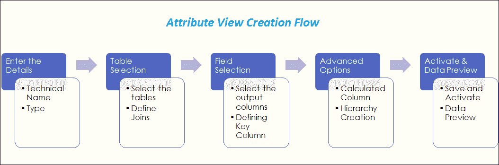

**为属性视图创建表**

在这里，我们将为产品表创建标准属性视图，因此首先我们创建“ PRODUCT”和“ PRODUCT_DESC”表。

用于创建表的 SQL 脚本如下所示–

产品表脚本-

```
CREATE	 COLUMN TABLE "DHK_SCHEMA"."PRODUCT"
(	
"PRODUCT_ID"	NVARCHAR (10) PRIMARY KEY,								
"SUPPLIER_ID"	NVARCHAR (10),				
"CATEGORY" NVARCHAR (3),				
"PRICE"	 DECIMAL (5,2)
);		

INSERT	INTO "DHK_SCHEMA"."PRODUCT" VALUES ('A0001','10000','A', 500.00);																	
INSERT	INTO "DHK_SCHEMA"."PRODUCT" VALUES ('A0002','10000','B', 300.00);																	
INSERT INTO "DHK_SCHEMA"."PRODUCT" VALUES ('A0003','10000','C', 200.00);																	
INSERT	INTO "DHK_SCHEMA"."PRODUCT" VALUES ('A0004','10000','D', 100.00);																	
INSERT	INTO "DHK_SCHEMA"."PRODUCT" VALUES ('A0005','10000','A', 550.00);

```

产品说明表脚本-

```
CREATE COLUMN TABLE "DHK_SCHEMA"."PRODUCT_DESC"									
(	
"PRODUCT_ID" NVARCHAR (10) PRIMARY KEY,								
"PRODUCT_NAME" NVARCHAR (10)				
);

INSERT INTO	"DHK_SCHEMA"."PRODUCT_DESC"	VALUES ('A0001','PRODUCT1');															
INSERT INTO	"DHK_SCHEMA"."PRODUCT_DESC"	VALUES ('A0002','PRODUCT2');															
INSERT INTO	"DHK_SCHEMA"."PRODUCT_DESC"	VALUES ('A0003','PRODUCT3');															
INSERT INTO	"DHK_SCHEMA"."PRODUCT_DESC"	VALUES ('A0004','PRODUCT4');															
INSERT INTO	"DHK_SCHEMA"."PRODUCT_DESC"	VALUES ('A0005','PRODUCT5');

```

现在，在模式“ DHK_SCHEMA”中创建表“ PRODUCT”和“ PRODUCT_DESC”。

**属性视图创建**

**步骤 1）**在此步骤中，

1.  选择“ SAP HANA 系统”。
2.  选择内容文件夹。
3.  在内容节点的 Package DHK_SCHEMA 下选择 Non-Structural Package Modeling，然后右键单击> new。
4.  选择属性视图选项。

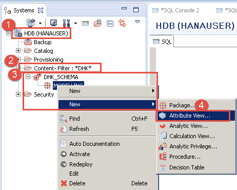

**STEP 2）**现在在下一个窗口中，

1.  输入属性名称和标签。
2.  选择视图类型，这里选择属性视图。
3.  选择子类型为“标准”。
4.  单击完成按钮。

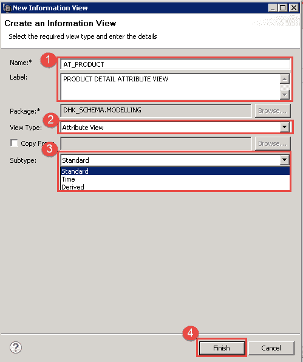

**步骤 3）**信息视图编辑器屏幕将打开。 信息编辑器中各部分的详细信息如下-

1.  方案窗格**：**在此窗格中，存在以下节点-

*   语义学
*   数据基础

2.  详细信息窗格**：**在此窗格中，存在以下选项卡–

*   **列**
*   **视图属性**
*   **等级**

3.  语义（场景窗格）：此节点表示视图的输出结构。 这是维度。
4.  数据基础（场景窗格）：此节点表示我们用于定义属性视图的表。
5.  在这里，我们放下用于创建属性视图的表。
6.  将显示详细信息选项卡（列，视图属性，层次结构）的窗格。
7.  **本地**：此处将显示所有本地属性详细信息。
8.  显示：筛选本地属性。
9.  属性的详细信息。
10.  这是用于性能分析，查找列，验证，激活，数据预览等的工具栏。

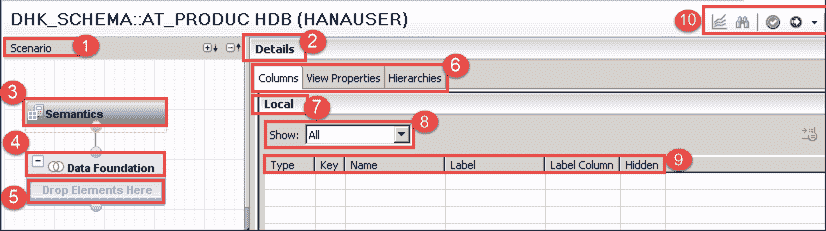

**STEP 4）**要包含用于创建属性视图的数据库表，请单击数据基础节点，然后按照以下说明逐步进行操作-

1.  从 DHK_SCHEMA 下的 TABLE 节点拖动表“ PRODUCT”和“ PRODUCT_DESC”
2.  将“ PRODUCT”和“ PRODUCT_DESC”拖放到数据基础节点。
3.  从“产品”表中选择字段作为“详细输出”窗格。 字段图标的颜色从灰色变为橙色。
4.  在详细信息窗格中，从“ PRODUCT_DESC”表中选择字段作为输出。 字段图标的颜色从灰色变为橙色。
5.  从两个表中选择作为输出的字段显示在“输出窗格”的“列列表”下。

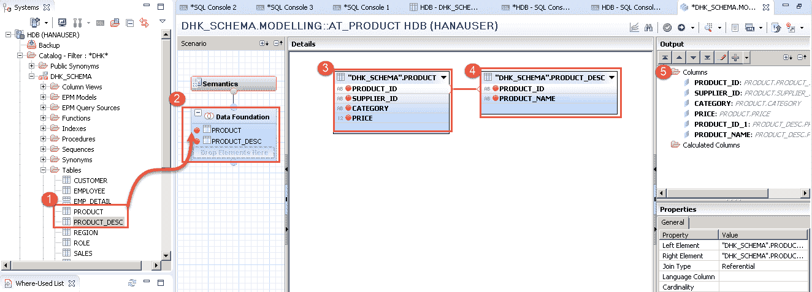

通过“ PRODUCT_ID”字段将“ PRODUCT”表连接到“ PRODUCT_DESC”。

**STEP 5）**选择 Join path 并右键单击它，然后选择 Edit 选项。 出现“编辑加入条件”屏幕

1.  选择联接类型作为类型“内部”。
2.  选择基数为“ 1..1”。

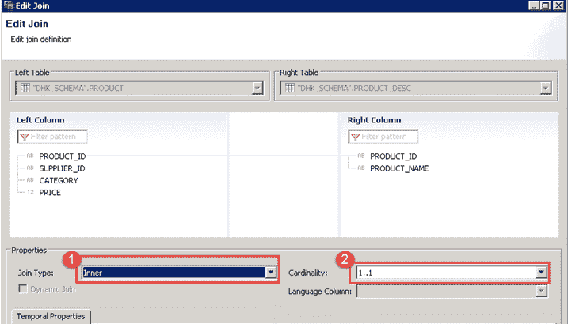

选择联接类型后，单击“确定”按钮。 在下一步中，我们选择列并定义输出键。

**步骤 6）**在此步骤中，我们将选择列并定义输出键

1.  选择语义面板。
2.  列选项卡将出现在详细信息窗格下。
3.  选择“ PRODUCT_ID”作为密钥。
4.  字段 PRODUCT_ID_1（PRODUCT_DESC 表字段）的选中隐藏选项。
5.  单击验证按钮。
6.  成功验证后，单击激活按钮。

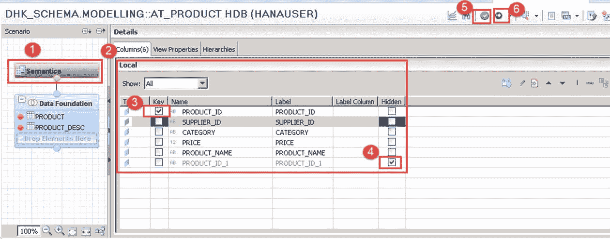

用于验证和激活活动的作业日志显示在同一页面的屏幕底部，即如下所示的“作业日志”部分-

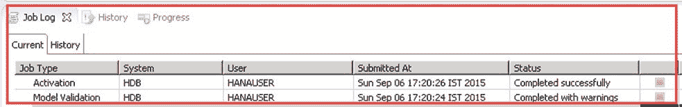

**STEP 7）**将创建名称为“ AT_PRODUCT”的属性视图。 要查看，请刷新“属性视图”文件夹。

1.  转到 DHK_SCHEMA- > MODELING 程序包。
2.  属性视图文件夹下的 AT_PRODUCT 属性视图显示。


**STEP 8）**要在属性视图中查看数据，请选择

1.  从工具栏中选择数据预览选项。
2.  从属性视图的数据视图中将有两个选项–

*   在数据预览编辑器中打开（这将显示带有分析选项的数据）。
*   在 [SQL](/sql.html) 编辑器中打开。 （这会将输出显示为仅 SQL 查询输出）。

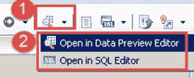

**STEP 9）**在数据预览编辑器中查看视图属性数据–

有 3 个选项-分析，区别和原始数据

**分析**：这是属性视图的图形表示。

1.  通过选择分析选项卡，我们选择标签和轴格式视图的属性。
2.  在标签轴上拖放属性，它将显示在标签轴（X 轴）上。
3.  在值轴上拖放属性，它将在值轴（Y 轴）上显示。
4.  输出将以图表，表格，表格和 HTML 格式提供。

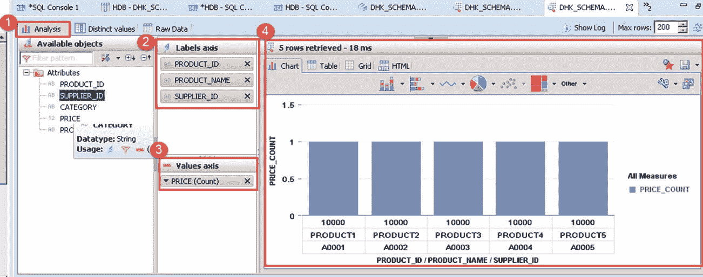

**不同值**：可以在此处显示列的不同值。 这将显示总数。 记录所选属性。

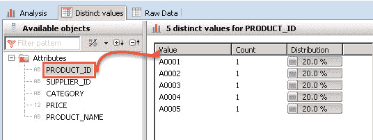

**原始数据选项卡：**此选项以表格格式显示属性视图的数据。

1.  单击原始数据选项卡
2.  它将以表格格式显示数据

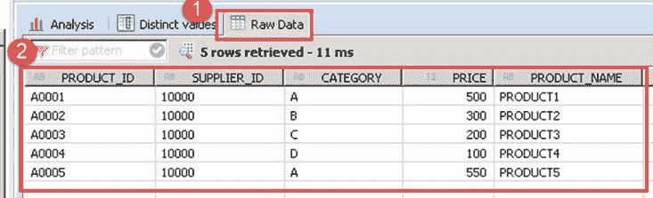

**STEP 10）**从 SQL 编辑器中查看属性数据，如下所示–

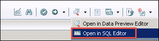

此选项通过 SQL 查询从“ SYS_BIC”模式下的列视图显示数据。 名为“将在激活属性视图“ AT_PRODUCT”后创建的名称”的列视图。该视图用于查看用于从视图显示数据的 SQL 查询。

1.  显示用于数据选择的 SQL 查询。
2.  显示输出。


激活属性视图后，将创建 _SYS_BIC 模式下的列视图。 因此，当我们运行数据预览时，系统从 _SYS_BIC 模式下的列视图中选择数据。

目录节点“ _SYS_BIC”下的“ AT_PRODUCT”列视图的屏幕快照如下-

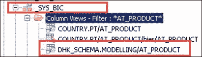