# SAP HANA Analytic View：完整教程

> 原文： [https://www.guru99.com/sap-hana-analytic-view.html](https://www.guru99.com/sap-hana-analytic-view.html)

**什么是 SAP HANA Analytic 视图？**

SAP HANA Analytic 视图基于 STAR Schema Modelling，它表示 OLAP /多维建模对象。

在 SAP HANA Analytic 视图中，维度表与包含事务数据的事实表结合在一起。 维度表包含描述性数据。 （例如产品，产品名称，供应商，客户等）。 事实表同时包含描述性数据和可衡量的数据（金额，税金等）。

*   SAP HANA Analytic 视图形成了类似立方体的结构，该结构用于数据分析。
*   Analytic View 主要用于需要基础表中的汇总数据的情况。

**示例**：

在此，我们根据先前创建的属性视图“ AT_PRODUCT”为采购订单创建一个分析视图。

我们使用表采购订单表头和采购订单明细表。

在“ DHK_SCHEMA”中创建表“ PURCHASE_ORDER”的 SQL 脚本

```
CREATE	 COLUMN TABLE "DHK_SCHEMA"."PURCHASE_ORDER"					
(		
PO_NUMBER NVARCHAR(10) primary key,							
COMPANY NVARCHAR (4),			
PO_CATEGORY NVARCHAR(2),			
PRODUCT_ID NVARCHAR(10),			
VENDOR NVARCHAR(10),			
TERMS NVARCHAR(4),			
PUR_ORG NVARCHAR(4),			
PUR_GRP NVARCHAR(3),			
CURRENCY NVARCHAR(5),			
QUOTATION_NO NVARCHAR(10),			
PO_STATUS VARCHAR(1),			
CREATED_BY NVARCHAR(20),			
CREATED_AT DATE		
);		

INSERT	INTO "DHK_SCHEMA"."PURCHASE_ORDER" VALUES(1000001,1000,'MM','A0001','V000001','CASH' ,1000,'GR1','INR',1000011,'A','HANAUSER','2016-01-07');																													
INSERT INTO "DHK_SCHEMA"."PURCHASE_ORDER" VALUES(1000002,2000,'MM','A0002','V000001','CASH',1000,'GR1','INR',1000012,'A','HANAUSER','2016-01-06');																			
INSERT INTO "DHK_SCHEMA"."PURCHASE_ORDER" VALUES(1000003,2000,'MM','A0003','V000001','CASH',1000,'GR1','INR',1000013,'A','HANAUSER','2016-01-07');																			
INSERT INTO "DHK_SCHEMA"."PURCHASE_ORDER" VALUES(1000004,2000,'MM','A0004','V000001','CASH',1000,'GR1','INR',1000014,'A','HANAUSER','2016-01-07');

```

在“ DHK_SCHEMA”中创建表“ PURCHASE_DETAIL”的 SQL 脚本

```

CREATE	 COLUMN TABLE "DHK_SCHEMA"."PURCHASE_DETAIL"					
(		
PO_NUMBER NVARCHAR(10) primary key,							
COMPANY NVARCHAR(4),			
PO_CATEGORY NVARCHAR(2),			
PRODUCT_ID NVARCHAR(10),			
PLANT NVARCHAR(4),			
STORAGE_LOC NVARCHAR(4),			
VENDOR NVARCHAR(10),			
TERMS NVARCHAR(4),			
PUR_ORG NVARCHAR(4),			
PUR_GRP NVARCHAR(3),			
CURRENCY NVARCHAR(5),			
QUANTITY SMALLINT,			
QUANTITY_UNIT VARCHAR(4),			
ORDER_PRICE DECIMAL(8,2),			
NET_AMOUNT DECIMAL(8,2),			
GROSS_AMOUNT DECIMAL(8,2),			
TAX_AMOUNT DECIMAL(8,2)			
);		

INSERT	INTO "DHK_SCHEMA"."PURCHASE_DETAIL"	VALUES(1000001,1000,'MM','A0001',1001,101,
'V000001','CASH',1000,'GR1','INR',10,'UNIT',50000.00,40000.00,50000.00,10000.00);																									
INSERT	INTO "DHK_SCHEMA"."PURCHASE_DETAIL"	VALUES(1000002,2000,'MM','A0002',1002,102,
'V000002','CASH',1000,'GR1','INR',10,'UNIT',60000.00,48000.00,60000.00,12000.00);																									
INSERT	INTO "DHK_SCHEMA"."PURCHASE_DETAIL"	VALUES(1000003,2000,'MM','A0003',1003,103,
'V000001','CASH',1000,'GR1','INR',20,'UNIT',40000.00,32000.00,40000.00,8000.00);																									
INSERT	INTO "DHK_SCHEMA"."PURCHASE_DETAIL"	VALUES(1000004,2000,'MM','A0004',1004,104,
'V000002','CASH',1000,'GR1','INR',20,'UNIT',20000.00,16000.00,20000.00,4000.00);																									

```

使用此表脚本，将使用数据创建两个表“ PURCHASE_ORDER”和“ PURCHASE_DETAIL”。

### SAP HANA 解析视图创建

我们将创建一个名称为“ AN_PUR​​CHASE_ORDER”的 SAP HANA Analytic View，并具有已创建的属性视图“ AT_PRODUCT”，表“ PURCHASE_ORDER”和“ PURCHASE_DETAIL”。

**步骤 1）**在此步骤中，

1.  在 DHK_SCHEMA 包下选择 Modeling 子包。
2.  右键单击->新建。
3.  选择“分析视图”选项。

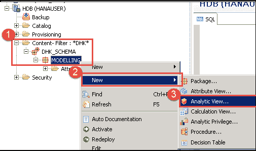

**STEP 2）**信息视图编辑器将显示为 Analytic View –

1.  输入“分析视图名称”为“ AN_PUR​​CHASE_ORDERS”并为其添加标签。
2.  选择视图类型作为“分析视图”。

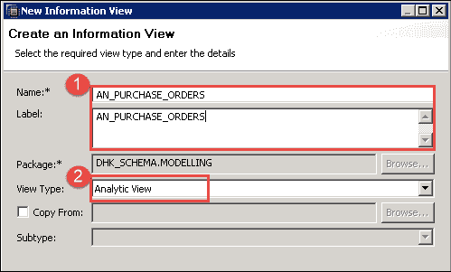

选择数据后，单击“完成”按钮。

将显示信息视图编辑器以进行分析视图。

**STEP 3）**在“方案”窗格下的“数据基础”节点中的架构中添加表。 方案窗格下将有三个节点-

1.  **语义**：此节点表示视图的输出结构。
2.  **启动联接**：该节点创建联接以将属性视图与事实表联接。
3.  **数据基础**：在此节点中，我们为 Analytic View 添加 FACT 表。 可以添加多个表，但是只能从一个表中选择度量。
4.  将表“ PURCHASE_ORDER”和“ PURCHASE_DETAIL”从 DHK_SCHEMA 拖放到“方案”窗格的“数据基础节点”。

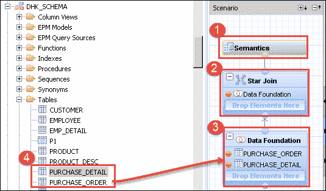

**STEP 4）**在星形联接节点中添加属性视图。

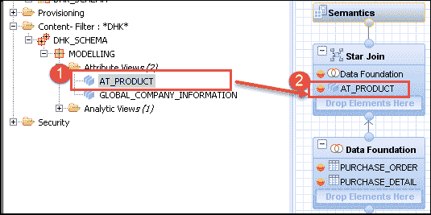

1.  从“建模”包中选择“ AT_PRODUCT”属性视图。
2.  在“星形连接”节点中拖放属性视图。

**步骤 5）**在详细信息面板的同一窗口中，按照指示进行操作，

1.  单击数据基础节点。 添加到数据基础节点中的表将显示在“详细信息”部分中。
2.  将表“ PURCHASE_ORDER”联接到表“ PURCHASE_DETAIL”的“ PO_NUMBER”字段中。
3.  输入加入类型和基数。

[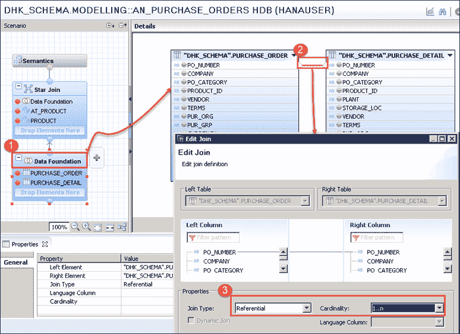 ](/images/sap-hana/030216_1026_SAPHANAMode35.png) 

单击确定按钮。

**STEP 6）**在同一窗口中，

1.  从“ PURCHASE_DETAIL”表中选择 PO_NUMBER，COMPANY，PO_CATEGORY，PRODUCT_ID，PLANT，STORAGE_LOC。
2.  从“ PURCHASE_DETAIL”表中选择“ CURRENCY”列。
3.  选择 GROSS_AMOUNT，TAX_AMOUNT。
4.  从“ PURCHASE_HEADER”表中选择 PO_STATUS，CREATED_BY，CREATED_AT 列。

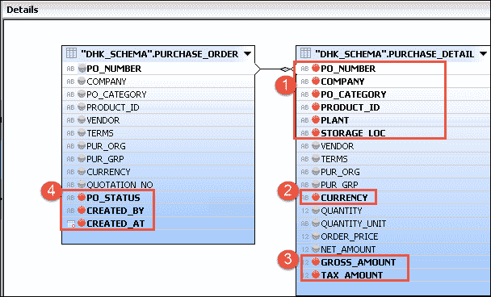

所有选定的列（橙色）将显示在“分析”视图的输出中。

**STEP 7）**现在，将属性视图连接到事实表（数据基础）。

单击语义窗格中的“星形连接节点”，如下所示–

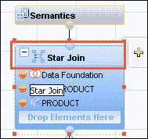

属性视图和事实表将显示在详细信息窗格中。 现在，我们将属性视图加入事实表，如下所示：

在“ PRODUCT_ID”列上将属性视图与 Data Foundation 连接起来。

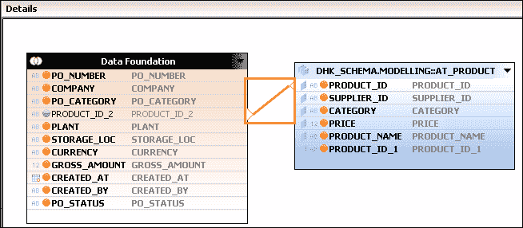

单击加入链接，将显示一个用于编辑加入的弹出窗口。 将联接类型定义为“引用”和基数 1 ... 1。


单击确定按钮。

**STEP 8）**在此步骤中，我们定义视图的属性，度量和键。

1.  Select Semantics Node in Scenario Pane.

    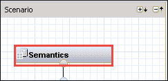

2.  在“详细信息”窗格下，选择“列”选项卡。
3.  将列类型定义为属性和度量，我将所有列都定义为属性，但“ GROSS_AMOUNT”除外，后者被定义为度量。

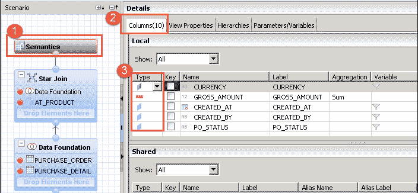

**STEP 9）**验证并激活分析视图

1.  验证分析视图。
2.  激活分析视图。

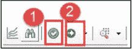

现在，将在“建模”子软件包的“分析文件夹”中创建并激活分析视图“ AN_PUR​​CHASE_ORDERS”，如下所示：

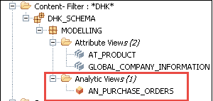

**STEP 10）**在分析视图中预览数据。

1.  转到工具栏部分，然后单击“数据预览”图标。
2.  选择在数据预览编辑器中打开。


同样，我们使用 3 个选项在“数据预览编辑器”中查看数据–

1.  **分析–** 在此选项卡中，我们必须在标签轴和值轴上拖放属性和度量。 我们可以看到图表，表格，表格和 HTML 格式的输出。

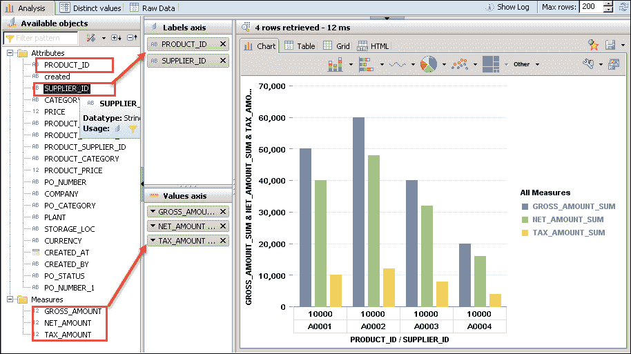

2.  **不同值–** 不同值显示所选属性的不同值。 我们一次只能选择一个属性。

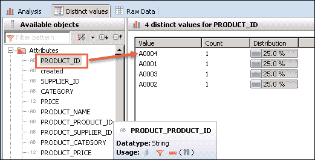

3.  **Raw Data** – It will show in Table format from Raw Data tab as below -

    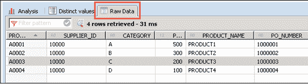

**注意**： SAP HANA Analytic 视图只能包含属性视图，并且不支持联合。