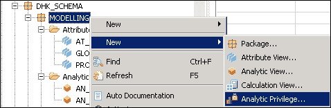
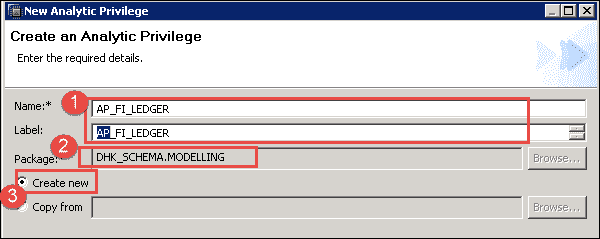
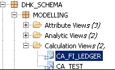
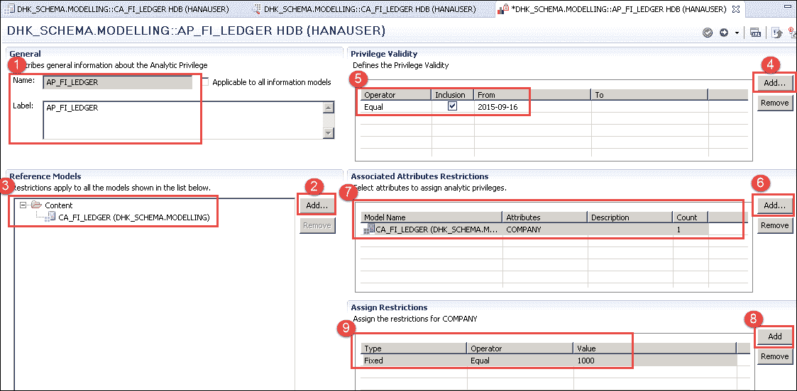
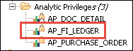
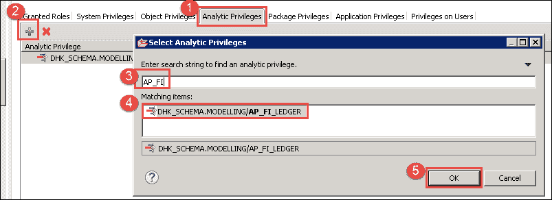
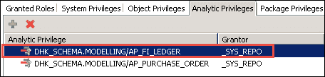
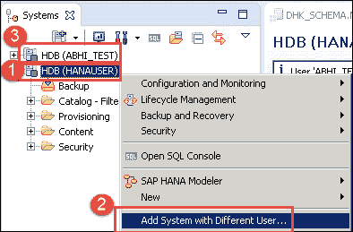
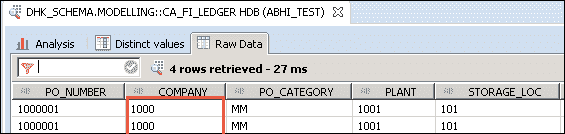

# SAP HANA 分析特权教程

> 原文： [https://www.guru99.com/sap-hana-analytic-privileges.html](https://www.guru99.com/sap-hana-analytic-privileges.html)

分析特权限制用户查看其授权的数据。 SAP HANA Analytic Privileges 用于安全目的。

SQL 特权在对象级别而非记录级别提供授权，因此将提供记录或行级别的授权“分析特权”。

SAP HANA Analytic Privileges 用于在以下信息视图上提供授权–

*   属性视图
*   分析视图
*   计算视图

现在，我们将创建一个分析特权，并将其分配给用户“ ABHI_TEST”，通过该分析，我们限制用户仅查看值 1000 的公司的数据。

**步骤 1）**转到以下选项-

建模程序包（右键单击）->新增功能->分析权限。

**步骤 2）**出现新的分析特权弹出窗口

1.  输入分析特权名称/标签。
2.  软件包名称会自动选择。
3.  选择选项将创建新的。

单击“确定”按钮，在下一步中将显示“分析权限”编辑器以添加和编辑权限。

**步骤 3）**分析权限编辑器将打开，如下所示：

1.  在常规部分中，显示名称和标签。
2.  单击参考模型部分中的“添加按钮”。
3.  Select Calculation View (CA_FI_LEDGER) which we created earlier.

    

4.  单击添加按钮以创建特权的有效性。
5.  分配权限有效性。
6.  单击添加按钮以选择分配限制的属性。
7.  选择属性公司。
8.  单击添加按钮为属性分配一个值以进行限制。
9.  通过选择类型/运算符和值来分配值。 在这里，我们希望限制用户查看唯一一家公司（1000）的计算视图数据。

验证并激活分析特权，将在“建模”程序包下的“分析特权”文件夹中创建一个分析特权，如下所示-

**步骤 4）**现在，我们将为用户“ ABHI_TEST”分配分析权限。 “ ABHI_TEST”用户具有访问建模包的特权。

双击安全性->用户中的用户“ ABHI_TEST”。

1.  选择“分析特权”选项卡。
2.  点击“ +”按钮。
3.  将显示“选择分析特权”的弹出窗口。 输入我们之前创建的分析特权的名称。
4.  选择“分析特权”。
5.  单击确定按钮。

分析特权添加如下：

**步骤 5）**现在，我们通过单击部署按钮在用户中部署此更改。

显示一条消息，如下所示–

用户“ ABHI_TEST”已更改。

**步骤 6）**检查分析特权分配给用户“ ABHI_TEST”的工作是否正常。

通过选择 HANAUSER 系统登录“ ABHI_TEST”用户，如下所示–

1.  选择“ HDB（HANAUSER）当前系统”，然后单击鼠标右键。
2.  选择“使用其他用户添加系统”，然后为用户“ ABHI_TEST”输入用户名/密码。
3.  系统 HDB（ABHI_TEST“）将添加到系统列表中。

ABHI_TEST 用户无法完全访问 HANAUSER 创建的“计算”视图的数据，因为 HANAUSER 已为公司-1000 创建了用于限制此计算视图的分析特权，并已分配给 ABHI_TEST 用户。

因此，转到内容文件夹->选择包->计算视图（CA_FI_LEDGER）->右键单击->数据预览。

数据预览屏幕将显示如下-

计算视图中的数据将限于公司代码 1000。

