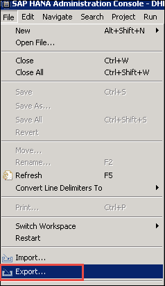
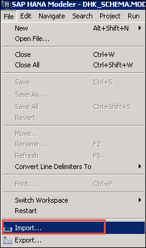
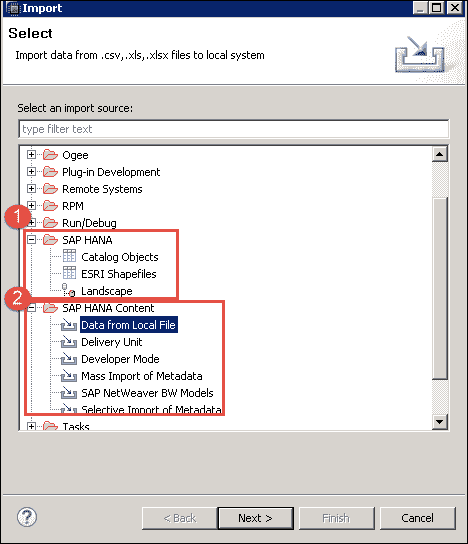

# SAP HANA 导入和导出教程

> 原文： [https://www.guru99.com/sap-hana-import-and-export.html](https://www.guru99.com/sap-hana-import-and-export.html)

SAP HANA 的“导入和导出”选项提供将表，信息视图，横向移动到其他或同一系统上的功能。

在本文中，我们将学习

1）出口

2）汇入

**导出**：

**步骤 1）**转到文件菜单->选择导出。

将显示用于导出的弹出窗口–

将显示两个用于 SAP HANA 对象的导出选项–

1.  **SAP HANA**

*   **目录对象**：用于导出目录对象（表，视图，过程等）。
*   **景观**：用于从一个系统到另一个系统的导出景观。

2.  **SAP HANA 内容**

*   **更改和运输系统（CTS）**：用于通过 ABAP 程序查看导出信息。
*   **交付单位**：交付单位是单个单位。 此选项用于导出映射到单个交付单位的多个包裹。
*   **开发人员模式**：此选项可用于将单个对象导出到本地系统中的某个位置。
*   **SAP 支持模式**：这可用于导出带有数据的对象以用于 SAP 支持。

 

**导入**：

**步骤 1）**转到文件菜单->选择导入。

将显示“导入选项”的弹出窗口–

将显示两个 SAP HANA 对象的导入选项–

1.  **SAP HANA**
    *   **目录对象**：用于导入目录对象（表，视图，过程等）。
    *   **ESRI 形状文件**：环境系统研究院有限公司（ESRI）形状文件格式用于存储数据集中的几何数据和空间特征的属性信息。
    *   **景观**：用于将景观从一个系统导入到另一个系统。
2.  **SAP HANA 内容**
    *   **来自本地文件的数据**：用于从表中的.csv，.xls，.xlsx 文件导入数据。
    *   **交付单位**：交付单位是单个单位。 此选项用于导入映射到单个交付单位的多个包裹。
    *   **开发人员模式**：此选项可用于将单个对象导入本地系统中的某个位置。
    *   **元数据的批量导入**：这可用于导入 Mass 对象的元数据。
    *   **SAP Net Weaver BW 模型**：可用于将 BW 模型导入 SAP HANA。
    *   **元数据的选择性导入**：可用于将单个对象的元数据导入 SAP HANA。

