# SAP HANA 安全性：完整教程

> 原文： [https://www.guru99.com/sap-hana-security.html](https://www.guru99.com/sap-hana-security.html)

##### 什么是 Sap Hana Security？

SAP HANA 安全保护重要数据免受未经授权的访问，并确保标准和合规性符合公司采用的安全标准。

SAP HANA 提供了一种功能，即多租户数据库，可以在单个 SAP HANA 系统上创建多个数据库。 它被称为多租户数据库容器。 因此，SAP HANA 为所有多租户数据库容器提供了所有与安全相关的功能。

SAP HANA 提供以下与安全性相关的功能–

*   用户和角色管理
*   授权书
*   认证方式
*   持久层中的数据加密
*   网络层中的数据加密

**SAP HANA 用户和角色**

SAP HANA 用户和角色管理配置取决于以下架构–

1.  **3-Tier Architecture.**

    SAP HANA 可以用作 3 层体系结构中的关系数据库。

    在此体系结构中，安全功能（授权，身份验证，加密和审核）安装在应用程序服务器层上。

    SAP 应用程序（ERP，BW 等）仅在技术用户或数据库管理员（基础人员）的帮助下连接到数据库。 最终用户无法直接访问数据库或数据库服务器。

[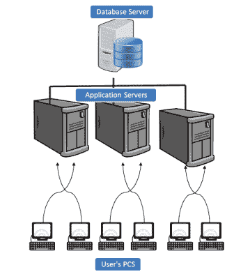 ](/images/sap-hana/030216_1259_SAPHANASECU1.png) 

2.  **2-Tier Architecture.**

    **SAP HANA 扩展应用程序服务（SAP HANA XS）**基于 2 层体系结构，其中应用程序服务器，Web 服务器和开发环境嵌入在单个系统中。

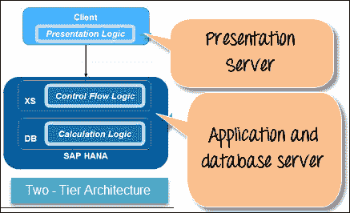

## SAP HANA 身份验证

数据库用户标识谁在访问 SAP HANA 数据库。 通过名为“身份验证”的过程进行验证。 SAP HANA 支持许多身份验证方法。 单点登录（SSO）用于集成多种身份验证方法。

SAP HANA 支持以下身份验证方法-

*   **Kerberos：**在以下情况下可以使用–
    *   直接从 JDBC 和 ODBC 客户端（SAP HANA Studio）。
    *   使用 HTTP 访问 SAP HANA XS 时。
*   **User Name / Password**

    当用户输入其数据库用户名和密码时，SAP HANA 数据库将对用户进行身份验证。

*   **Security Assertion Markup Language(SAML)**

    **SAML** 可用于验证直接通过 ODBC / JDBC 访问 SAP HANA 数据库的 SAP HANA 用户。 这是将外部用户身份映射到内部数据库用户的过程，因此用户可以使用外部用户 ID 登录 sap 数据库。

*   **SAP Logon and Assertion Tickets**

    可以通过登录票证或断言票证对用户进行身份验证，该票证已被配置并颁发给用户以创建票证。

*   **X.509 Clients Certificates**

    通过 HTTP 进行 SAP HANA XS 访问时，可以使用由受信任的证书颁发机构（CA）签名的客户端证书来对用户进行身份验证。

## SAP HANA 授权

当用户使用客户端界面（JDBC，ODBC 或 HTTP）访问 SAP HANA 数据库时，需要 SAP HANA 授权。

根据提供给用户的授权，它可以对数据库对象执行数据库操作。 此授权称为“特权”。

特权可以直接或间接（通过角色）授予用户。 分配给用户的所有特权将合并为一个单元。

当用户尝试访问任何 SAP HANA 数据库对象时，HANA 系统将通过用户角色对用户执行授权检查，并直接授予特权。

找到请求的特权后，HANA 系统将跳过进一步的检查，并授予对请求数据库对象的访问权限。

在 SAP HANA 中，以下特权是它们的-

| **特权类型** | **说明** |
| 系统特权 | 它控制正常的系统活动。

系统特权主要用于–

*   在 SAP HANA 数据库中创建和删除架构
*   在 SAP HANA 数据库

*   监视和跟踪 SAP HANA 数据库
*   执行数据备份
*   管理许可证
*   管理版本
*   管理审核
*   导入 内容导出和输出
*   维护交货单位

 |
| 对象特权 | 对象特权是 [SQL](/sql.html) 特权，用于授予读取和修改数据库对象的权限。 要访问数据库对象，用户需要具有数据库对象或存在数据库对象的模式的对象特权。 可以将对象特权授予目录对象（表，视图等）或非目录对象（开发对象）。 对象权限如下-

*   创建任何
*   更新，插入，选择，删除，删除，更改，执行
*   INDEX，触发器，调试 ，参考文献

 |
| 分析特权 | 分析特权用于允许对 SAP HANA 信息模型的数据（属性视图，分析视图，计算视图）进行读取访问。

*   在查询处理期间评估此特权。
*   分析特权授予对
*   基于用户角色的相同信息视图中数据不同部分的不同用户访问权限。
*   SAP HANA 数据库中使用了分析特权，以提供行级数据。

控件使单个用户可以在同一视图中查看数据。 |
| 套餐优惠 | 程序包特权用于为 SAP HANA 存储库中的各个程序包的操作提供授权。 |
| 申请特权 | SAP HANA 扩展应用程序服务（SAP HANA XS）中需要访问权限的应用程序特权。

通过 _SYS_REPO 模式中的 GRANT_APPLICATION_PRIVILEGE 和 REVOKE_APPLICATION_PRIVILEGE 过程来授予和撤消应用程序特权。 |
| 用户特权 | 它是一种 SQL 特权，可以由用户在自己的用户上授予。

ATTACH DEBUGGER 是可以授予用户的唯一特权。 |

## SAP HANA 用户管理和角色管理

要访问 SAP HANA 数据库，需要用户。 根据不同的安全策略，SAP HANA 中有两种类型的用户，如下所示–

1.  **Technical User (DBA User) –** Itis a user who directly work with SAP HANA database with necessary privileges. Normally, these users don't get deleted from the database.

    这些用户是为执行管理任务而创建的，例如创建对象并授予对数据库对象或应用程序的特权。

    SAP HANA 数据库系统默认提供以下用户作为标准用户–

*   系统
*   系统
*   _SYS_REPO

2.  **Database or Real User:** Each user who wants to work on SAP HANA database, need a database user. Database user are a real person who works on SAP HANA.

    以下是两种类型的数据库用户：

| **用户类型** | **Description** | **分配了角色** |
| 标准用户 | 该用户可以在自己的架构中创建对象，并在系统视图中读取数据。 使用“ CREATE USER”语句创建的标准用户。 | 为读取的系统视图分配了 PUBLIC 角色。 |
| 受限用户 | 受限用户没有通过 SQL 控制台的完全 SQL 访问权限，而是使用“ CREATE RESTRICTED USER”语句创建的。 如果使用任何应用程序都需要特权，那么将通过角色提供特权。

*   受限用户无法创建数据库对象。
*   受限用户无法查看数据库中的数据。
*   受限用户仅通过 HTTP 连接到数据库。
*   必须使用 SQL 语句启用对客户端连接的 ODBC / JDBC 访问。

 | 用户需要 RESTRICTED_USER_ODBC_ACCESS 或 RESTRICTED_USER_JDBC_ACCESS 角色才能完全访问 ODBC / JDBC 功能 |

SAP HANA 用户管理员有权访问以下活动–

1.  创建/删除用户。
2.  定义和创建角色。
3.  向用户授予角色。
4.  重置用户密码。
5.  根据要求重新激活/取消激活用户。

1.  **Create User in SAP HANA-** only database user with ROLE ADMIN privileges can create user and role in SAP HANA.

    **步骤 1）**要在 SAP HANA Studio 中创建新用户，请转到安全标签，如下所示，并执行以下步骤：

    1.  进入安全节点。
    2.  选择用户（右键单击）->新用户。

    [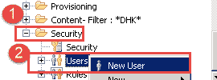 ](/images/sap-hana/030216_1259_SAPHANASECU3.png) 

    **步骤 2）**出现用户创建屏幕。

    1.  输入用户名。
    2.  输入用户密码。
    3.  这些是身份验证机制，默认情况下，用户名/密码用于身份验证。

[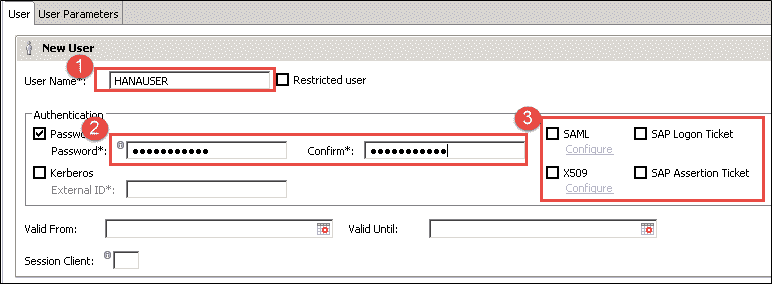 ](/images/sap-hana/030216_1259_SAPHANASECU4.png) 

通过单击部署，将创建  按钮用户。

**2.定义和创建角色**

角色是可以授予其他用户或角色的特权的集合。 该角色包括对数据库对象&应用程序的特权，并取决于作业的性质。

这是授予特权的标准机制。 特权可以直接授予用户。 SAP HANA 数据库中有许多标准角色（例如，MODELLING，MONITORING 等）。

我们可以将标准角色用作创建自定义角色的模板。

角色可以包含以下特权–

*   用于管理和开发任务（CATALOG READ，AUDIT ADMIN 等）的系统特权
*   数据库对象的对象特权（SELECT，INSERT，DELETE 等）
*   SAP HANA 信息视图的分析特权
*   存储库软件包的软件包特权（REPO.READ，REPO.EDIT_NATIVE_OBJECTS 等）
*   SAP HANA XS 应用程序的应用程序特权。
*   用户的特权（用于程序调试）。

**角色创建**

**步骤 1）**在此步骤中，

1.  转到 SAP HANA 系统中的“安全性”节点。
2.  选择角色节点（右键单击），然后选择新建角色。

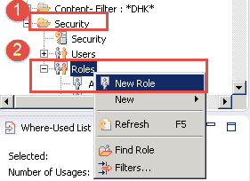

**步骤 2）**显示角色创建屏幕。

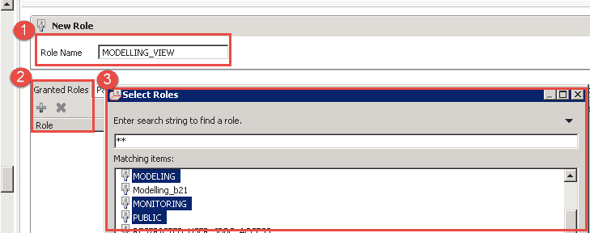

1.  在“新角色块”下输入角色名称。
2.  选择“授予的角色”选项卡，然后单击“ +”图标以添加标准角色或退出角色。
3.  选择所需角色（例如，MODELLING，MONITORING 等）

**步骤 3）**在此步骤中，

1.  所选角色将添加到“授予的角色”选项卡中。
2.  可以通过选择系统特权，对象特权，分析特权，程序包特权等将特权直接分配给用户。
3.  单击部署图标以创建角色。

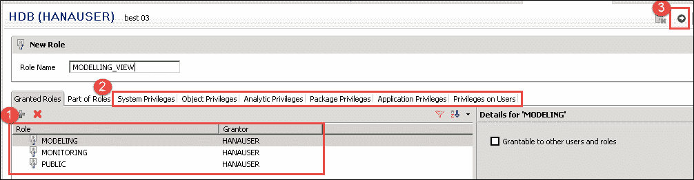

如果您想将此角色分配给其他用户和角色，请勾选“授予其他用户和角色”选项。

**3.向用户**授予角色

**步骤 1）**在这一步中，我们将角色“ MODELLING_VIEW”分配给另一个用户“ ABHI_TEST”。

1.  转到“安全性”节点下的“用户”子节点，然后双击它。 将显示用户窗口。
2.  单击授予角色“ +”图标。
3.  将出现一个弹出窗口，搜索角色名称将分配给用户。

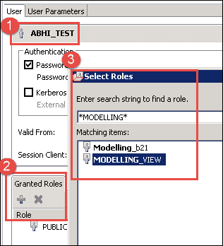

**步骤 2）**在此步骤中，将在“角色”下添加角色“ MODELLING_VIEW”。

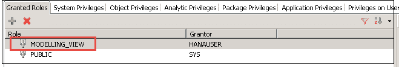

**步骤 3）**在此步骤中，

1.  单击部署按钮。
2.  显示一条消息“ User'ABHI_TEST”已更改。

**4.重置用户密码**

如果需要重设用户密码，请转到“安全性”节点下的“用户”子节点，然后双击它。 将显示用户窗口。

**步骤 1）**在此步骤中，

1.  输入新密码。
2.  输入确认密码。

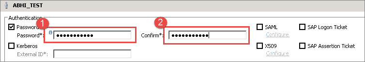

**步骤 2）**在此步骤中，

1.  单击部署按钮。
2.  显示一条消息“ User'ABHI_TEST”已更改。

**5.重新激活/停用用户**

转到“安全性”节点下的“用户”子节点，然后双击它。 将显示用户窗口。

有停用用户图标。 点击它

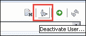

出现确认信息“弹出”。 点击“是”按钮。

将显示一条消息“用户'ABHI_TEST'已停用”。 停用图标的名称更改为“激活用户”。 现在，我们可以从同一图标激活用户。

## SAP HANA 许可证管理

使用 SAP HANA 数据库需要许可证密钥。 可以使用 SAP HANA Studio，SAP HANA HDBSQL 命令行工具和 HANA SQL 查询编辑器来安装和删除许可证密钥。

SAP HANA 数据库支持两种类型的许可证密钥–

*   **永久许可证密钥：**永久许可证密钥有效期至到期日。 我们需要在过期之前请求并应用许可证密钥。 如果许可证密钥过期，则会在 28 天之内自动安装临时许可证密钥。
*   **临时许可证密钥：**随新的 SAP HANA 数据库安装自动安装。 有效期为 90 天，以后可以从 SAP 申请永久密钥。

**授权管理**

**“许可证管理”** 特权是许可证管理所必需的。

## SAP HANA 审核

SAP HANA 审核功能使您可以监视和记录在 SAP HANA 系统中执行的操作。 在创建审核策略之前，应为系统激活此功能。

**授权进行 SAP HANA 审核**

**“审核管理员”** 系统 SAP HANA 审核所需的特权。

**摘要**：

在本教程中，我们学习了以下主题-

*   SAP HANA 安全性概述。
*   SAP HANA 身份验证的详细信息。
*   SAP HANA 授权的详细信息。
*   SAP HANA 用户管理方法。
*   SAP HANA 角色管理方法
*   SAP HANA 许可证管理流程。
*   SAP HANA 角色审核流程。