# SAP HANA 报表

> 原文： [https://www.guru99.com/sap-hana-reporting.html](https://www.guru99.com/sap-hana-reporting.html)

到目前为止，我们已经通过 SAP SLT，SAP BODS 从 SAP Source，Non-SAP 和 Flat 文件加载了数据，并创建了信息视图（属性视图，分析视图和计算视图）。

现在，我们将讨论报表工具中的信息视图–报表工具中的 JDBC，ODBC 和 ODBO 等驱动程序是 SAP HANA Client 的一部分。

因此，通过安装 SAP HANA 客户端软件（* .exe 文件），可使所有驱动程序在 PC 上可用，以连接到 SAP HANA 的报告工具。

在本教程中，我们将使用 SAP BO，SAP Lumira 和 Microsoft Excel 访问 SAP HANA 信息视图。

报告工具的选择取决于所需报告的类型。

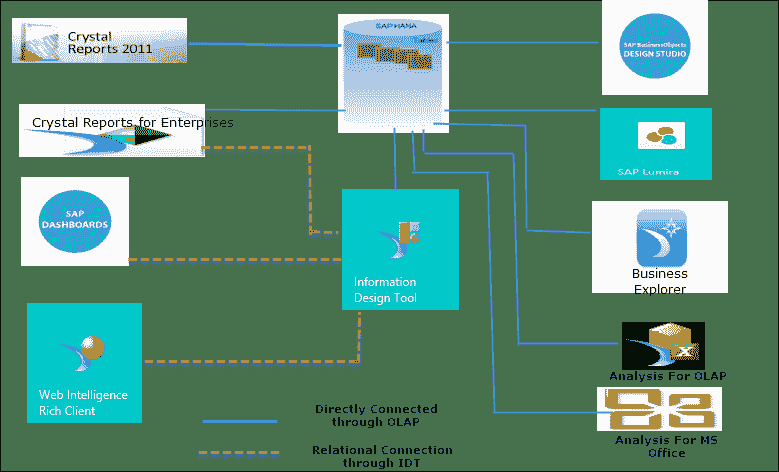

在本教程中，您将学习-

*   [SAP BI（商业智能）概述中的报告](#1)
*   [HANA 上 SAP Business Objects（BO）的 Webi 中的报告](#2)
*   [Crystal Report](#3) 中的报告
*   [在 SAP Lumira 中报告](#4)
*   [在 Microsoft Excel 中报告](#5)

## SAP BI（商业智能）概述中的报告

[SAP BI](/sap-bi.html) 是数据仓库和报告工具。

在 BI（商业智能）中，原始数据将被清理，应用，处理业务逻辑并向用户提供有意义的信息。 BI 是一种 SAP 产品，提供了用户友好的环境。

SAP BI 支持许多数据库，但是当我们从源数据迁移到 SAP HANA 时，架构将如下所示-

SAP BI 是三层体系结构–

1.  数据库服务器–在此，数据物理存储在 PSA，ODS，Infocube 中。
2.  应用程序服务器–用于访问数据库服务器中的数据并为演示服务器处理数据。
3.  演示服务器-将数据显示给用户。

SAP Bex Query Designer（SAP BI 的组件）可以作为信息提供者访问 SAP HANA View，并在 Bex 中显示数据。

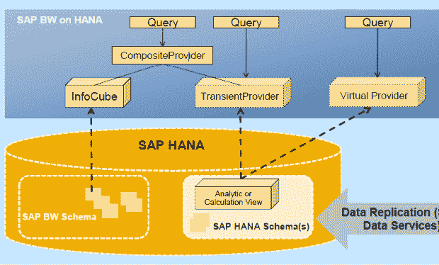

## 来自 HANA 的 SAP Business Object（BO）Webi 中的报表

SAP Business Objects Web Intelligence（SAP BO WebI）是 **SAP Business Objects 平台**（ **SBOP** ）客户端工具家族的一部分。 SAP Business Objects 工具使用 JDBC / ODBC 驱动程序连接到源系统。

SAP BO WebI 的功能如下所示–

*   Webi 是即席报告工具。
*   Webi 用于详细程度报告。
*   Webi 以表格或图形格式显示结果。
*   用户可以创建/修改自己的报告查询。

安装 SAP HANA 客户端后，将在 PC 上安装 JDBC / ODBC 驱动程序。

在向用户展示数据时，这些驱动程序充当 SAP HANA 与客户端报告工具之间的中介。

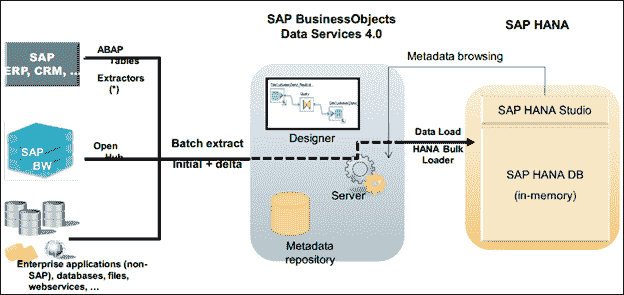

SAP BO Server 和 SAP BO Platform（SBOP）客户端工具。

### 使用信息设计工具创建宇宙

**步骤 1）**在这一步中，我们将使用信息设计工具（IDT）创建一个 Universe。

可以通过 ODBC 和 JDBC 驱动程序访问 HANA，并且可以使用 [SQL](/sql.html) 语言定义和查询 HANA 表。 使用称为 HANA Studio 的工具来管理表。

1.  通过导航到启动 IDT

**开始菜单**-> **SAP Business Intelligence** -> **SAP Business Objects BI 平台 4 客户端工具**-> **信息设计工具**

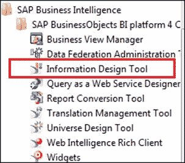

出现信息设计工具屏幕。 要创建 Universe，我们需要 IDT 中的一个项目。

2.  Navigate to Project Option as below-
    1.  单击文件。
    2.  单击新建选项。
    3.  Select Project option.

        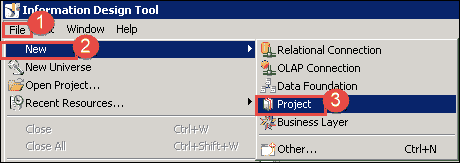

        **或**

        1.  单击新文件图标。
        2.  选择项目。

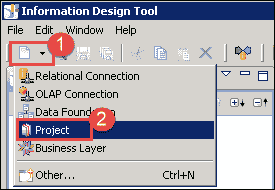

将出现“新建项目”的弹出窗口-在此弹出窗口中，输入以下详细信息：

1.输入项目名称

2.单击完成按钮。

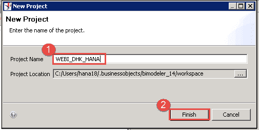

项目名称“ WEBI_DHK_HANA”将显示在“本地项目”选项卡下，如下所示。

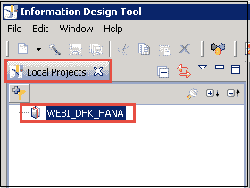

**项目是一个本地工作空间，您可以在其中存储用于构建一个或多个 Universe 的资源。**

有两个可用的连接，每个连接的详细信息如下-

1.  **关系连接–** 要从表中访问数据并访问常规 RDBMS 的，请使用关系连接。
2.  **OLAP 连接–** 要使用应用程序（SAP，Oracle，Microsoft，SAP BO）中的数据和存储在多维数据集/信息视图中的数据，请使用 OLAP 连接。

**步骤 2）**现在我们创建一个**关系连接。**

因此，转到**项目->新建->关系连接。**

出现“新关系连接”源名称的弹出窗口-

1.  输入资源名称。
2.  单击下一步按钮。

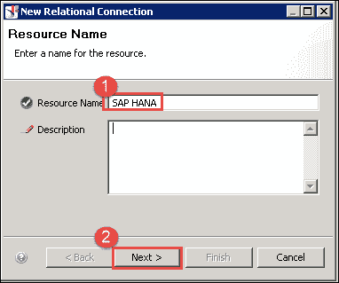

将出现一个用于选择数据库中间件驱动程序的弹出窗口-

1.  在 SAP HANA 数据库 1.0 下选择 JDBC 驱动程序选项。
2.  单击下一步按钮。

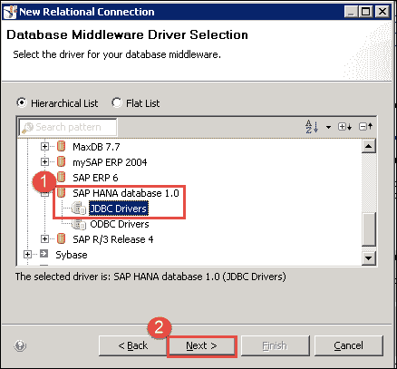

将显示“新关系连接”参数的弹出窗口，并在其中输入以下详细信息。

1.  身份验证模式将被选择为“使用指定的用户名和密码”。
2.  输入 HANA 用户名。
3.  输入密码。
4.  在“数据源”部分中选择“单个服务器”。 输入主机名（最好为 30015）。
5.  输入实例编号。
6.  单击测试连接按钮以验证连接。

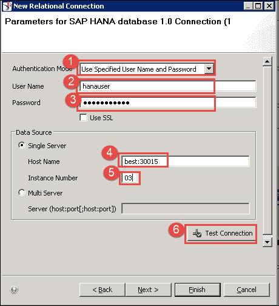

将显示“测试连接成功”的弹出窗口。

成功连接后，将创建名称为 SAP HANA.cnx 的连接。

**步骤 3）**要通过 Web Intelligence，仪表板或 Crystal Report for Enterprise 使用 Universe，我们需要发布连接。 因此，现在我们为 SAP HANA.cnx 发布连接。

1.  右键单击项目“ WEBI_DHK_HANA”，然后在“选择 SAP HANA.cnx”连接下选择。
2.  选择“发布到存储库的连接”。
3.  在存储库中成功发布后，将创建名称为 SAPHANA.cns 的发布连接。

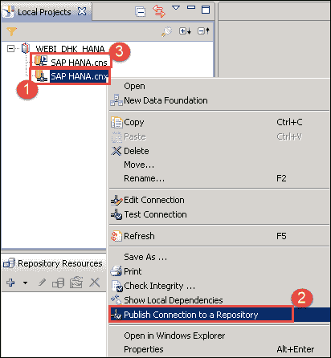

出现用于发布与存储库的连接的弹出窗口–

1.  选择业务 IDT。
2.  单击完成按钮。

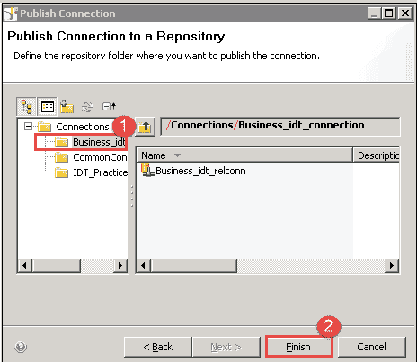

将显示一个弹出窗口“连接已成功发布”。

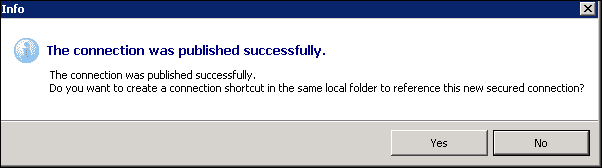

现在，我们使用 SAP HANA 业务层创建 Universe。

**步骤 4）**创建 Universe（Universe 是数据仓库或事务数据库的业务表示形式。Universe 允许用户在不了解数据库复杂性的情况下与数据进行交互）。

要创建 Universe，我们使用 SAP HANA 业务层，如下所示-

**SAP HANA 业务层**

从 SAP BOBI 4.1 开始，SAP 在使用信息设计工具创建 Universe 时提供了一个新选项“ SAP HANA 业务层”。

在 SAP BOBI 4.1 版本之前，我们需要在建立数据基础的同时创建一个派生表，并映射变量和输入参数。

SAP HANA 业务层会根据选定的 SAP HANA 视图自动创建数据基础和业务层。

SAP HANA 业务层会自动检测输入的参数和变量。

我们通过以下 SAP HANA 业务层创建 Universe-

1.  选择创建的项目“ WEBI_DHK_HANA”。
2.  右键单击该项目，然后选择一个新选项。
3.  选择选项“ SAP HANA 业务层”。

[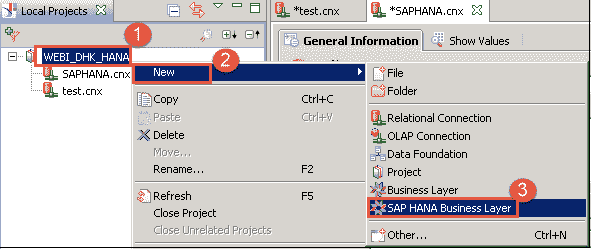 ](/images/sap-hana/030216_1322_SAPHANARepo16.png) 

出现 SAP HANA 业务层弹出窗口-

1.  输入业务层名称。
2.  输入数据基础名称。
3.  输入描述。
4.  单击下一步按钮。

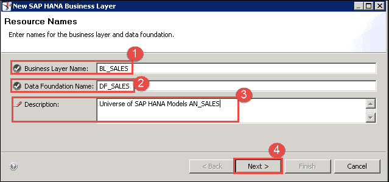

显示“选择 SAP HANA 连接”的弹出窗口-

1.  勾选“ SAPHANA.cnx”连接。
2.  单击下一步按钮。

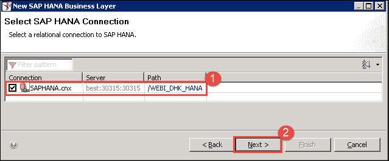

将显示一个弹出窗口，用于选择 SAP HANA 信息模型。

1.  现在，选择在 HANAUSER 软件包下创建的分析视图（AN_PUR​​CHASE_ORDERS）。
2.  单击完成按钮。

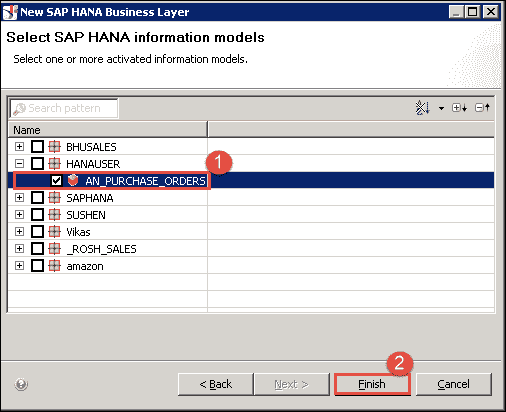

分析视图将在信息设计工具中打开。

**步骤 5）**信息设计工具的详细信息如下-

1.  在“项目”下，将显示所有关系连接，业务层和数据基础。
2.  在资源库资源部分中，将显示存储在资源库中的对象（连接，业务层等）。
3.  业务层显示分析视图的业务视图。 适用于职能人员。
4.  Data Foundation shows table and column name. It is for Technical Person.

    [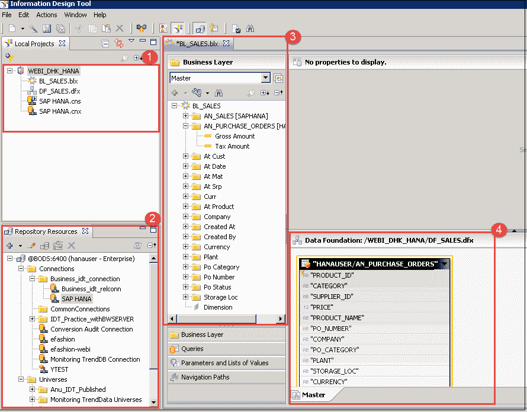 ](/images/sap-hana/030216_1322_SAPHANARepo20.png) 

    **步骤 6）**在此步骤中，

    选择业务层部分，转到名称为 Analytic View 的文件夹。

    现在，按照以下几点进行：

    1.  选择数据基础部分。
    2.  将列拖放到分析视图
    3.  它将在“分析视图”下显示对象
    4.  拖拽字段将显示在“分析视图”（AN_PUR​​CHASE_ORDER）下。

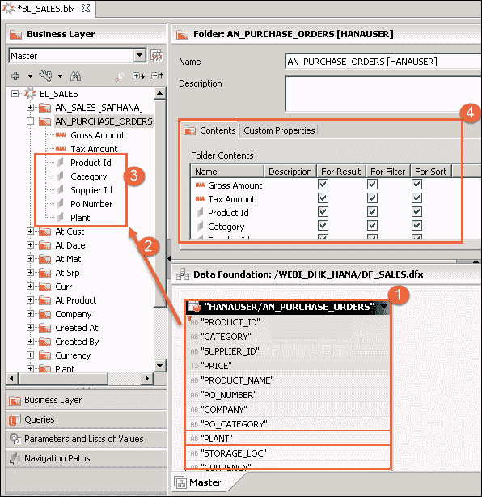

**步骤 7）**在此步骤中，保存所有对象。

转到文件，然后单击“全部保存”选项以保存所有对象。

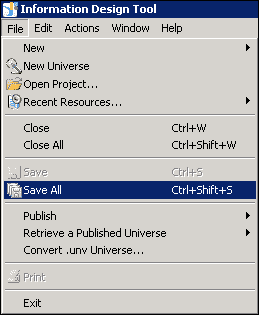

之后，请执行以下步骤。

**步骤 8）**创建查询并查看输出。

1.  转到查询选项。
2.  将显示一个“查询”面板，选择要包括在“查询”中的字段。
3.  将它们拖放到“查询 1 的结果对象”部分。
4.  单击结果集部分上的刷新按钮。
5.  结果将显示。

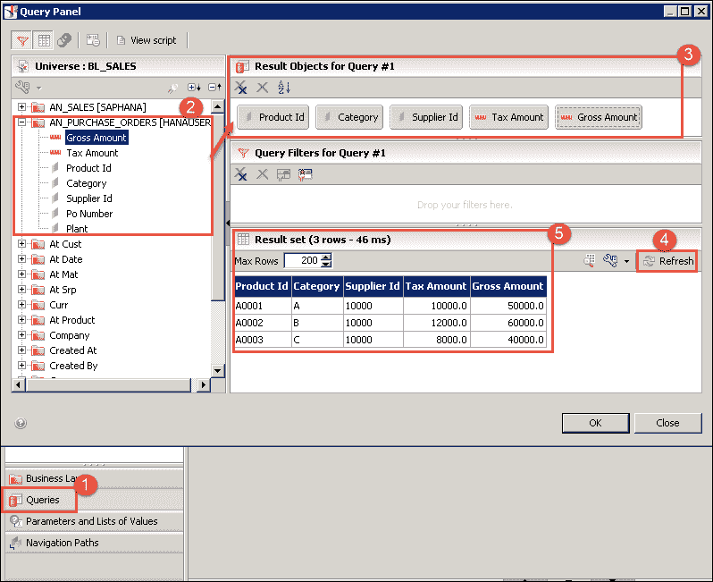

## SAP Crystal Report 中的报告

SAP Crystal Report 帮助我们设计，探索，可视化和提供报告，这些报告可以在 Web 或企业应用程序上运行。 借助 SAP Crystal Report，我们可以创建简单报告或复杂报告。

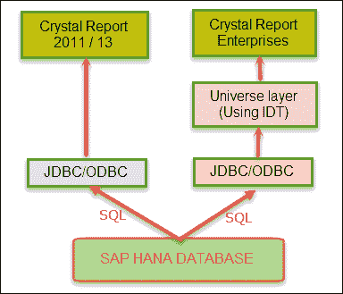

SAP Crystal Reports 有两种类型–

1.  **Crystal Report 2011/13/16：**将在以下情况下使用：

*   如果要从 Crystal Reports 调用 HANA 存储过程。
*   如果要创建 [SQL](/sql.html) 表达式
*   如果要使用参数或变量执行视图并提交非默认值

2.  **企业水晶报表：**将在以下情况下使用：

*   如果有 Universe 可用或需要，请使用 SAP Crystal Reports Enterprises。

我们将为企业使用水晶报表。

**步骤 1）登录到 Crystal Report for Enterprise。**

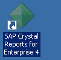

用于企业的 SAP Crystal 报表将显示如下-

1.  它是“报告格式”部分，它提供了另一种格式化工具。
2.  这是窗口的图标（数据资源管理器，大纲，组树，查找）。
3.  将显示数据浏览器的详细信息，轮廓，组树，查找等。
4.  报告页面格式选项。
5.  报告工作区。

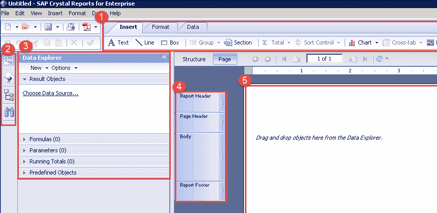

**步骤 2）**现在，我们为数据源创建一个连接。

在数据浏览器中单击“选择数据源”选项-

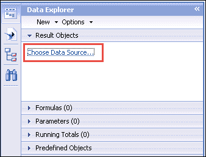

将显示“选择数据源类型”的弹出窗口-

从“ SAP HANA 平台”部分中选择“浏览”选项。

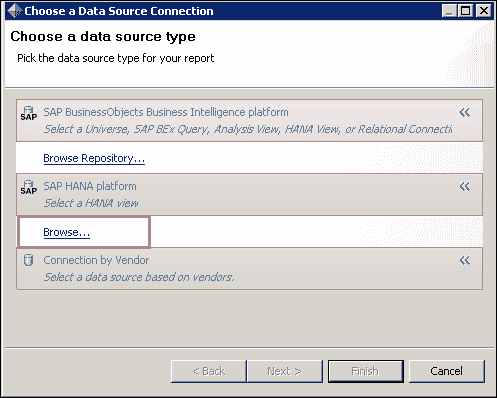

将显示一个用于连接到服务器的弹出窗口。 点击“新服务器”按钮。

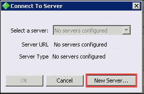

服务器连接窗口将显示如下-

1.  点击添加按钮。
2.  输入连接显示名称（saphana）。
3.  连接名称将出现在连接列表中。
4.  输入 HANA 服务器名称。
5.  输入 HANA 服务器实例名称。
6.  输入 HANA 用户名。
7.  点击“测试连接”按钮。
8.  用于测试连接登录的弹出窗口。 输入 SAP HANA 用户的密码。
9.  单击确定按钮。

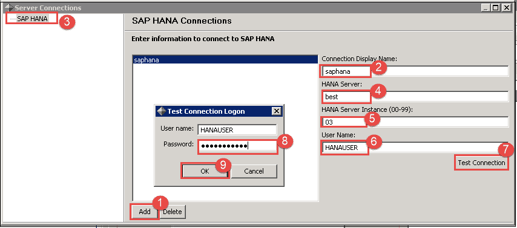

将显示连接成功的消息。

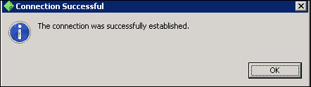

单击确定按钮。

将显示一个用于连接到服务器的弹出窗口。

**步骤 3）**在此步骤中，

1.  我们将做以下事情
    1.  选择服务器“ saphana”。
    2.  点击确定按钮

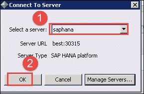

将显示一个输入密码的弹出窗口，输入密码，然后单击“确定”。

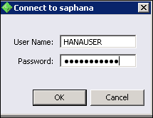

将会出现另一个弹出窗口，用于选择 HANA View。

2）在这一步中，我们选择“ SAP HANA 视图”。

1.  选择“ HANA 视图”（“分析视图” AN_PUR​​CHASE_ORDERS）。
2.  单击确定按钮。

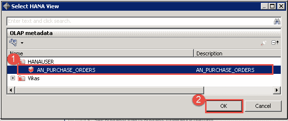

3.  在此步骤中，将打开查询窗口。

按照以下要点创建查询-

1.  从查询列表中选择所需的列。
2.  在查询中拖放必填字段。
3.  单击刷新按钮。
4.  结果集将显示。
5.  单击 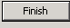 按钮。

报告输出将显示如下-

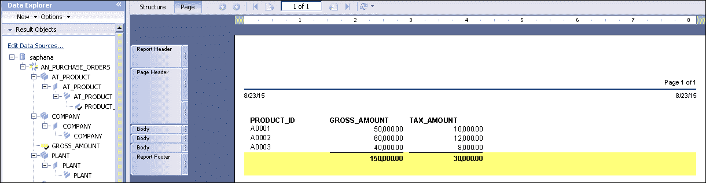

## 在 SAP Lumira 中报告

SAP Lumira 是 SAP 用来分析和可视化数据的新软件。

通过 SAP Lumira，用户可以创建漂亮的交互式地图，infograpg 和图表。 SAP Lumira 可以从 Excel 和其他来源导入数据。

SAP Lumira 可以直接访问 SAP HANA 的信息视图。 SAP HANA 使用仪表板执行可视 BI 分析。

在 SAP Lumira 中，需要执行以下步骤以可视化数据。

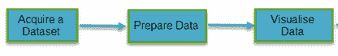

现在我们在 SAP Lumira 中可视化 SAP HANA 视图，因此首先我们通过单击桌面上的 SAP Lumira Client 图标，如下所示登录 SAP Lumira：

**步骤 1）创建文档并获取数据集**

打开 SAP Lumira 后，打开用于在 SAP Lumira 上工作的屏幕，有关此屏幕的详细信息如下-

1.  应用程序工具栏–它包含工具栏，如文件，编辑，视图，数据和帮助。
2.  主页链接–使用此选项，我们可以转到主屏幕。
3.  我的文档部分
    1.  文件资料
    2.  可视化
    3.  数据集
    4.  故事
4.  SAP Lumira Cloud –通过使用此选项，我们可以使用云选项。
5.  连接– W 可以在这里看到所有连接。

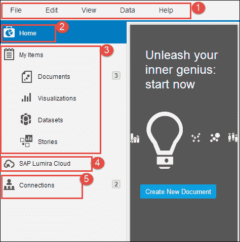

因此，单击“我的项目”部分上的“文档”选项以创建文档–

1.  转到文件应用程序工具栏。，单击文件选项
2.  选择新选项。

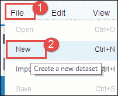

SAP Lumira 支持以下数据集–

*   Microsoft Excel
*   文本
*   从剪贴板复制
*   连接到 SAP HANA
*   从 SAP HANA 下载
*   宇宙
*   用 SQL 查询
*   连接到 SAP Business Warehouse
*   SAP Universe 查询面板

**步骤 2）连接到 SAP HANA**

在这里，我们将连接到 SAP HANA 并访问 SAP HANA 信息视图。

1.  因此，选择“连接到 SAP HANA”。
2.  单击下一步按钮。

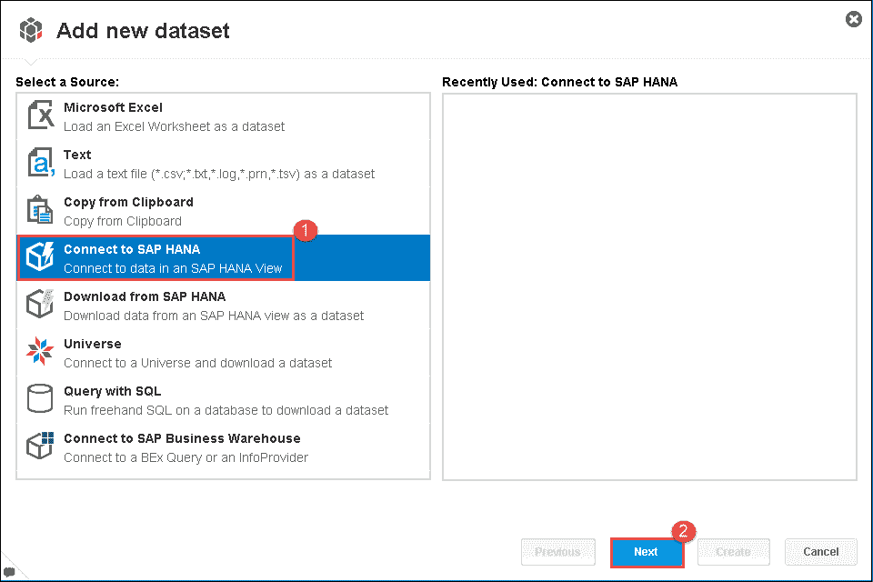

SAP HANA 服务器凭据的弹出窗口将显示如下-

1.  输入 SAP HANA 服务器名称。
2.  输入 SAP HANA 实例号。
3.  输入 SAP HANA 用户名。
4.  输入 SAP HANA 密码。
5.  单击“连接”按钮以连接到 SAP HANA 服务器。

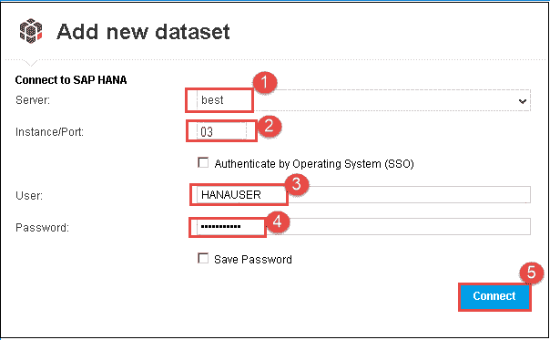

单击“连接”按钮后，我们将连接到 SAP HANA 并能够访问 SAP HANA 视图。

**步骤 3）访问 SAP HANA Analytic View**

选择 SAP HANA 视图的窗口将显示如下-

1.  选择 SAP HANA 视图（此处为“ AN_PUR​​CHASE_ORDERS”）。
2.  单击下一步按钮。

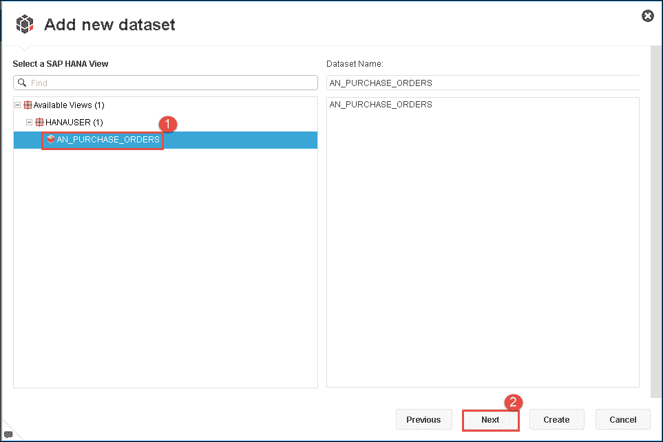

**步骤 4）定义尺寸和尺寸。**

将显示用于选择度量和尺寸的下一个窗口–

1.  所有度量将被分组在度量部分下。
2.  所有维度将归入“维度节”下。
3.  单击创建按钮。

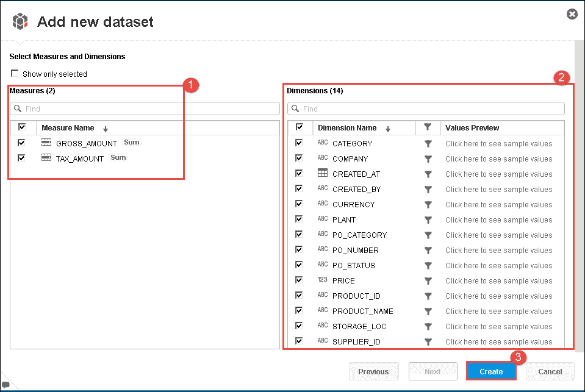

**步骤 5）在 SAP Lumira 中可视化 SAP HANA Analytic View。**

在 SAP HANA 中激活信息视图后，在 SAP HANA 目录节点中创建的“ _SYS_BIC”架构下，使用与信息视图名称相似的列视图。

当需要从 SAP HANA 外部访问任何 SAP HANA 信息视图时，我们只能从“ _SYS_BIC”模式访问它。

将出现一个可视化屏幕，该屏幕在“ _SYS_BIC”模式下选择列视图–

1.  Different Chart Type can be selected from Chart Builder Section.
    1.  单击“图表生成器”图标。
    2.  选择柱形图选项。

    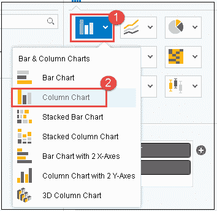

2.  单击“测量”部分前面的“ +”图标，以 Y 轴格式添加测量。
3.  我们添加了“ GROSS_AMOUNT”和“ TAX_AMOUNT”度量。
4.  单击“尺寸”部分前面的图标。 出现所有可用尺寸的列表。
5.  从维度列表中选择“ CATEGORY”，“ PRODUCT_ID”，“ PRODUCT_NAME”以显示在 X 轴上。

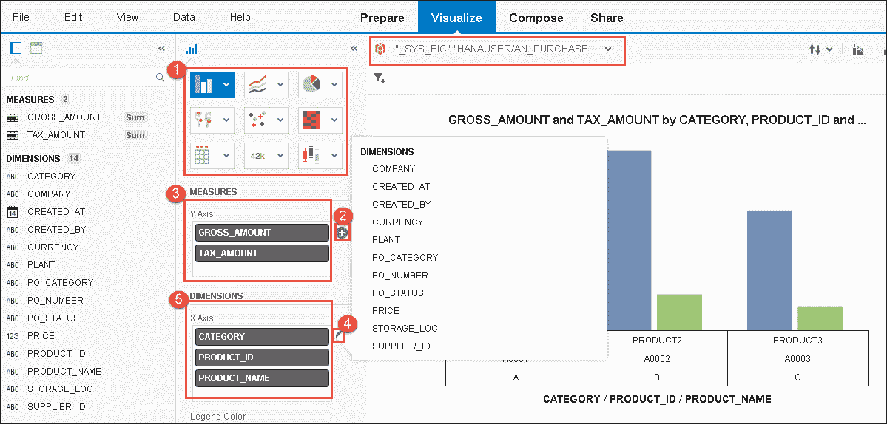

SAP HANA Analytic 视图将显示在 SAP Lumira 的可视化选项卡中，在该选项卡中，我们具有以下不同的屏幕：

1.  升/降，排名，清除，刷新等工具
2.  这可以用于过滤。
3.  SAP HANA lumira 中的 SAP HANA Analytic 视图的输出。

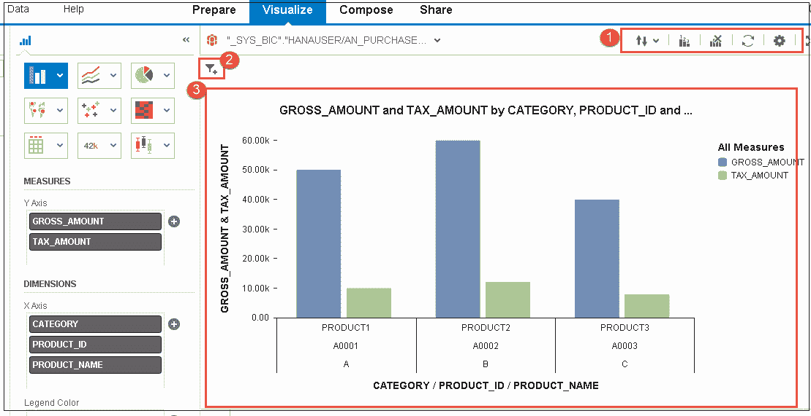

## Microsoft Excel 中的报告

Microsoft Excel 具有强大的报表内置选项； 我们可以通过数据透视表和图表快速创建报告。

MS Office 使用 MDX 语言（（多维表达语言）从 SAP HANA 访问数据。

报表工具使用 MDX 语言从数据库环境中的多维对象访问数据。 通过仅 MDX 查询，我们可以访问 SAP Hana 层次结构。

我们只能访问语义上具有“ CUBE”属性的 SAP HANA 信息视图，因此我们无法通过 MS Excel 访问属性视图。

**连接驱动程序-MS** Excel 使用 ODBO（OLE DB FOR OLAP）驱动程序连接到 SAP HANA 数据库。

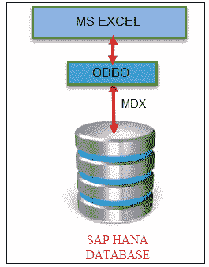

现在，我们将按照以下步骤从 SAP HANA 访问 SAP HANA 数据库–

**步骤 1）连接到 SAP HANA Excel-**

1.  打开 MS Excel。 转到数据标签。
2.  单击“来自其他来源”图标。
3.  从数据连接向导中选择。

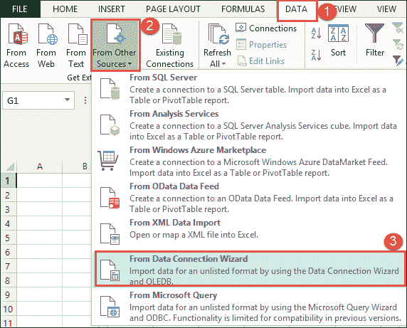

数据连接向导的屏幕将显示如下-

1.  选择“其他/高级”选项。
2.  单击下一步按钮。

“数据链接属性”窗口将打开，如下所示-

1.  在“提供”选项卡下选择“ SAP HANA MDX 提供程序”。
2.  单击下一步按钮。

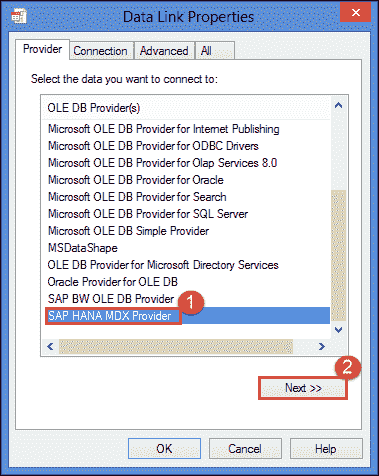

将显示数据链接属性的窗口–

输入以下详细信息，如下所示–

1.  输入 SAP HANA 数据库的主机名。
2.  输入 SAP HANA 数据库的实例号。
3.  输入 SAP HANA 数据库的用户名/密码。
4.  输入语言名称。
5.  单击“测试连接”以测试从 Excel 到 SAP HANA 数据库的连接。

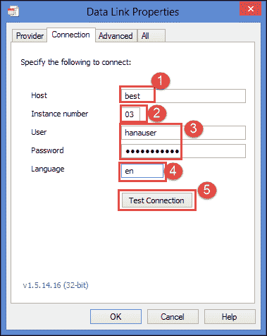

将会弹出消息“测试连接成功”。

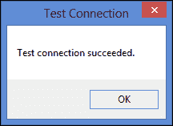

单击确定按钮。

**步骤 2）**到目前为止，我们已经创建了从 Excel 到 SAP HANA 的连接，并测试了该连接。 现在，我们可以从 Excel 访问 SAP HANA 信息视图。

现在将显示“数据连接向导”窗口。

1.  选择其中包含 SAP HANA 信息视图的软件包。
2.  选择信息视图（分析视图，计算视图）。
3.  Click on Next Button.

    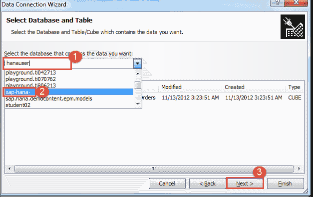

    数据连接文件的新窗口将出现，输入以下详细信息。

    1.给出文件名（AV_SALES）。

    2.勾选“将密码保存在文件中”选项，以避免在打开 Excel 文件时输入密码。

    3.将会显示一个有关保存密码安全性的弹出窗口。

    4.单击完成按钮。

    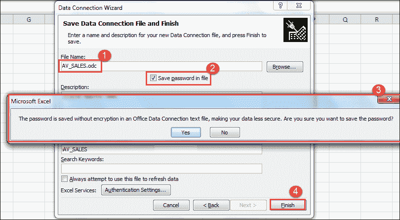

**步骤 3）**现在，SAP HANA 信息视图将在 Excel 中显示为数据透视表，如下所示–

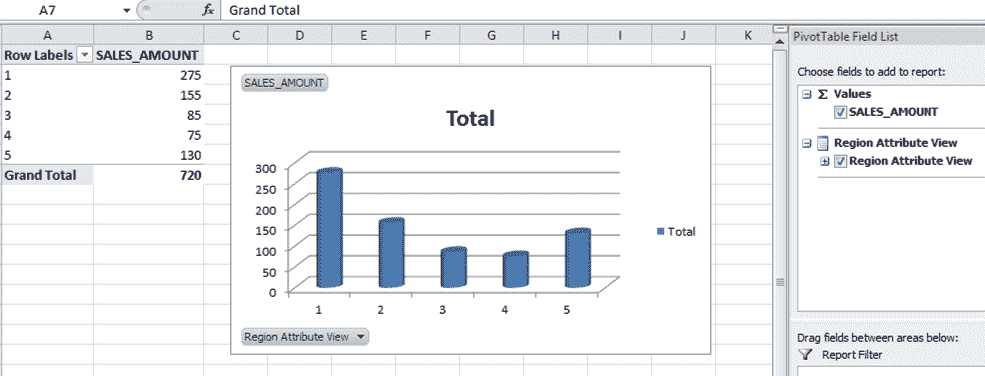

**摘要：**

我们已经在本教程的以下主题中学习了–

*   SAP BI 中的报表概述
*   使用 SAP HANA 信息视图示例在 SAP BO Webi 中进行报告。
*   以 SAP HANA 信息视图为例在 SAP Crystal Report Enterprise 中进行报表。
*   使用 SAP HANA 信息视图示例在 SAP Lumira 中进行报告。
*   通过使用 SAP HANA 信息视图在 Microsoft Excel 中进行报告。