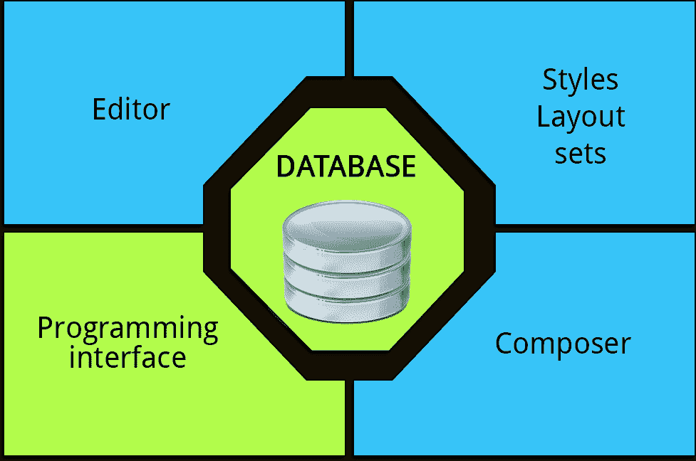
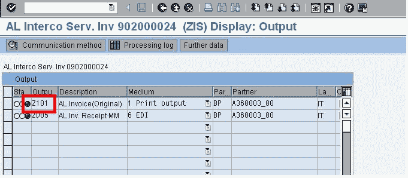

# SAP 脚本教程：SE71，SE78，SCC1，VF03，SO10

> 原文： [https://www.guru99.com/sap-script.html](https://www.guru99.com/sap-script.html)

SAP 脚本是 SAP 系统自己的文本处理系统，其外观在外观上与其他领先的文本处理系统非常相似。

用于以预格式化的形式打印预格式化的文本。

## SAPScript 的组件

SAP 脚本包含五个主要组件：



1.  用于输入和编辑文本行的编辑器
2.  打印版式的样式和版式集。 它们是使用相应的维护事务独立于各个文本创建的，之后分配给文本
3.  作曲者是中央输出模块。 SAP 脚本编写器对外部不可见
4.  一个编程接口，使您可以将 SAP 脚本组件包括到自己的应用程序中，并从程序中控制布局集的输出
5.  几个数据库表，用于存储文本，样式和布局集

## 布局集

要使用编程接口输出文档，R / 3 应用程序需要所谓的布局集（一种形式）。在 SAP 脚本中，布局集描述了各个打印页面的布局，并使用文本元素提供了可定义的输出块， 可以将打印程序定义为页面设计。

布局集本身不包含任何数据。 通过打印程序完成文档数据的选择。 打印程序从数据库表中选择数据，并将其提供给布局集。 当执行打印程序时，文档将打印在屏幕上的打印机上。

通常，SAPScript 布局由以下组件组成

1.  **标头数据**：标头数据用于 SAP 打印的信息和控制。 标头数据由两部分组成-*独立于设备的*-存储诸如开始页，默认段落，语言属性等信息。*与设备相关的*存储诸如页面格式，每英寸方向线等信息。
2.  **段落和字符格式**：使用各种属性来格式化段落。 例如，标准段落属性指定左或右页边距，对齐方式，行距等。字体属性指定字体系列，字体大小等。字符格式允许格式化段落中的整个文本块
3.  **Windows 和文本元素：** Windows 是页面中各个文本区域（页眉地址，日期，页脚）。 它有助于将文档中包含的信息组合为特定的组，并使每个组出现在打印页面的单个区域中。您可以为每个窗口定义文本元素（窗口文本）。 打印程序按名称访问文本元素，对其进行格式化并将其打印在相应的窗口中。 段落和使用的字符格式必须在表格中定义。
4.  **页面：**它们是文档的各个页面，并且必须具有唯一的名称。 您通常会发现各个页面的布局不同：发票的首页与后续页面有所不同，在后续页面上您无需重复一般信息，例如地址或客户数据。
5.  **页面窗口：**在定义窗口和页面时，您尚未确定要输出的文本的位置和间距。页面窗口通过指定输出窗口的左上边缘来定义输出介质中的矩形输出区域。 输出区域及其宽度和高度

## 控制指令

“控制命令”的目的是允许控制输出格式。这些命令不是由 SAP 脚本编辑器解释的，而是传递给 SAP 脚本 Composer 进行处理。 例如，这包括行和页面格式，根据段落和指定的字符格式的文本格式。

语法

```
Enter /: in the paragraph format
```

例子

*   NEW-PAGE-明确分页符
*   保护......... ENDPROTECT-在一页中打印完整段落。
*   包含-将另一个文本的内容包含到当前文本中
*   性能-调用任何 ABAP 程序的子例程

## 打印程序

脚本的执行通过 ABAP 程序（称为打印程序）完成。 每个打印程序应具有一个 ENTRY 表单，该表单将通过自定义调用。

对于标准配置，我们可以在 *TNAPR* 表中查看表单名称（脚本名称），打印程序名称和输出类型。打印程序使用 Form 控制功能来调用脚本 。

打印程序调用全部或某些表单控制功能来执行脚本

*   OPEN_FORM（强制性）打开布局集输出
*   CLOSE_FORM（强制性）结束布局集输出
*   START_FORM（可选）开始新的布局集
*   WRITE_FORM（强制性）调用布局集元素
*   END_FORM（可选）结束当前布局集

## 输出类型

输出类型可以指定内部使用所需的打印形式或要发送给客户或供应商的形式。 输出类型也可以是您要发送给另一个部门工作人员的内部电子邮件消息。

例如，“打印输出”可以分类为开票凭证的一种输出类型，即，当执行该输出类型时，将打印开票凭证。 同样，“传真”可以是一种输出类型，即，执行该输出类型时，发送开票凭证的传真

任何文档（例如，开票凭证）的所有输出类型都将存储在表格 NAST 中 。输出类型通过程序 RSNAST00 执行。

示例：开票凭证中的输出类型-

1.  前往 VF03
2.  输入开票凭证编号，然后再次按 Enter
3.  在菜单转到->标头下选择输出
4.  Z101 是打印输出的输出类型



## 标准文字和图形

可以使用事务 **SO10**

创建报告的标准文本，图形和打印机宏与报告 RSTXLDMC 一起上载到单个标准文本文档中，或者通过事务 **SE78 创建。** 图形以“基准 TIFF 6.0”格式上载（PC 上的.tif 文件）。

SAP 脚本&可以使用 RSTXSCRP 程序

在两个系统之间导出或导入标准文本元素。 **跨客户端复制脚本**：

SAP Script 是客户端相关的对象。与程序不同，一个客户端中对 SAP 脚本所做的更改不会反映在其他客户端中。 要将脚本从一个客户端复制到另一个客户端，请转到 **SE71** 并使用“实用工具”菜单下的“从客户端复制”选项，或使用事务从原始客户端导入保存脚本的传输请求。 **SCC1。**

**注意事项**

1.  SAP 脚本不维护任何版本。 因此，在修改 SAP 脚本时，请确保所做的更改已在脚本中完整记录。 这也适用于标准文本。
2.  在屏幕和打印机上查看时，表格的输出将有所不同。 因此，请始终在打印机上测试脚本的输出。