# SAP ABAP 中的智能表单

> 原文： [https://www.guru99.com/smart-forms.html](https://www.guru99.com/smart-forms.html)

SAP Smart Forms 用于在 SAP Systems 中创建和维护用于批量打印的表单。作为输出介质，SAP Smart Forms 支持打印机，传真，电子邮件或 Internet（通过使用生成的 XML 输出）。

SAP 于 1998 年引入 SmartForms，以克服 SAP 脚本中的限制。 与 SAP Script 相比，SmartForms 更易于开发，维护和传输。

在本教程中，您将学习：

*   [智能表单和 SapScript 的比较](#1)
*   [智能表单的优势](#2)
*   [SAP Smart Form](#3) 的体系结构
*   [Smartforms 指南](#4)
*   [智能表单中的 Windows](#5)
*   [智能表单编程流程](#6)

## 智能表单和 SapScripts 比较

*   SmartForms 中可能有多种页面格式，而 SAPScripts 中则不是
*   可以有一个没有主窗口的 SmartForm。
*   例程可以用 SmartForms 工具编写。
*   SmartForms 激活后会生成功能模块。
*   无法在 SmartForms 中创建标签。

## 智能表格的优势

*   由于完全图形化的用户界面，它们无需任何编程知识即可帮助改编表格
*   激活智能表格时，系统会在运行时自动生成功能模块。
*   要进行任何更改，我们必须使用拖放&拖放，剪切&粘贴。 这些操作不包括编写代码行或使用脚本语言。
*   我们可以插入静态和动态表。 其中包括各个表格单元格中的换行符，表格标题和小计的触发事件以及在输出之前对数据进行排序。
*   智能表单允许用户包括图形，这些图形可以显示为表单的一部分或背景图形。 在打印输出期间，用户可以根据需要取消显示背景图形。
*   可以使用生成的 XML 输出进行 Web 发布

## SAP Smart Form 的体系结构

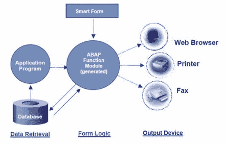

## 智能表格指南

让我们在 SAP 系统中进行分析-

1.  在交易代码框中输入交易 **SMARTFORMS** 。
2.  在下一个屏幕中，输入表单名称，然后单击创建。

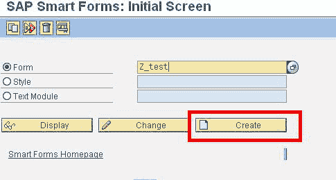

下一个屏幕分为三个部分-

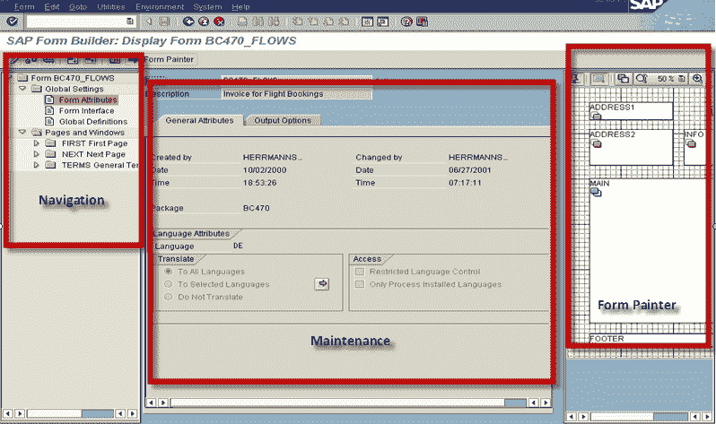

**导航窗口**由节点和子节点组成。 它们包含所有属于树液形式的元素（文本，窗口等）

*   **维护窗口**显示元素的属性
*   **表格打印机**窗口显示页面的布局

每当我们创建智能表单时，SAP 都会创建/生成功能模块。与 SAPscripts 不同，SAP FORMS 允许您更改语言。

在导航窗口中，您会找到

**全局数据声明**：此处定义的数据可用于整个 smartform 进行编码。

**表单接口**：此处定义了将从打印程序传递到智能表单的所有数据。

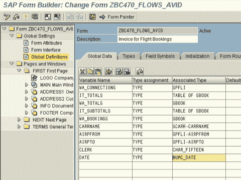

右键单击页面将允许创建新页面，窗口，图形或地址。

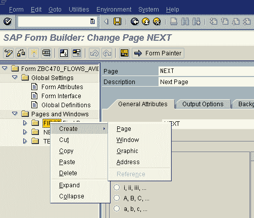

打印将在“下一页”字段的基础上进行。

但是将按照导航窗口中的顺序进行处理！

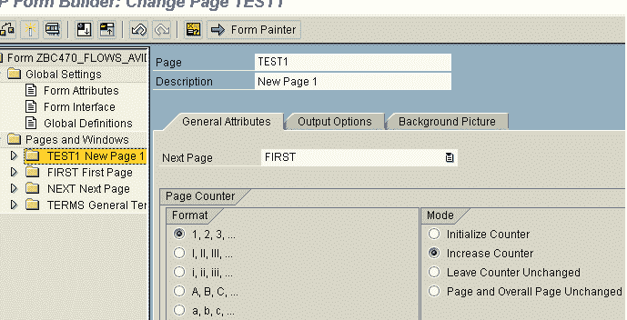 

对于背景图片和图形，您可以拾取黑白或彩色位图图像，并以标准文本的形式存储。 您可以绕过 smartform 屏幕并打开 Form Graphics 屏幕。 交易代码： **Se78**

**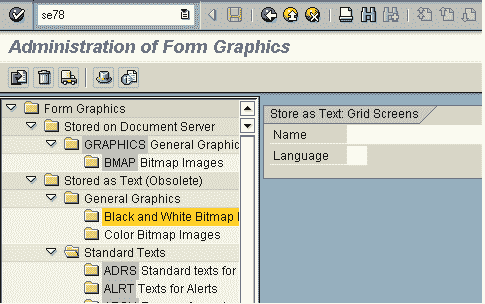** 

在智能表单窗口的图形中设置-

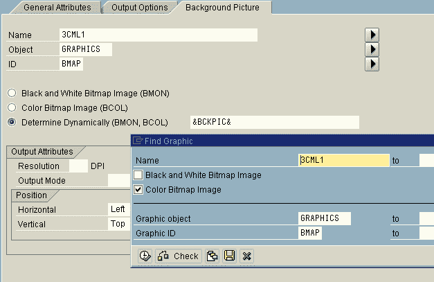

## **智能格式的 Windows**

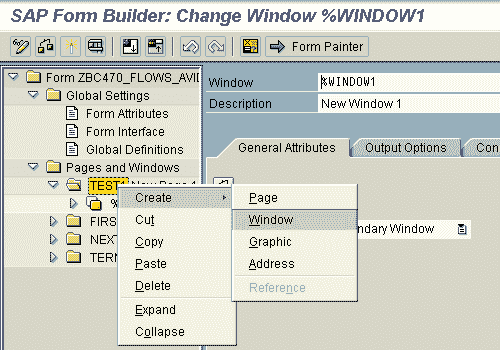 

Windows 有两种类型

1.  主要
2.  次要的

**注意事项**

*   一个页面中的主窗口不能超过 1 个。 您可以有多个辅助窗口
*   无论您在辅助窗口中打印什么，它都必须是静态的。 （如果您的 PO 中有 20 行，并且存在页面限制，则这些行会转到主窗口中的下一页。即，在内容的前继和后继类型中，它们将按顺序在主窗口中打印。这不是 在辅助窗口中允许。

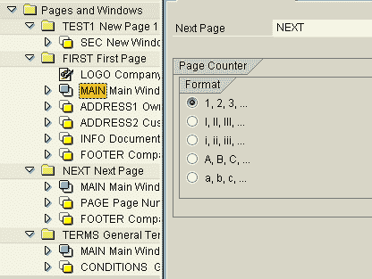 

在主窗口中，我们可以添加文本作为自定义，以自定义表单输出。

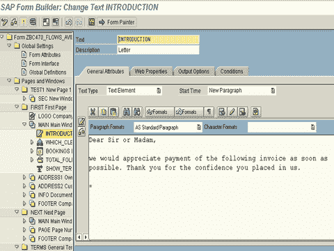

每个窗口上的“输出”选项确定要放置的行大小，宽度，颜色和背景。

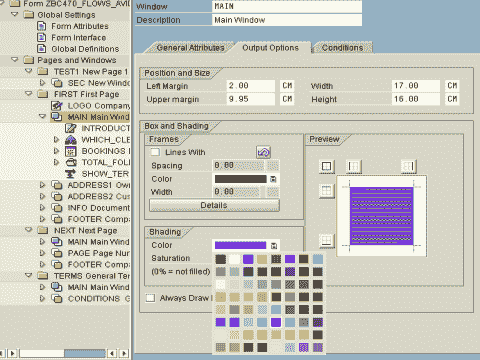

Smartforms 提供了提供地址号的选项，该地址号在中央地址管理中维护。 该地址将直接从 ADRC 表中获取，并以表格形式填充。

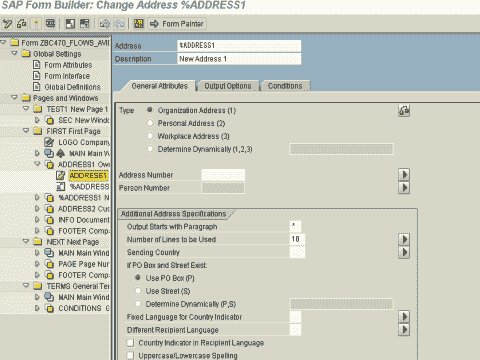

可以在 Smartforms viz 中使用两种不同的编辑器。 普通编辑

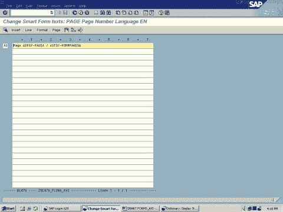

和图形编辑器。

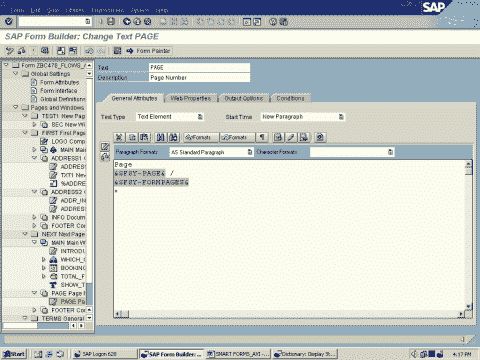

可以使用实用程序中的配置编辑器来更改此设置。

在 Table painter 中，您可以根据客户要求绘制格式（例如标题，子标题，项目，子总计，总计等）。

您可以使用表格布局来确定：

*   行数和单元格数
*   每行的高度
*   每个单元的宽度
*   窗口中表格的对齐方式

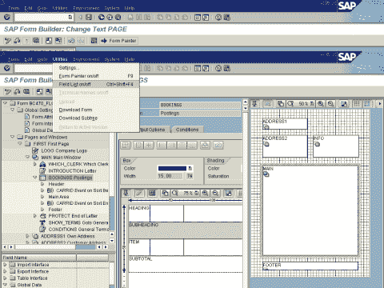 

表格显示了将在表格中使用的不同线型。 线型定义每个单元格的大小和每行中单元格的数量。

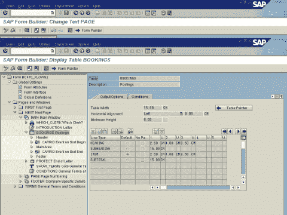

## 智能表单编程流程

创建 SAP Smart Form 模板时，用户将使用 Smart Form Builder 创建表单布局，在 Smart Form 模板中定义必填字段，条件和特殊的编程说明。

表单设计完成后，需要先激活表单，然后才能通过打印程序对其进行测试或访问。激活表单将启动处理所有表单处理的功能模块。

该功能模块与应用程序/打印程序交互，以在用户定义的输出媒体中为指定设备创建输出。

对于智能表单，我们使用 2 个功能模块来处理智能表单。 我们将智能表单的名称作为导入参数传递给第一个功能模块。 然后，它返回动态生成的功能模块的名称，该功能模块将实际调用智能表单。

智能表单名称可以传递给功能模块-' **SSF_FUNCTION_MODULE_NAME'**

**[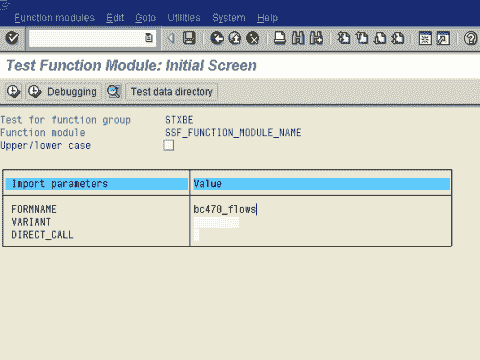 ](/images/sap/2011/02/12.png)** 

This will return the Function module name of the smartform which is referenced.

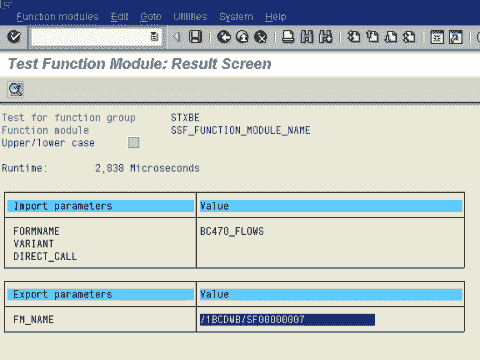

The Print program will be calling the FM **'SSF_FUNCTION_MODULE_NAME'** to get the Function module name at Runtime. Therafter it will call the Function module thus obtained to execute the smartform.

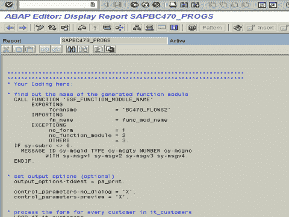

## 范本

当您知道输出的确切大小或输出为固定格式时，可以使用模板。

例如 税单/支票/航空公司表格/火车票：所有这些都使用模板。

表格和模板之间的最大区别是表格中的高度会动态变化。我们称行为模板中的“线”。

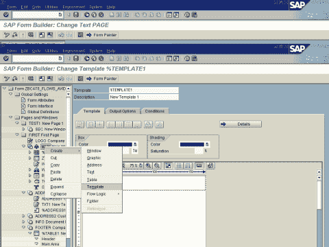 

SMART 样式

智能样式包含：

*   标头数据包含智能样式的默认值
*   段落格式，包括缩进和间距，字体属性，制表符以及轮廓和编号
*   字符格式，包括效果（上标，下标），条形码和字体属性
*   段落或字符格式的颜色和下划线

您可以使用事务“ smartforms” /“ smartstyles”来创建智能样式。

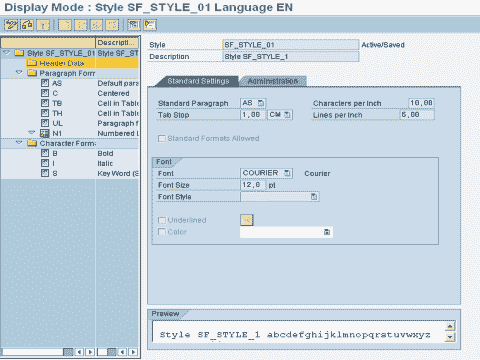

这就是本教程的全部内容