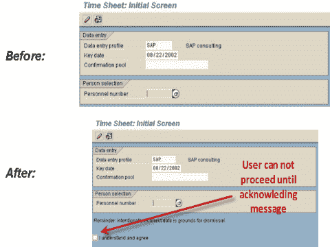
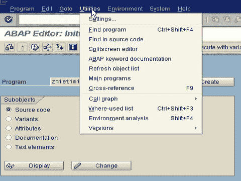
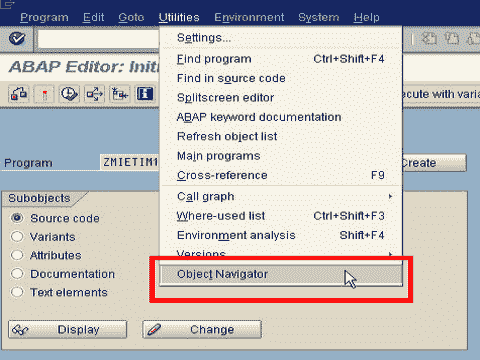
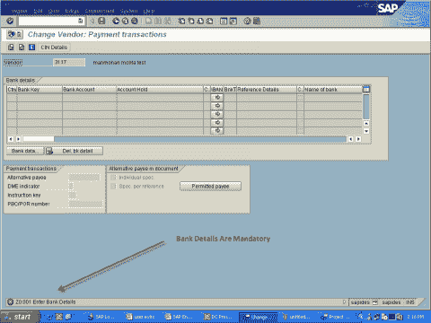
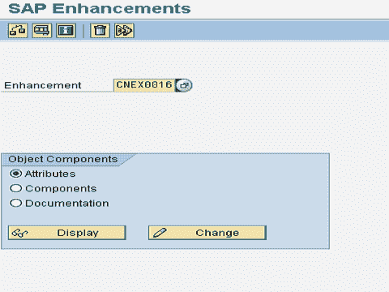
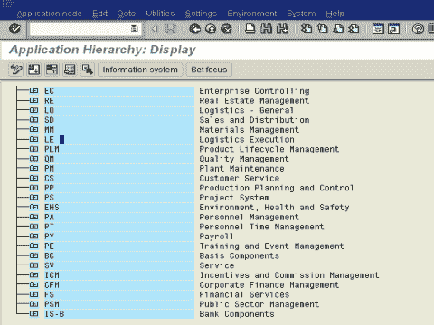
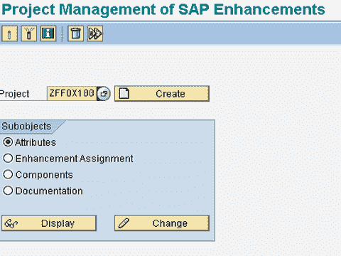

# 什么是 SAP ABAP 中的用户出口和客户出口

> 原文： [https://www.guru99.com/what-is-user-and-customer-exits.html](https://www.guru99.com/what-is-user-and-customer-exits.html)

**什么是客户出口？**

客户出口是 SAP 在许多标准程序，屏幕和菜单中提供的**“挂钩”** ，客户可以在其上**“挂起”** 自定义功能来满足业务需求 要求。 稍后更多...

在本教程中，您将学习：

*   [客户出口的类型](#1)
*   [客户退出的示例](#2)
*   [定位客户出口](#3)
*   [创建客户出口](#4)
*   [什么是用户退出？](#5)

## 客户出口的类型

有三种主要的客户出口类型：

1.  功能模块出口
2.  屏幕退出
3.  菜单退出

**功能模块出口**：它允许客户通过功能模块在 SAP 应用程序中的特定位置添加代码

```
Syntax: CALL CUSTOMER-FUNCTION '004'
```

**屏幕退出**：它允许客户通过子屏幕将字段添加到 SAP 程序的屏幕中。 子屏幕在标准屏幕的流逻辑中被调用。

```
Format: CALL CUSTOMER-SUBSCREEN CUSTSCR2
```

**菜单退出：**它允许客户将项目添加到标准 SAP 程序的下拉菜单中。 这些项目可用于调用附加程序或自定义屏幕。

```
Format: +CUS ( additional item in GUI status )
```

## 客户退出示例

**屏幕退出示例**：

在事务 CAT2-时间表输入中，HR 希望包含一个交互式确认，即故意提交不正确的数据是解雇的理由。



**菜单退出的示例**：
在事务 SE38-ABAP 编辑器中，开发团队希望包括一个指向事务 SE80-Object Navigator 的菜单链接，以便于使用。 在之前



之后



**功能模块出口示例**：
该公司希望在 Vendor 创建过程中将 Vendors 的银行详细信息设为必填事件。因此，该公司必须闪烁一条错误消息“请输入银行详细信息” [ 之前的

**** 

**AFTER**

**** 

## 定位客户出口

在事务 **SMOD** 中，并查看详细信息-



或者在事务 **SE81** 中，您可以使用适当的应用程序区域



## **创建客户出口**

要创建客户出口，您首先需要在事务 **CMOD** 中创建一个项目



稍后，您将客户出口分配给您的项目。

## 什么是用户出口？

用户出口的作用与客户出口的作用相同，但它们仅适用于 **SD** 模块。 出口被实现为对功能模块的调用。 该代码由开发人员编写。

众所周知，SD 中的用户出口是 **MV45AFZZ**

*   USEREXIT_FIELD_MODIFICATION-修改屏幕属性
*   USEREXIT_SAVE_DOCUMENT-在用户点击“保存”时执行操作
*   USEREXIT_SAVE_DOCUMENT_PREPARE
*   USEREXIT_MOVE_FIELD_TO_VBAK-将用户标题更改移动到标题工作区时。
*   USEREXIT_MOVE_FIELD_TO_VBAP-用户项目更改移至 SAP 项目工作区时