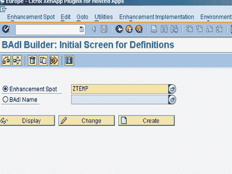

# 什么是 BADI？ SAP ABAP 教程

> 原文： [https://www.guru99.com/what-is-badi.html](https://www.guru99.com/what-is-badi.html)

BADI 代表 **B** 易用性**广告** d **I** ns 就像客户出口一样，BADI 帮助挂钩自定义增强功能到 SAP 功能。 **BADI 的示例**：在事务 CAT2-时间表输入中，HR 希望包含一个交互式确认，即故意提交不正确的数据是解雇的理由。 这可以使用 BADI

实现

## 特征：

*   BADI 是面向对象的
*   它们可以多次实施
*   它不需要 SAP 软件变更注册
*   对 BADI 的功能升级后的发行版没有影响

## 定义和实施 BADI

这涉及三个步骤

**步骤 1** 创建 BADI 定义：事务 SE18。

 

**步骤 2** 定义 BADI 接口：事务 SE19

**步骤 3** 定义一个实现接口的类：在实现创建期间，还将创建一个用于实现增强接口的类。