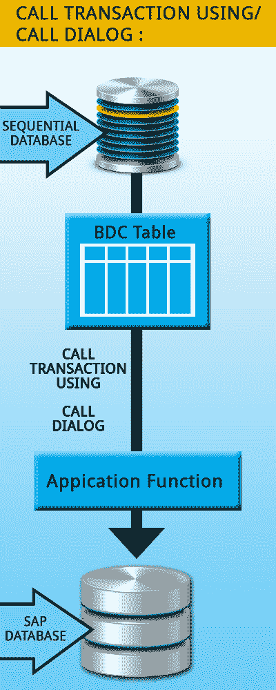
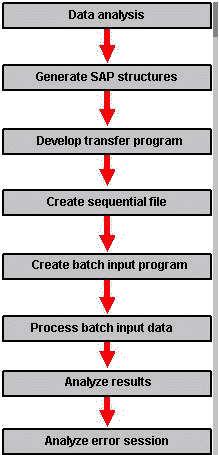
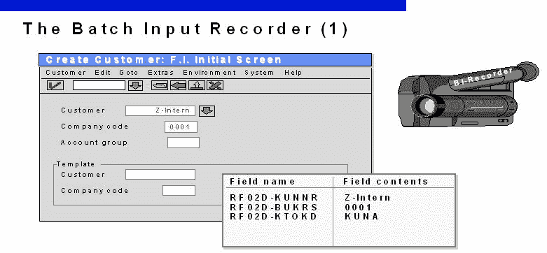

# SAP ABAP BDC（批处理数据通信）教程

> 原文： [https://www.guru99.com/bdc-batch-data-communication.html](https://www.guru99.com/bdc-batch-data-communication.html)

## 批量输入简介

批输入通常用于将数据从非 R / 3 系统传输到 R / 3 系统或在 R / 3 系统之间传输数据。

这是一种数据传输技术，使您可以将数据集自动传输到属于事务的屏幕，从而传输到 SAP 系统。 批输入由批输入会话控制。

在本教程中，您将学习：

*   [批输入](#1)简介
*   [批量输入方法](#2)
*   [批量输入程序](#3)
*   [编写 BDC 程序](#4)
*   [创建批量输入会话](#5)
*   [批量输入记录器](#6)

**Batch input session**

Groups a series of transaction calls together with input data and user actions . A batch input session can be used to execute a dialog transaction in batch input, where some or all the screens are processed by the session. Batch input sessions are stored in the database as database tables and can be used within a program as internal tables when accessing transactions.

**Points to note**

*   BDI 可以像执行用户一样执行正常的 SAP 事务，但是它会自动执行事务。 **使用批处理数据输入时，将完成所有屏幕验证和业务逻辑验证。**
*   适用于输入大量数据。
*   无需手动交互

## 批量输入方法

SAP 提供了两种将旧数据传输到 R / 3 系统的基本方法。

1.  经典批输入法。
2.  呼叫交易方法。

**经典批输入方法**

在这种方法中，ABAP / 4 程序将外部数据读取到 SAP System 并存储在批输入会话中。

创建会话后，您可以运行该会话以在其中执行 SAP 事务。

该方法使用功能模块 *BDC_ OPEN，BDC_INSERT 和 BDC_CLOSE*

批输入会话可以通过三种方式处理

1.  在前台
2.  在后台
3.  处理过程中，显示​​错误

如果要测试数据传输，应在前台或使用错误显示处理批输入会话。

如果要执行数据传输或测试其性能，则应在后台处理会话。

关于经典批输入法的注意事项

*   同步处理
*   传输多个交易的数据。
*   同步数据库更新。
*   为每个会话生成一个批处理输入过程日志。
*   无法并行生成会话。

**呼叫交易方法。**

在这种方法中，ABAP / 4 程序使用 CALL TRANSACTION USING 语句来运行 SAP 事务。

整个批次输入过程在程序中在线进行



注意事项：

*   更快地处理数据
*   异步处理
*   传输单个交易的数据。
*   没有生成批输入处理日志。

## 批量输入程序

 

通常，您将遵循以下步骤序列来为您的组织开发批输入

1.  分析旧数据。 确定如何将要传输的数据映射到 SAP 结构中。 还请注意必要的数据类型或数据长度转换。
2.  生成用于导出程序的 SAP 数据结构。
3.  将数据导出到顺序文件中。 请注意，预定义的 SAP 批处理输入程序需要字符格式。
4.  如果未使用 SAP 提供的 BDC 程序，请编写您自己的批处理输入程序。 请根据实际情况选择合适的批量输入方式。
5.  处理数据并将其添加到 SAP System。
6.  分析过程日志。 对于没有创建正确日志的 CALL TRANSACTION 方法，请使用程序收集的消息。
7.  根据过程分析的结果，纠正并重新处理错误的数据。

## 编写 BDC 程序

您可能会遵循以下过程来编写 BDC 程序

1.  分析事务以处理批输入数据。
2.  确定要使用的批输入方法。
3.  从顺序文件中读取数据
4.  执行数据转换或错误检查。
5.  将数据存储在批处理输入结构 BDCDATA 中。
6.  为经典的批处理输入生成批处理输入会话，或使用 CALL TRANSACTION USING 语句直接处理数据。

**批输入数据结构**
批输入数据结构的声明

```
DATA : BEGIN OF < bdc table>

OCCURS <occurs parameters>.

INCLUDE STRUCTURE BDCDATA.

DATA:END OF <bdc table>.
```

| 栏位名称 | 类型 | 长度 | 描述 |
| --- | --- | --- | --- |
| 程序 | 焦炭 | 8 | 模块池 |
| DYNPRO | numc | 4 | Dynpro 编号 |
| 迪金 | CHAR | 1 | 启动 dynpro |
| FNAM | CHAR | 35 | 栏位名称 |
| FVAL | CHAR | 80 | 栏位值 |

特定屏幕数据中字段的顺序没有任何意义

**注意点**

*   在填充 BDC 数据时，请确保考虑到用户设置。 这对于涉及数字（例如数量，数量）的填充字段特别有用。 由用户设置决定数字的分组字符是什么，例如：根据用户设置，可以将 50,000.00 或 50.000,00 写成五万个数字。
*   将 FVAL 字段压缩为数量和数量字段，以使它们保持对齐。
*   请注意，在填充 BDC 数据表时，应将通过 BDC 填充的所有字段都视为字符类型字段。
*   在某些屏幕中，当您使用 BDC 在表控件中填充值时，必须注意在屏幕的默认大小上存在多少行，以及用于多少行的代码。 如果必须填充更多的行，则必须像手动填充表控件时那样为“ Page Down”功能编写代码。
*   在上述情况下将出现的行数将根据用户使用的屏幕大小而有所不同。 因此，请始终为标准屏幕尺寸编写代码，并使您的 BDC 始终以标准屏幕尺寸工作，而不管用户将其屏幕尺寸保持为什么。

## 创建批量输入会话

1.  使用功能模块 BDC_OPEN_GROUP 打开批输入会话。
2.  对于会话中的每笔交易：
    *   用在事务中处理的所有屏幕和字段的值填充 BDCDATA。
    *   使用 BDC_INSERT 将事务转移到会话中。
3.  使用 BDC_CLOSE_GROUP 关闭批输入会话

## 批量输入记录器

批输入记录器（系统>服务>批输入>记录器）记录手动输入的交易，并创建一个批输入会话，稍后可使用 SM35 执行该会话。



*   通过从批次输入初始屏幕中选择“记录”按钮来启动批次输入记录器。
*   记录名称是用户定义的名称，可以与可以从记录创建的批输入会话名称匹配。
*   输入 SAP 事务并开始过帐事务。
*   完成 SAP 事务过帐后，可以选择“获取事务并保存”以结束记录，也可以选择“下一个事务”并过帐另一个事务。
*   保存记录后，您可以从记录创建批处理输入会话和/或从记录生成批处理输入程序。
*   现在，您可以像分析其他任何批处理输入会话一样分析您创建的批处理输入会话。
*   由批输入记录器的功能生成的程序是数据接口编程器的强大工具。 它提供了坚实的基础，然后可以根据客户要求进行更改。