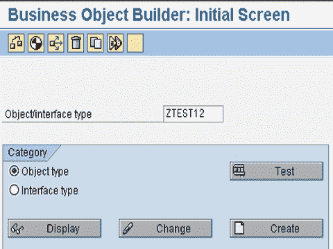
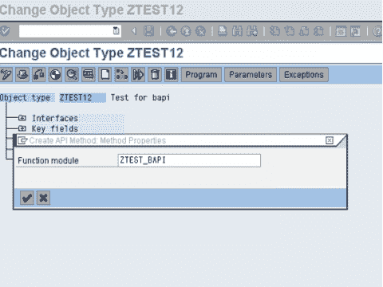
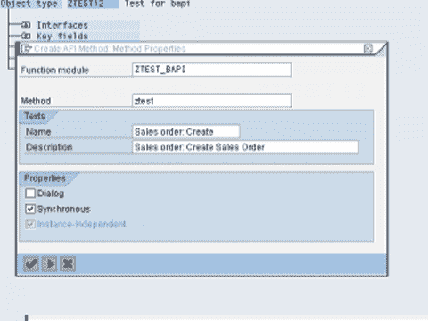
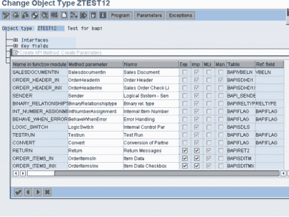

# SAP BAPI 教程-在 ABAP 中创建 BAPI 的分步指南

> 原文： [https://www.guru99.com/all-about-bapi.html](https://www.guru99.com/all-about-bapi.html)

## 什么是 BAPI？

业务应用程序编程接口（BAPI）是标准化的编程接口（方法），使外部应用程序可以访问 R / 3 系统中的业务流程和数据。

它们**提供稳定和标准化的方法**，以实现 R / 3 系统与外部应用程序，旧版系统和附加组件之间的无缝集成。

BAPI 在 **BOR（业务对象存储库）**中定义为执行特定业务功能的 SAP 业务对象类型的方法。它们被实现为**启用 RFC 的功能**模块，并在 ABAP 工作台的功能生成器。

Some BAPIs and methods provide basic functions and can be used for most SAP Business Objects.These are called **STANDARDIZED BAPI's.**

List of Standardized BAPIs:

*   读取数据的 BAPI-GetList（），GetDetail（），GetStatus（），ExistenceCheck（）
*   用于创建或更改数据的 BAPI-Create（），Change（），Delete（）和 Undelete（），
*   用于批量处理的 BAPI -ChangeMultiple（），CreateMultiple（），DeleteMultiple（）。

## 如何创建一个 BAPI

**步骤 1** 。转到事务 swo1（工具->业务框架-> BAPI 开发->业务对象构建器）。根据 BAPI 的功能要求选择业务对象。 正在创建。

**步骤 2。** 以更改模式打开业务对象。 然后选择实用程序-> API 方法->添加方法。然后输入功能模块的名称并选择继续。

**步骤 3。**在下一个对话框中，需要指定以下信息：

*   方法：为该方法建议一个合适的名称，
*   文字：输入 BAPI 的说明，
*   单选按钮：对话框，同步，与实例无关。 BAPI 通常是同步实现的。

**步骤 4。** 要创建方法，请在下一个对话框中选择“是”。

**步骤 5。** 生成并执行程序后，以刚刚创建的方法检查程序。因此，将创建 BAPI。

## 测试 BAPI

您可以通过[在业务对象构建器中测试](/software-testing.html)业务对象的各个方法来测试 BAPI。 （或者可以使用事务“ SWUD”来测试该方法）。

## 释放并冻结 BAPI

*   要释放 BAPI，首先释放功能模块（使用事务 se37）。
*   在业务对象构建器中将方法的状态设置为“已发布”（使用事务 SWo1-编辑->更改状态->已发布。）

您还可以将 BAPI Explorer（交易代码 BAPI）用于 BAPI 上的 360'视图