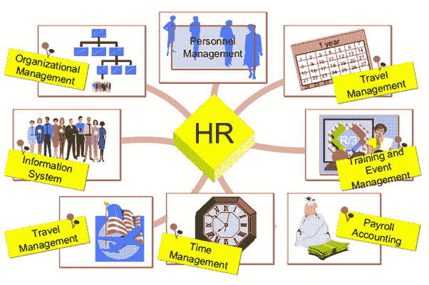

# 什么是 SAP HR？ SAP HCM 简介

> 原文： [https://www.guru99.com/sap-hr-introduction.html](https://www.guru99.com/sap-hr-introduction.html)

## 什么是 SAP HR？

SAP 人力资本管理（SAP HCM）是 SAP 中的重要模块。 它也称为 SAP 人力资源管理系统（SAP HRMS）或 SAP 人力资源（HR）。

SAP HR 软件允许您自动执行记录保存过程。 这是人力资源部门利用管理和工资单文件的理想框架。

在此 SAP HR 教程中，您将学习：

*   [什么是 SAP HR？](#1)
*   [SAP HR 模块](#2)
*   [组织管理](#3)
*   [人事管理](#4)
*   [时间管理（TM）](#5)
*   [薪金](#6)
*   [差旅管理](#7)

## SAP HR 模块

### SAP HR 包含以下模块

*   组织管理
*   人事管理
*   时间管理
*   工资核算
*   差旅管理

## 组织管理：

组织管理是 SAP HR 的一个非常重要的子模块。 它使组织能够代表组织计划并分析当前计划。 它还允许您创建其他计划并创建更好的工作流管理。

### 组织管理职能：

*   创建组织结构的图形报告
*   管理部门/组织单位的信息
*   跟踪各个部门的职位
*   维持工作
*   报告关系
*   职位空缺相关报告

## 人事管理：

人事管理是 SAP 系统的重要子模块。 它记录重要的员工信息。 它可以帮助您执行各种管理任务，例如雇用员工，人员信息，差旅费用，工资核算等。

### 人事管理模块的重要功能是：

*   个人信息类型维护
*   合约要素
*   监视家人/亲戚的约会
*   教育
*   其他/先前实体关系
*   成本分配
*   内部医疗服务

## 时间管理（TM）

时间管理是人力资源的另一个重要子模块，可以记录员工数据。 它主要与出勤，时间评估，轮班等有关。

### 以下是时间管理模块的一些重要功能：

*   假期日历
*   个人工作时间表
*   每月工作时间表
*   出勤配额
*   出勤检查
*   图形出勤/休假报告
*   活动分配

## 薪资：

SAP 薪资模块可帮助您处理员工完成的工作的付款。 它包括工资，医疗福利，税金，扣除额等。SAP 工资单模块还与其他模块集成在一起，例如个人管理，时间管理，财务会计等。

### 以下是薪资系统的一些重要功能：

*   自动计算工资的总工资核算
*   自动特殊付款计算
*   完整的总/净追溯记录
*   与社会保险机构，银行等进行数据交换

### 培训和活动管理：

培训和事件管理模块负责识别培训需求，安排培训过程，安排成本管理等。

## 差旅管理

该 SAP 模块包括管理公务差旅，差旅费用管理，差旅费用等。

### 差旅管理的重要功能：

*   行程数据输入
*   膳食津贴的计算
*   维护收据索赔
*   预付款
*   代表公司内部规则
*   旅行特定的帐户分配
*   模拟陈述

### 摘要：

*   SAP 人力资本管理（SAP HCM）是 SAP 中的重要模块
*   SAP HR 包含以下模块
*   组织管理 2）人事管理 3）时间管理 4）工资核算，以及 5）差旅管理
*   组织管理代表组织计划并分析当前计划
*   人事管理局记录必要的员工信息。
*   时间管理记录员工数据的出勤，时间评估，轮班等。
*   SAP 薪资模块可帮助您处理员工完成的工作的付款
*   该 SAP 模块包括管理公务差旅，差旅费用管理，差旅费用等。