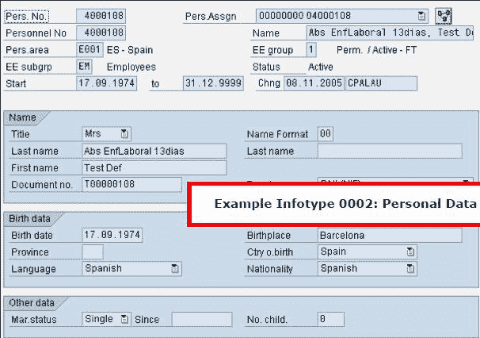
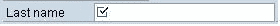
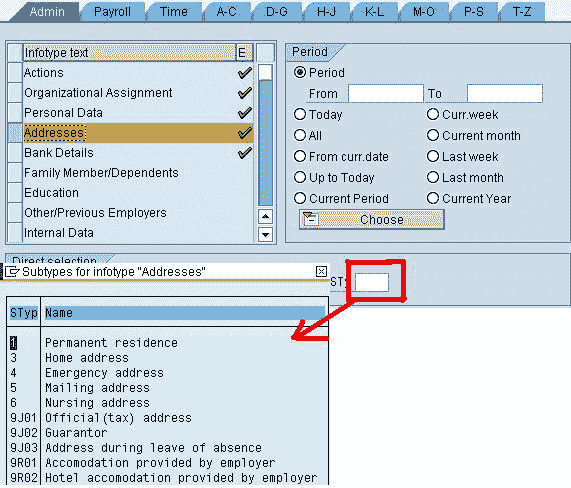
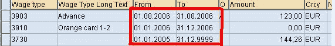

# 什么是信息类型？

> 原文： [https://www.guru99.com/what-is-infotype.html](https://www.guru99.com/what-is-infotype.html)

**What is a Infotype?**

SAP 信息类型是一个信息单元，用于存储管理目的所需的员工相关数据。

它具有 4 位数字代码和相关名称。 它将相似的数据存储到一个屏幕中。

例如，个人数据（信息类型 0002）存储员工的个人数据（即名字，姓氏，出生日期，婚姻状况）。

每个 SAP 信息类型都有需要输入数据的字段。 有两种类型的字段：

*   必填字段，该字段中有一个勾号。 
*   可选字段，为空白。 

信息类型的编号范围已由 SAP 预先确定。 它们如下：

*   人力资源/薪资数据=信息类型 0000 至 0999
*   组织数据=信息类型 1000 至 1999
*   时间数据=信息类型 2000 到 2999

可以在信息类型级别定义访问 SAP HR 主数据的授权。 因此，可以仅授予 SAP 用户访问与其职位相关的员工信息的权限，从而可以为机密人员信息维护适当的安全级别。

### 信息类型子类型

Some infotypes are divided in different groups linked to the same theme.These groups are called subtypes. "Permanent Residence" and "Emergency Address" are subtypes of the Infotype 0006 (Addresses).

### 信息类型期间

Infotypes are maintained according to **specific validity dates : start and end dates**. which allows to maintain an employee's data history. When you update an employee's data, the previous data is most likely automatically time-delimited. As a result, an employee can have **many records for one infotype**, with **different validity periods.**

