# SAP 信息类型：使用 PA30，PA20 创建，更改，复制，删除，概览

> 原文： [https://www.guru99.com/how-to-create-an-infotype.html](https://www.guru99.com/how-to-create-an-infotype.html)

在本教程中，我们将学习：

[如何创建信息类型](#1)

[如何显示信息类型](#2)

[如何更改信息类型](#3)

[如何复制信息类型](#4)

[如何删除信息类型](#5)

[如何显示信息类型概述](#6)

## 如何创建信息类型

**步骤 1）**在 SAP 命令提示符下，输入事务 PA30

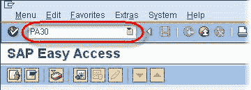

**步骤 2）**在下一个 SAP 屏幕中，

1.  输入人员编号
2.  点击输入按钮

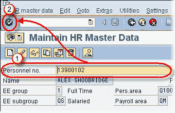

1.  选择相关的选项卡以查看相关的信息类型。
2.  选择您想要创建新记录的信息类型。

**步骤 3）**单击创建按钮

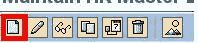 

**步骤 4）**在下一个 SAP 屏幕中，

1.  输入新记录的开始和结束日期。
2.  在字段中输入数据。 确保至少输入必填字段的数据

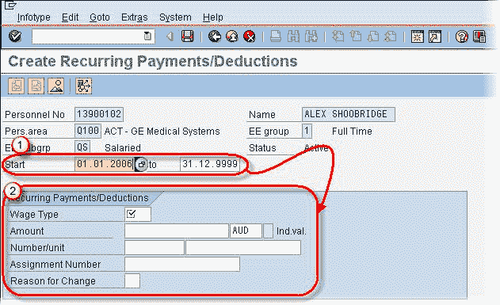

**步骤 5）**单击保存按钮。

 

记录已创建！

## 如何显示信息类型

**步骤 1）**要在 SAP 中显示信息类型，可以使用事务 PA30 或 PA20。

**步骤 2）**在 SAP 命令提示符下，

1.  输入事务 PA20。
2.  单击输入按钮

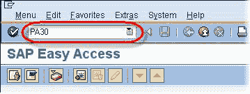 

**步骤 3）**在下一个 SAP 屏幕中，

1.  输入人员编号
2.  点击输入按钮

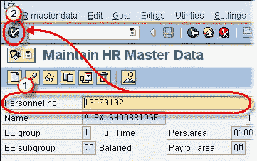 

1.  选择相关的选项卡以查看相关的信息类型。
2.  突出显示您要显示的信息类型。

**步骤 4）**单击显示按钮

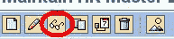 

**步骤 5）**显示信息类型。 注意，SAP 将所有字段显示为灰色，并且不能更改任何字段。

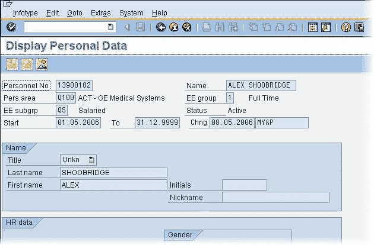

## 如何更改信息类型

**步骤 1）**要在 SAP 中显示信息类型，可以使用事务 PA30 或 PA20。

**步骤 2）**在 SAP 命令提示符下，输入事务 PA30

 

**Step 3)** In the next SAP screen,

1.  输入人员编号
2.  点击输入按钮

1.  选择相关的选项卡以查看相关的信息类型。
2.  选择您想要更改的信息类型。

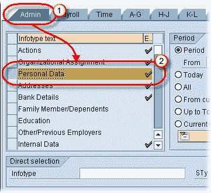

**步骤 4）**单击更改按钮

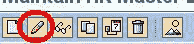

**步骤 5）**在下一个 SAP 屏幕中，

1.  维护对现有“信息类型”字段的任何更改。

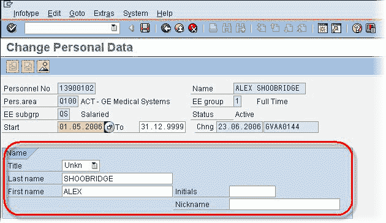

**步骤 6）**单击保存按钮。

记录已更改！

## 如何复制信息类型

**步骤 1）**在 SAP 命令提示符下，输入事务 PA30

**步骤 2）**在下一个 SAP 屏幕中，

1.  输入人员编号
2.  点击输入按钮

1.  选择相关的选项卡以查看相关的信息类型。
2.  选择您要复制的信息类型。

**步骤 3）**单击复制按钮

**步骤 4）**在下一个 SAP 屏幕中，

1.  维护日期以指定新记录的有效性
2.  指定对新记录的任何更改。

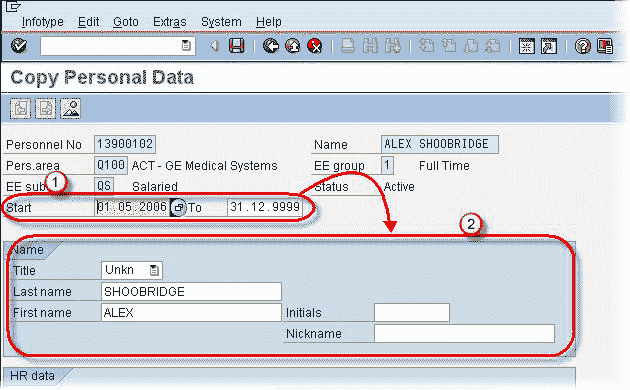

**Step 5)** Click the save button.

 

记录已复制！

## 如何删除信息类型

**Step 1)** In the SAP command prompt , Enter transaction PA30

**Step 2)** In the next SAP screen,

1.  输入人员编号
2.  点击输入按钮

1.  选择相关的选项卡以查看相关的信息类型。
2.  选择您要删除的信息类型。

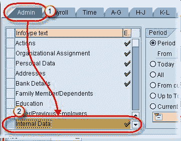

**步骤 3）**单击删除按钮

 

**Step 4)** In the next SAP screen,

1.  再次单击删除按钮

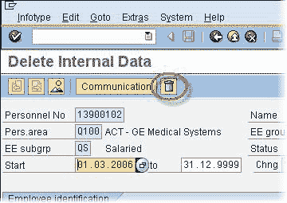

**步骤 5）**单击输入按钮

记录被删除！

## 如何显示信息类型概述

**Step 1)** In the SAP command prompt , Enter transaction PA30

**Step 2)** In the next SAP screen,

1.  输入人员编号
2.  点击输入按钮

1.  选择相关的选项卡以查看相关的信息类型。
2.  选择您希望查看的信息类型。

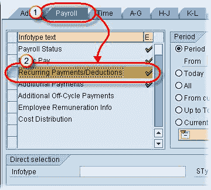

**步骤 3）**选择总览期间

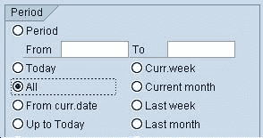

**步骤 4）**单击概述按钮

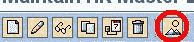 

**步骤 5）**下一个 SAP 屏幕为您概述信息类型的记录。 （在本例中为 IT14）

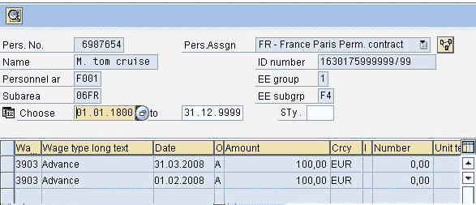