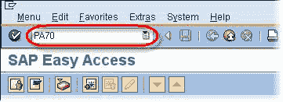
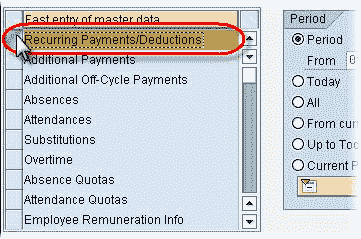
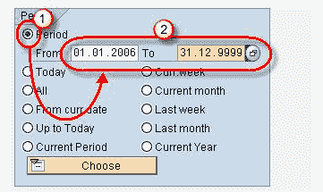
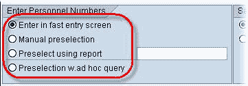
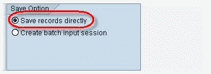
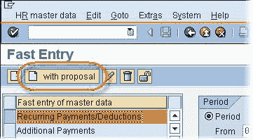
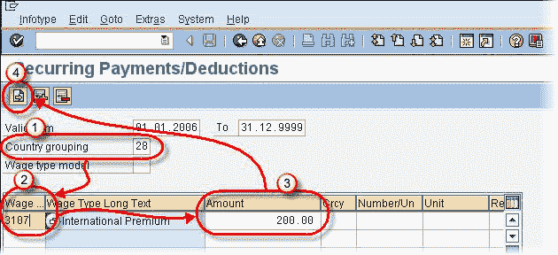
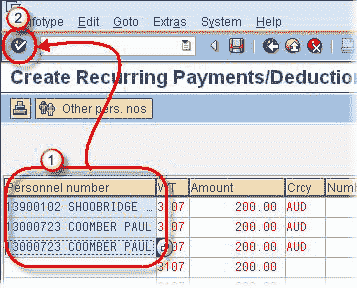

# SAP 快速入门教程：PA70，PA71

> 原文： [https://www.guru99.com/sap-fast-entry-tutorial.html](https://www.guru99.com/sap-fast-entry-tutorial.html)

快速输入允许您为多个员工创建和维护相同的信息类型。

它将所有必填字段的数据收集到 SAP 中的一个表中。

仅可用于有限数量的信息类型（例如，信息类型 0014 和 0015）。

**事务**：PA70 和 PA71

在本教程中，让我们为 IT14 创建快速条目。

**步骤 1）**在 SAP 命令提示符下，输入事务 PA70

**步骤 2）**选择信息类型

1.  选择期间单选按钮
2.  输入新记录的开始日期和结束日期。

**步骤 3）**在“输入人员编号”下，选择以下选项之一：

1.  **在快速输入屏幕中输入**：您将人员编号直接输入到快速输入数据表中。
2.  **手动预选**：您可以使用 SEARCH 功能手动预选人员编号。
3.  **预选择使用报告**：使用标准 SAP 报告选择人员编号。
4.  **通过 Ad HocQuery 预选**：您可以使用 Ad Hoc Query 选择人员编号。

**步骤 4）**在本教程中，我们将在“快速输入”屏幕中输入 pernr。

**步骤 5）**在“保存选项”下，选择“直接保存记录”单选按钮。

**步骤 6）** SAP 提供了两种创建数据的选项

1.  **创建**：当您想输入具有不同金额的不同工资类型时使用。
2.  **使用投标创建**：当您要为所有选定的雇员输入相同的数据时使用。

**步骤 7）**在本教程中，我们将创建带有建议的文件。

**步骤 8）**在下一个 SAP 屏幕中，

1.  输入国家（地区）分组。
2.  输入工资类型
3.  输入工资类型金额。
4.  单击下一步屏幕。

1.  输入您要应用工资类型和金额的员工的人员​​编号。
2.  单击验证

**步骤 9）**单击保存以完成任务。

可以使用事务 **PA42** 创建&，并为不同的员工维护相同的操作