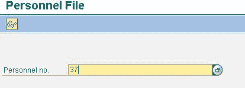

# 如何在 SAP 中查看为员工 PA10 保存的所有信息类型

> 原文： [https://www.guru99.com/how-to-view-all-infotypes-saved-for-an-employee.html](https://www.guru99.com/how-to-view-all-infotypes-saved-for-an-employee.html)

您可以使用“人员文件”查看为 pernr 在 SAP HR 中保存的所有信息类型。

人事档案可刺激浏览员工的个人数据。

使用以下菜单路径访问人事档案工具：人力资源= >人事管理= >人事管理= > HR 主数据= >人事文件或事务 PA10

 
汁液培训人员档案

人事文件显示已为人事号码保存数据的所有信息类型。
信息类型以升序显示，然后按其有效性排序。 它们的显示顺序相同，适用于子类型。 它们都出现在各自的信息类型之后

如果同一信息类型存在多个记录，则它们将一个接一个地显示。 然后，系统继续进行下一个信息类型。 当到达最后一个存在数据的信息类型时，SAP 返回初始屏幕。

您可以使用下一个记录功能（或 F19）和上一个功能（或 F18）在人员文件中前后滚动。