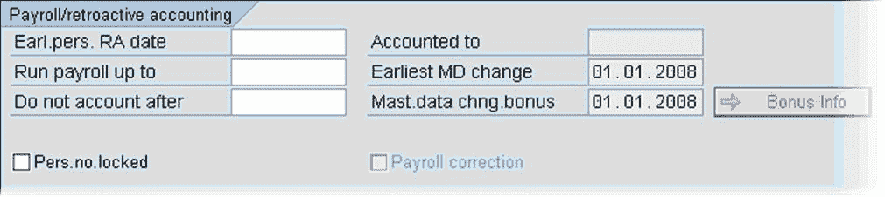
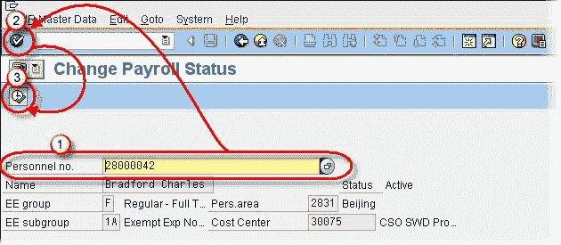
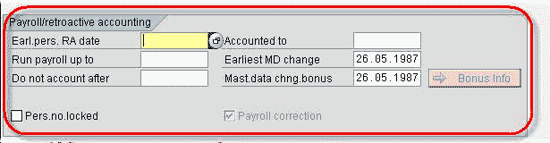

# SAP 中有关 Infotype 0003 薪资状态的所有信息

> 原文： [https://www.guru99.com/all-about-inoftype-0003-payroll-status.html](https://www.guru99.com/all-about-inoftype-0003-payroll-status.html)

**Infotype 003 - Payroll Status**

*   它会自动存储控制员工的[薪资](/sap-payroll.html)运行和时间评估的数据。
*   它是由系统在“雇用操作”期间在后台自动创建的。
*   在评估时间，运行工资单或更改员工过去的工资单时，数据会自动更新。
*   仅在特殊情况下，才应更改此信息类型中存储的数据，因为这些更改将影响员工的薪资处理和/或追溯记帐

| 领域： | 细节： |
| **伯爵。 RA 日期** | 将确切日期设置回系统可以运行追溯记帐的日期。 |
| **最多运行工资单** | 即使员工已离开公司，也要执行工资核算的一天。 |
| **不要在**之后结算 | 该员工的薪资一直运行到该日期。 |
| **Pers.no Locked** | 可以锁定员工工资。 |
| **已计入** | 雇员发薪的日期。 |
| **最早的 MD 更改** | 该程序识别是否必须重复工资以及何时重复工资以考虑主数据更改。 |
| **MD 更改奖金** | 执行与奖励会计相关的追溯[会计](/accounting.html)。 |
| **薪资更正** | 如果在更正阶段人员编号被拒绝或数据已更改。 |

**Maintain IT003 :**To maintain Payroll Status in your SAP HR command prompt enter transaction **PU03**1.Enter the Pernr.2.Click Validate3.Click Execute

根据需要维护数据。

