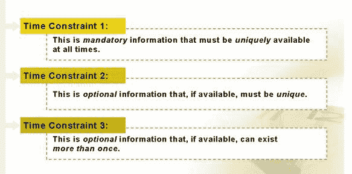
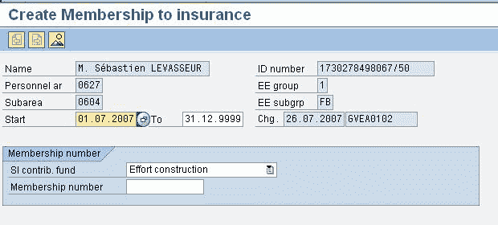
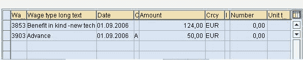

# 什么是时间限制？ SAP HR 教程

> 原文： [https://www.guru99.com/what-are-time-constraints.html](https://www.guru99.com/what-are-time-constraints.html)

SAP 中的信息类型具有时间限制，该时间限制决定了它们将如何存在以及在更新时如何反应。 SAP 中的三种时间约束类型-

让我们详细研究一下-

### 时间限制 1

*   对于属于时间限制 1 的信息类型，必须存在**强制**才能存在记录，而**在任何时间点只能存在 1 个**。
*   例如，信息类型 0002（个人数据）。

### 时间限制 2

*   对于属于时间限制 2 的信息类型，**对于记录的存在不是强制性的**，但是**在任何时间点都只能存在** t。
*   例如，信息类型 0218（会员保险）

 

### 时间限制 3

*   对于属于时间限制 3 的信息类型，**对于记录的存在不是强制性的**，但是**可以存在许多记录**
*   例如，SAP 信息类型 0015（附加付款）。

