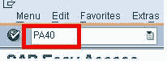
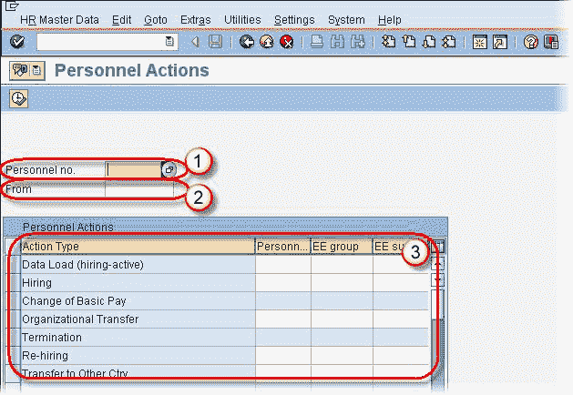
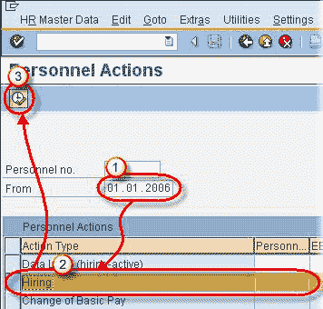
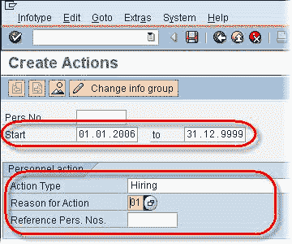
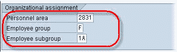

# SAP PA40：人员操作教程

> 原文： [https://www.guru99.com/sap-personnel-actions-tutorial.html](https://www.guru99.com/sap-personnel-actions-tutorial.html)

人员操作包括以逻辑顺序显示的所有必需的信息类型，必须针对特定的 HR 事件（例如雇用，终止等）输入数据。

**步骤 1）**在 SAP 中 命令提示符，输入事务 PA40

 

**步骤 2）** SAP 人员操作屏幕分为 3 个部分：

1.  人员编号：在此字段中，输入员工的人员​​编号，在执行“雇用”操作时需要此编号，因为它可能是系统自动生成的。
2.  发件人：在此字段中，输入适用于人员操作的开始日期。
3.  操作类型：在此部分中，选择适当的人员操作。

**步骤 3）**为了使人员操作更清晰，让我们在 SAP 中执行招聘操作。

1.  在发件人字段中输入聘用日期。
2.  从操作类型列表中选择雇用。
3.  单击执行交易。

**步骤 4）**在下一个 SAP 屏幕中

*   默认为“开始”和“截止”日期，如有必要，请进行检查和维护。
*   检查操作类型是否正确。
*   输入采取行动的原因。

*   输入人员区域。
*   输入进入员工组。
*   输入员工子组。

**步骤 5）**单击保存按钮。 人员编号将自动显示。

单击保存后，将激活招聘信息组。 与“雇用”操作相关的每个信息类型将一个接一个地显示。 维护完每种信息类型后，请按 Enter 并保存并保存以验证您的输入。