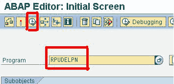
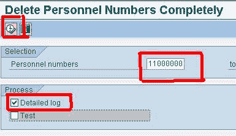
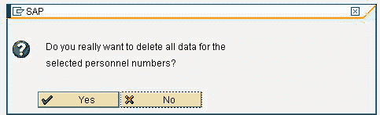
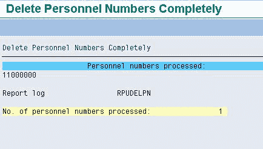

# 如何删除人员编号：SAP RPUDELPN

> 原文： [https://www.guru99.com/how-to-delete-a-personnel-number.html](https://www.guru99.com/how-to-delete-a-personnel-number.html)

您可能会遇到许多需要删除人员编号的情况。 例如，您错误地在 SAP 系统中错误的日期雇用了一名员工。 或者，员工被录用并在同一天离开组织。

以下步骤将删除人员编号和系统中为该员工存储的所有数据。 请注意，您必须在 SAP 中具有必要的授权才能执行程序。

**步骤 1）**在交易 SE38 中，

1.  输入程序名称 **RPUDELPN**
2.  点击执行

**步骤 2）**在下一个屏幕中

1.  输入人员编号
2.  检查详细日志标志
3.  点击执行

**步骤 3）**显示确认屏幕。单击“是”。

**步骤 4）**从 SAP 系统中删除了员工，并且其数据无法恢复。 显示日志

您也可以使用事务 **PU00** 仅删除员工的某些信息类型。