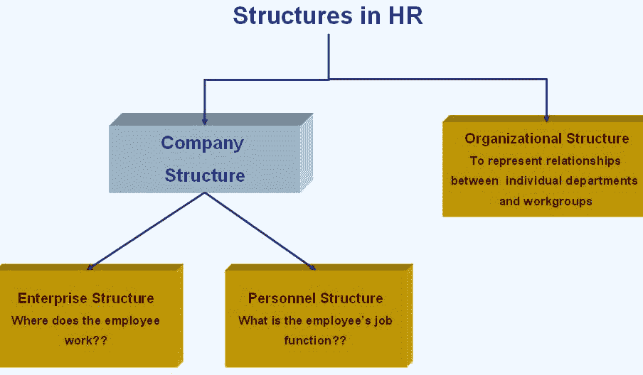
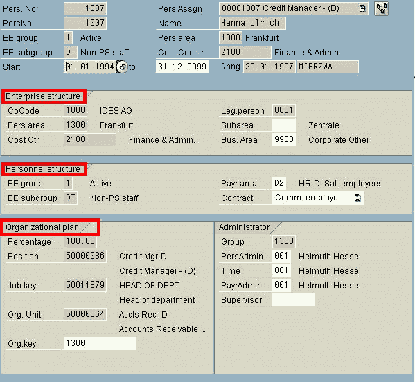
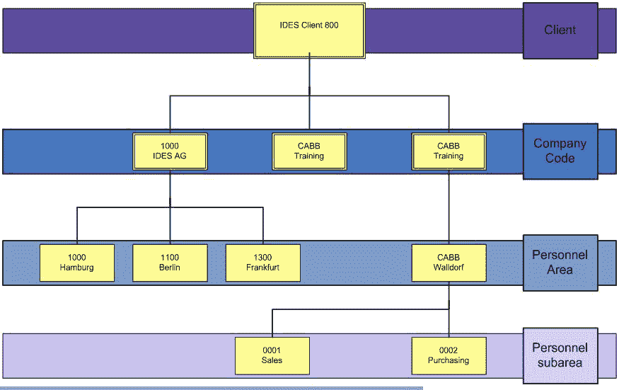
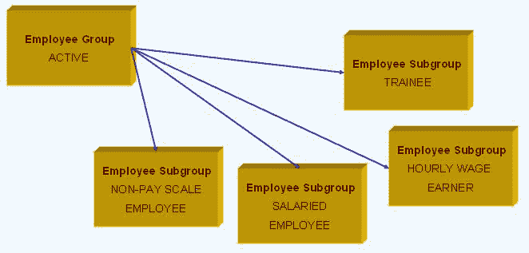
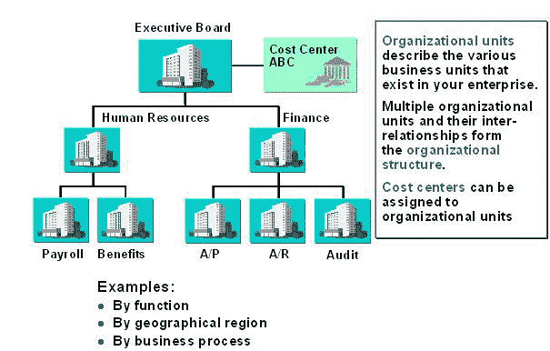
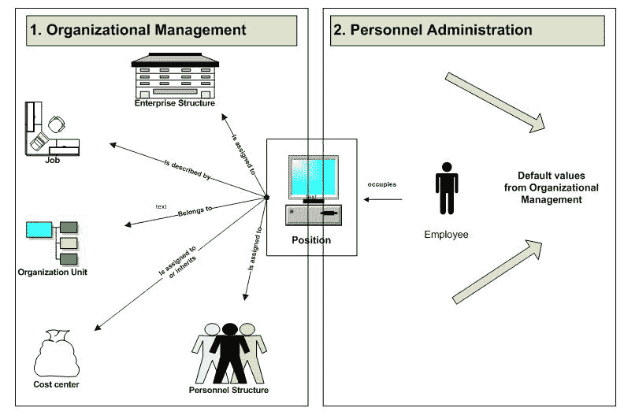

# SAP 中的组织，企业，人员结构

> 原文： [https://www.guru99.com/structures-in-sap.html](https://www.guru99.com/structures-in-sap.html)

**Why do we need structures?**Structures are required to represent statutory, regional and organizational conditions in an organization.Allocation of employees to the structures is the first step for entering personal data.Allocation to structures also help to find out the following:o Where does the employee work?o Which position does the employee hold?o How many hours in a period does the employee work?o Which public holidays does an employee get?o How is the employee paid?There are **3 types of structures in SAP**

1.  企业架构
2.  人员结构
3.  组织架构

 对于员工，有关这三个结构的信息存储在 IT0001 中

 。

## **企业结构**

以下是一个示例企业结构-

 企业结构有 4 个主要组成部分

1.  客户
2.  公司代码
3.  人事区
4.  人事分区

Lets look into them in detail**CLIENT**

*   它是系统的独立法律和组织单位。 客户通常是整个公司集团（例如 GE）。
*   可以由 3 个字符的字母数字代码（例如 058，AZZ）标识
*   客户端之间无法进行数据交换（仅在特殊情况下）
*   从一个客户更改为另一个客户的员工必须分配一个新的人员编号
*   客户端 000 由 SAP 交付，不应更改。
*   您的 SAP 系统既包含与客户端无关的信息（例如程序，事务，报表），也包含与客户端相关的元素（hr 主数据，om 主数据）。

**COMPANY CODE**

*   公司代码是一家独立的公司，拥有自己的[会计](/accounting.html)单位； 制定自己的资产负债表的公司（例如 GE Chemicals，GE Electric）。
*   由 4 个字符的字母数字代码标识（例如 0001，AB01）

**PERSONNEL AREA**

*   它代表公司代码的一个子类别（例如，澳大利亚的 GE 化学公司，英国的 GE 化学公司）
*   由 4 个字符的字母数字代码标识（例如 0001，AB01）
*   您必须为公司代码分配唯一的人员区域
*   人员区域用作评估的**选择标准，并用于授权检查**

**PERSONNEL SUBAREA**

*   它代表人员区域的一个子区域（例如，GE Chemicals UK，有效的人员子区域可以是 GE Chemicals London 和 GE Chemicals Brussels）。
*   由 4 个字符的字母数字代码标识（例如 0002，ABCD）
*   **PSA 设置的一些重要指标包括以下**的分组：
    1.  薪资范围和薪资类型的默认值
    2.  公众假期日历
    3.  鉴定
    4.  法人的分配
    5.  基本工资的默认值
    6.  工资类型分组
    7.  分配与税收相关的公司功能
*   公司法规（针对 HR）是在人员子区域级别定义的。 这些规定可能是法律，合同规定或公司特定规定。

## **人员结构**

*   人员结构显示整个企业中个人的位置，包括
    1.  **员工组**
    2.  **员工子组**。
*   示例：现役，退休人员，外部

**EMPLOYEE GROUP**

*   员工组用于一般性地对员工进行分类。
*   它定义了员工在公司员工队伍中的位置
*   由 1 个字符的字母数字代码（Ex 1，A）标识。
*   有效的不同雇员组的示例包括现役，退休人员，外部
*   员工小组具有以下重要的组织职能
    1.  可用于生成数据输入的默认值，例如[薪资](/sap-payroll.html)会计区域或员工的基本工资。
    2.  可以用作报告的选择标准。
    3.  可以用作授权检查的实体。

**EMPLOYEE SUB-GROUP (ESG)**

*   员工子组是员工组的细分。
*   每个 ESG 均分配有 2 个字符的字母数字标识符（$$）。
*   在职员工有效的 ESG 包括培训生，时薪工作者，带薪员工，无薪级员工
*   员工法规（针对 HR）是在“员工子组”级别定义的。
*   ESG 设定的一些重要指标包括以下各项的分组
    1.  工作时间表
    2.  鉴定
    3.  工资类型分组
    4.  集体协议条款分组
    5.  处理员工工资
    6.  分配员工特征，例如活动状态，就业状态和培训水平。
    7.  时间配额
    8.  工资区

## **组织结构**

*   它基于组织计划。
*   组织计划提供了组织管理的基础。组织使用组织计划来表示各个部门与工作组之间的关系。
*   组织计划使用称为对象的元素，例如人员（P），职位（C），职位（S），组织单位（O），成本中心（K）等。
*   存在一些接口，可以帮助人们建立组织结构

**Integration of OM and PA**

*   集成交换机-PLOGI ORGA 集成了 PA（人事管理）和 OM（组织管理）。
*   如果存在 PA 和 OM 之间的集成，则在“动作信息类型”（0000）中输入位置时，系统会为 EG，ESG 和 PA 建议存储在 OM 中的值。

