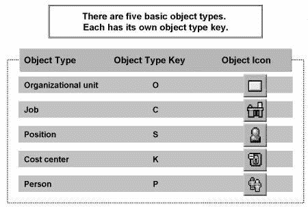
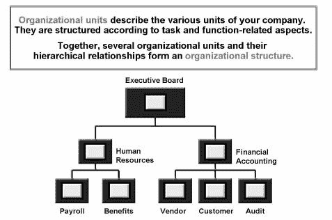
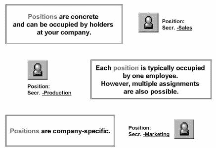
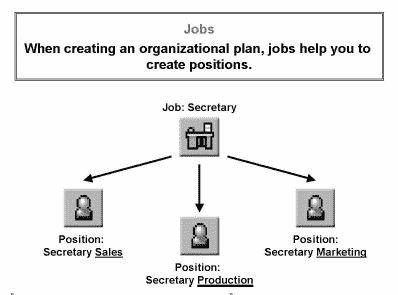
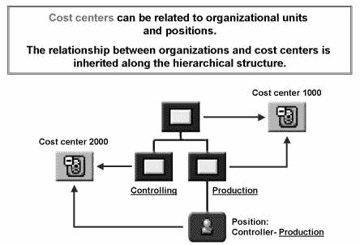
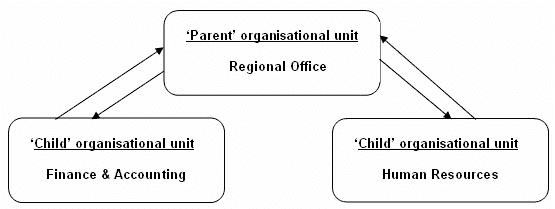
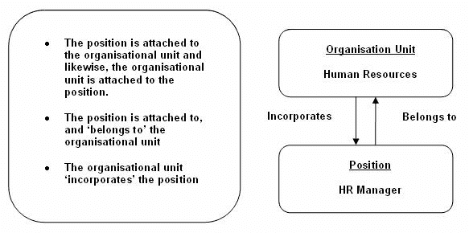
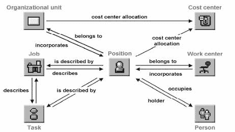
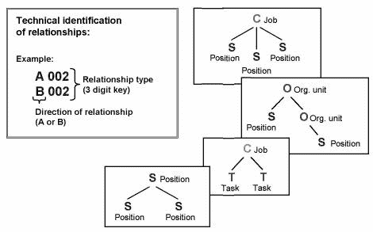

# 了解 SAP HR 中的组织管理（OM）

> 原文： [https://www.guru99.com/sap-hr-organizational-management-tutorial-part-1.html](https://www.guru99.com/sap-hr-organizational-management-tutorial-part-1.html)

在本教程中，我们将介绍 SAP HR OM 模块中的关键概念。

SAP HR 的 [OM 模块](#1)

[SAP HR 组织作为单个部门工作](#2)

## SAP HR 的  OM 模块

*   **对象类型** OM 中的实体保持为对象类型（例如组织单位，职位，职位）
*   **关系**将对象链接在一起（例如，人到位置，单位到组织单位）
*   **有效日期**验证对象的寿命
*   **信息类型**用于记录相关信息的数据输入屏幕

**对象类型**

OM 的每个方面都记录为对象类型，这是将相似数据组合在一起的一种方式。 例如，组织单位是一种对象类型，位置是另一种对象类型。
**关系**
OM 中有许多对象，而关系的创建是将数据链接在一起的方式。 在构建层次结构组织结构时，您正在创建组织单位对象之间的关系。 如果将职位附加到组织单位，则将在职位对象和组织单位对象之间创建关系。
**有效日期**

每当创建对象或对象之间的关系时，都必须输入开始日期和结束日期。 这些有效日期可确保只能在指定的使用寿命内进行数据输入。
**信息类型**

这些是用于记录 OM 信息的数据输入屏幕。 有些信息类型会在“幕后”自动更新； 其他信息类型需要您手动输入信息。
让我们详细研究不同的 **对象类型**
OM 基于对象类型和关系的使用 。 对象类型将相似的数据分组在一起。 尽管组织计划可以由许多对象类型组成，但是五种基本的构建基块对象类型及其“代码”如下：

 

*   SAP HR 系统的人事管理（PA）模块将与人有关的数据保存在主数据文件中的信息类型中。
*   组织管理（OM）模块查看组织的部门结构，并将数据保存为对象类型。 OM 对象类型是对相似数据进行分组的一种方式。 系统为每种对象类型分配一个代码。
*   这些对象分别创建和维护，然后使用关系链接在一起。

**组织单位** **** 

*   对象类型 **O** 用于组织单位。
*   组织单位是公司中执行职能的单位。
*   例如，这些单位可以是部门，小组或项目团队。
*   通过将组织单位相互关联来创建公司的组织结构。
*   组织结构是创建组织计划的基础。

**位置** **** 

*   对象类型 **S** 用于位置。
*   职位用于将任务分配到不同职位，并描述组织计划中的报告结构。
*   职位是具体的，由公司员工担任。
*   职位分配给组织单位，并且可以继承工作的特征。

**职位** **** 

*   对象类型 **C** （分类）用于 Job。
*   职位由公司内的人员担任（例如市场部秘书，人力资源经理）。 相反，工作是企业中功能的分类（例如秘书，经理），由任务和特征的分配来定义。
*   职位充当职位描述，适用于具有相似任务或特征的多个职位。 创建作业时，它们会列在作业目录中。
*   当您创建新职位时（例如市场部秘书），您可以将其与职位索引中已经存在的职位（例如秘书）相关联。 然后，该职位会自动继承工作的任务和特征。 这显着减少了数据输入时间，因为不必分别将任务和特性分配给每个位置，而是通过描述性作业继承它们。 但是请注意，也可以将特定任务和特征直接分配给职位。

作业在以下组件中也很重要：

*   人事成本计划
*   职业与继任计划
*   薪酬管理

创建作业时，它们会列在作业目录中。 作业目录是为企业维护的作业列表。

**成本中心** 

*   对象类型 **K** 用于成本中心。
*   成本中心是一个控制/财务项目，代表成本的来源。 成本中心在 OM 外部，并将在“控制”模块中创建和维护。 成本中心可以与组织单位或职位有关系。
*   成本中心分配沿组织结构继承。

**人**

*   对象类型 **P** 用于 Employee。
*   一个人通常是公司中担任职位的雇员。
*   员工的其他信息在 PA 中维护（例如地址，基本工资等）。IT0001（组织分配）包含职位分配，定义工作，组织单位和成本中心分配。

其他值得注意的对象类型是**任务**

*   对象类型 **T** 用于任务
*   任务是员工必须承担的个人职责和责任

Tasks can be clubbed under two headings

*   作为工作流程的一部分
*   作为人员管理的一部分来描述职位和职位

## SAP HR 组织如何作为一个单元工作

### 人际关系

We need to look at two types of Relationships in SAP

**1.**Relationships with same Object Types

**2.**Relationships with different Object Types

Lets look into them in detail -

### 具有相同对象类型的关系

*   组织单位相互关联以形成层次结构。
*   每个组织单位均作为单独的对象类型创建。 使用上面的示例，“区域办事处”的组织单位是对象类型，财务& [会计](/accounting.html)和人力资源的组织单位也是如此。
*   要创建相互关联的层次结构，区域办公室和财务&会计之间以及区域办公室和人力资源之间必须存在一种关系。
*   关系在两个方向上形成，因此区域办事处合并了财务&会计和财务&会计属于区域办事处。
*   在对象之间创建关系时，SAP 自动创建相应的反向关系。

### 与不同对象类型的关系

**** 

*   任何 SAP 组织单位都将附有职位。 因此，组织单位对象将被链接为位置对象类型的关系。
*   在上面详细的示例中，人力资源的组织单位对象与 HR Manager 的职位对象具有“ **并入**”关系，因此 HR Manager 的职位对象具有“ **关系” 到**'与人力资源的组织单位对象。

### 共同关系

**** 

*   通过关系链接对象。
*   您可以在组织计划中的各个元素之间创建关系。 几个链接的对象可以表示**结构**。 关系的类型不同，因为元素之间的连接类型不同

