# SAP PPOCE：如何创建组织单位

> 原文： [https://www.guru99.com/intoduction-to-organization-and-staffing-transaction.html](https://www.guru99.com/intoduction-to-organization-and-staffing-transaction.html)

在本教程中，我们将学习

[组织和人员配备交易简介](#1)

[如何创建组织单位](#2)

[如何在现有结构中创建组织单位](#3)

## 组织和人员配备交易简介

对于不具备 SAP 深入技术知识的最终用户，组织和人员事务是管理 SAP HR-OM（组织管理）的最简单方法。

这是一个可通过人力资源进行访问的用户友好事务。>组织管理>组织计划>组织和人员编制>创建，更改，显示。

SAP 交易代码

*   创建-PPOCE
*   变化-PPOME
*   显示-PPOSE

对于所有三个事务，主屏幕都分为两个区域：对象管理器&工作区。

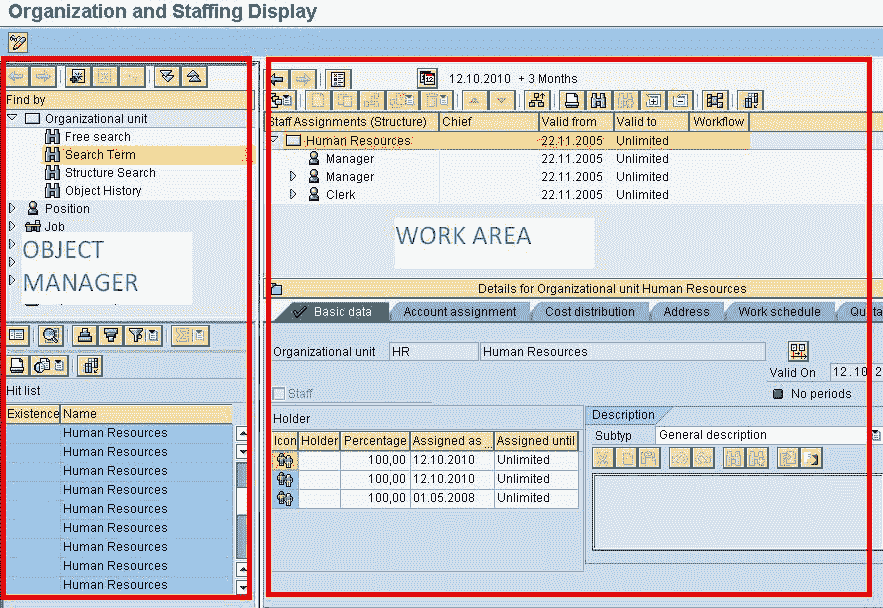

两个主要区域中的每一个都细分为窗格：

1.  **对象管理器**-包含**搜索区域和选择区域。** 对象管理器可用于许多 HR 用户界面。
2.  **工作区域**-包括**概述区域和详细区域**。

组织和人员配置界面中的四个区域使您可以浏览以获取信息并保持在同一屏幕上。 以下是屏幕的图形描述：

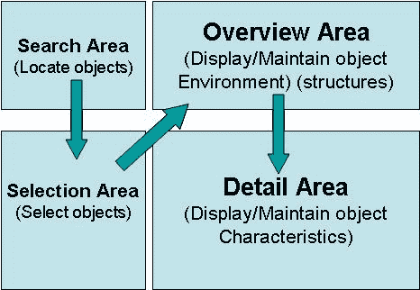 

[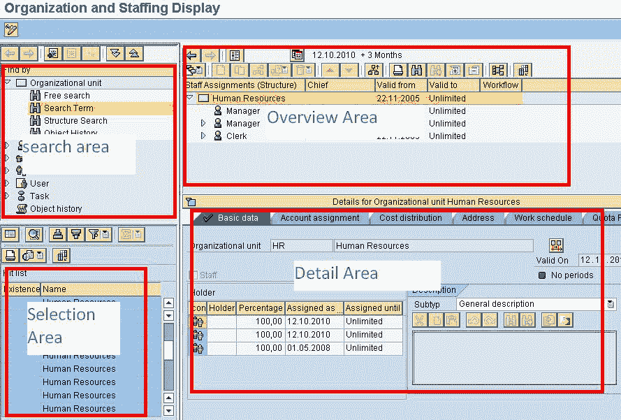](/images/sap/2010/10/sap-om-organization-and-staffing-transaction1.jpg)

*   **搜索区域**-为您提供各种搜索选项，以查找 SAP OM 对象
*   **选择区域**-搜索结果显示在选择区域中。
*   **概述区域**-在“选择区域”中选择的搜索结果将显示在“概览”区域中。 概述区域为您提供了 OM 对象层次结构的基于图标的视图。
*   **细节区域**-可以在细节区域中编辑与所选 OM​​对象相关的属性。

## 如何创建组织单位

**步骤 1）**在 SAP 命令提示符下，输入事务 **PPOCE**

[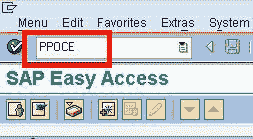](/images/sap/2010/10/sap-om-create-organizational-unit.jpg)

**步骤 2）**在下一个 SAP 屏幕中，输入组织单位的开始日期，然后单击复选标记

[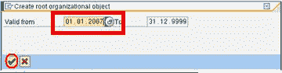](/images/sap/2010/10/sap-om-create-organizational-unit1.jpg)

**步骤 3）** **新组织单位**将同时显示在概述和详细信息屏幕区域中

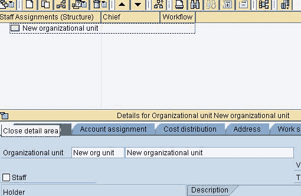

**步骤 4）**在详细信息部分中，根据业务蓝图输入详细信息。

[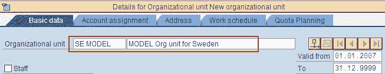](/images/sap/2010/10/sap-om-create-organizational-unit3.jpg)

**步骤 5）**单击“保存”按钮。 概述区域也会发生以下变化

Imp 注意：创建模式只能用于新的根组织单位。 要在结构中创建其他组织单位，请使用更改模式。

## 如何在现有结构中创建组织单位

**步骤 1）**在 SAP 命令提示符下，输入事务 **PPOME**

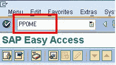

**步骤 2）**在下一个 SAP 屏幕中，单击  按钮。
**步骤 3）**在下一个 SAP 屏幕中，输入新组织单位的开始日期。

[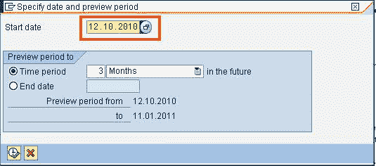](/images/sap/2010/10/sap-om-create-organizational-unit7.jpg)

**步骤 4）**接下来，搜索将要添加新组织单位的组织单位。 输入组织单位的名称，然后单击查找。

[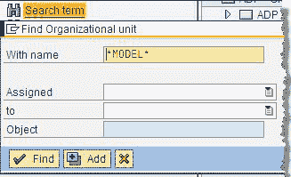](/images/sap/2010/05/sap-om-create-organizational-unit.jpg) 

**步骤 5）**在结果窗口中，双击所需的结果。

 

**步骤 6）**所选组织单位将显示在概览部分中。 选择目标组织单位，然后单击创建。

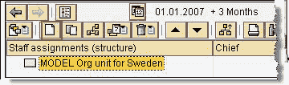 

**步骤 7）**在下一个 SAP 弹出窗口中，您可以选择现有组织单位与正在创建的组织单位之间的关系。 在这种情况下，单击**“是**的线路主管

**[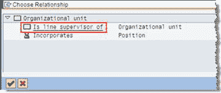 ](/images/sap/2010/05/sap-om-create-organizational-unit3.jpg)** 

**步骤 8）**在详细信息部分中，提供要创建的新组织单位的信息，然后单击保存按钮。

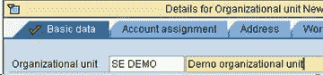 

**步骤 9）**在概述部分，您会注意到，下级组织单位（'Demo'）现在已添加到更高级别的组织单位
之下

