# 如何创建，复制&界定职位：SAP PPOME

> 原文： [https://www.guru99.com/how-to-create-a-new-position.html](https://www.guru99.com/how-to-create-a-new-position.html)

在本教程中，我们将学习

[如何创建新职位](#2)

[如何复制新职位](#1)

[如何划定位置](#3)

## 如何创建新职位

**步骤 1）**在 SAP 命令提示符下，输入事务 **PPOME**

**步骤 2）**在下一个 SAP 屏幕中，单击  按钮。

**步骤 3）**在下一个 SAP 屏幕中，输入新职位的开始日期

 

**步骤 4）**接下来，搜索将要添加新职位的组织单位。 输入组织单位的名称，然后单击查找。

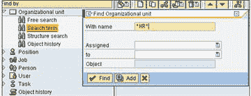

**步骤 5）**在结果窗口中，双击所需的结果。

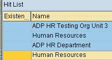

**步骤 6）**所选组织单位将显示在概览部分中。 选择目标组织单位，然后单击创建。

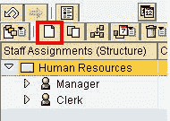

**步骤 7）**在下一个 SAP 弹出窗口中，您可以选择组织单位和职位之间的关系。 选择**“合并”**

**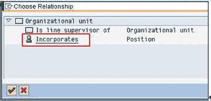** 

**步骤 8）**在详细信息部分中，提供您要创建的新职位的信息，然后单击保存按钮。

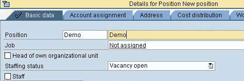

**步骤 9）**在概述部分中，您会注意到新职位已添加到组织单位下。

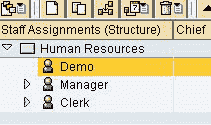

## 如何复制新职位

**步骤 1）**在 SAP 命令提示符下，输入事务 **PPOME**

**步骤 2）**在下一个 SAP 屏幕中，单击  按钮。

**步骤 3）**在下一个 SAP 屏幕中，输入新职位的开始日期

**步骤 4）**接下来，搜索将要添加新职位的组织单位。 输入组织单位的名称，然后单击查找。

**步骤 5）**在结果窗口中，双击所需的结果。

**步骤 6）**所选组织单位将显示在概览部分中。 选择您要复制的位置，然后单击复制按钮。

[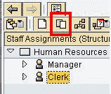 ](/images/sap/2010/10/sap-om-create-position7.jpg) 

**步骤 7）**下一个 SAP 弹出窗口**选择要对该位置进行复印的数量。** 还指定开始日期，结束日期和，说明

**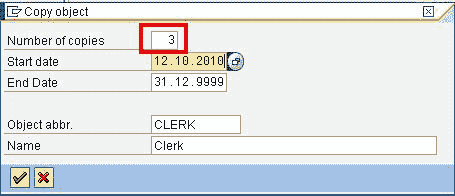** 

**步骤 8）**在概述部分中，您可以看到位置“职员”被复制了三次

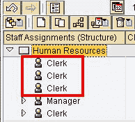

现在，如果需要，您可以在“详细信息”部分中更改头寸的详细信息。

## 如何划定位置

如果由于重组而导致该职位不再可用，则您不应从系统中删除该职位，而应继续对该职位进行定界。能够定界的前提是没有在职员工与其链接 。 在这种情况下，首先应将员工解雇或转移到另一个职位。请确保在执行此操作之前您确实不需要此职位，因为此操作很难回滚。

为了划定头寸，请执行以下操作：

**步骤 1）**在 SAP 事务中 **PPOME**

 

**步骤 2）**选择要定界的位置

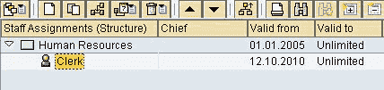 

**步骤 3）**选择按钮“定界”并选择选项“对象”

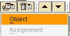 

**步骤 4）**在下一个 SAP 弹出窗口中，输入定界日期。 单击复选标记按钮。

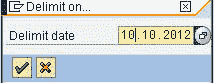 

该位置是定界的。

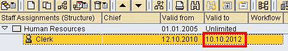