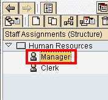
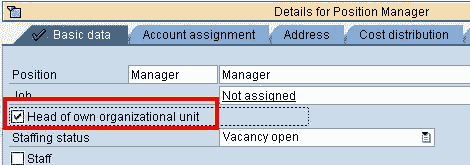
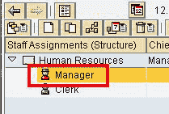

# 在 SAP 中将职位定义为组织单位负责人

> 原文： [https://www.guru99.com/identify-a-position-as-head-of-org-unit.html](https://www.guru99.com/identify-a-position-as-head-of-org-unit.html)

宣布某个职位为组织单位负责人后-

*   该职位将成为组织单位所有员工的经理
*   Manager 会自动负责时间表的批准，培训请求和任何其他 SAP 工作流程。

担任首席职务时应考虑两个重要事项：

1.  只能将职位分配给一个组织单位
2.  没有负责人的组织单位将自动继承其所属的组织单位的负责人。

**步骤 1）**在 SAP 事务中 **PPOME**

**步骤 2）**选择您想担任首席的职位

**步骤 3）**在详细信息部分的基本数据标签下，选择组织单位负责人

**步骤 4）**单击保存。 在“概述”部分中，职位图标会发生变化，表示他是组织单位的负责人。

