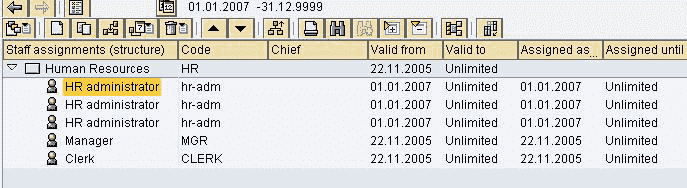
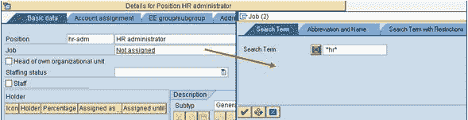
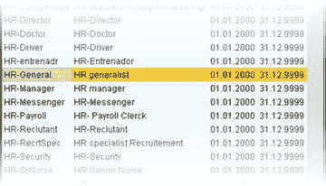
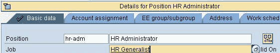
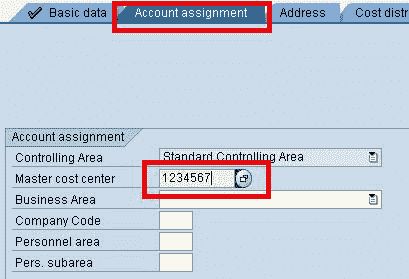

# 如何将作业&成本中心分配给 SAP 中的职位

> 原文： [https://www.guru99.com/how-to-assign-a-job-cost-center-to-a-positon.html](https://www.guru99.com/how-to-assign-a-job-cost-center-to-a-positon.html)

在本教程中，我们将学习如何为职位分配工作&成本中心

**步骤 1）**在 SAP 事务中 **PPOME**

**步骤 2）**在总览部分中，选择要分配作业的职位

 

**步骤 3）**在详细信息部分的基本数据选项卡下，选择作业搜索。 输入工作名称，然后单击对勾

 

**步骤 4）**从搜索结果中选择所需的作业。 点击保存按钮

作业被分配到位置

 

**步骤 5）**要将成本中心分配给头寸，请选择客户分配选项卡，然后输入主成本中心信息。

