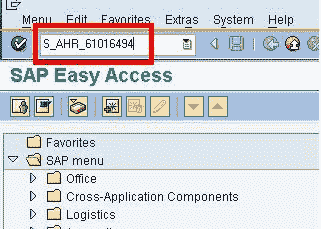
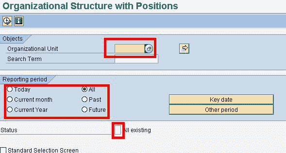
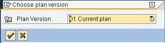
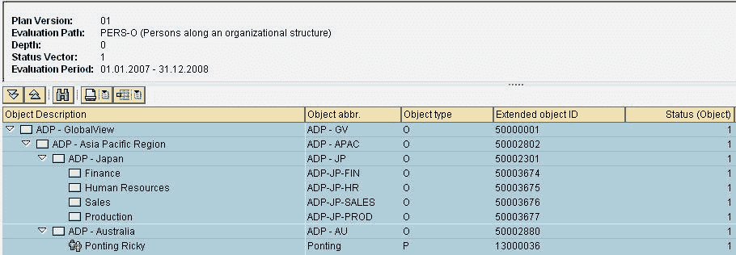

# 如何显示职位的组织结构

> 原文： [https://www.guru99.com/display-organizational-structure-with-positions.html](https://www.guru99.com/display-organizational-structure-with-positions.html)

尽管 SAP 提供了各种各样的报告来查看与 OM 相关的数据，但所有报告中最好和最简单的方法是查看带有职位的组织结构。

在 SAP 事务代码框中，输入事务 **S_AHR_61016494**

 

在下一个 SAP 屏幕中，

1.  输入组织单位。 您可以根据需要搜索组织单位
2.  选择报告期间。 如果您不想在一段时间内运行报告，请选择“关键日期”，这将在您选择的特定日期运行报告
3.  Select Status , which gives you the option to select the Plan version.

    

单击执行

报告输出如下所示-

****