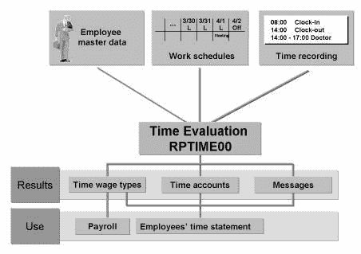
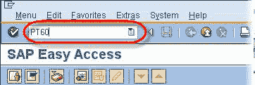
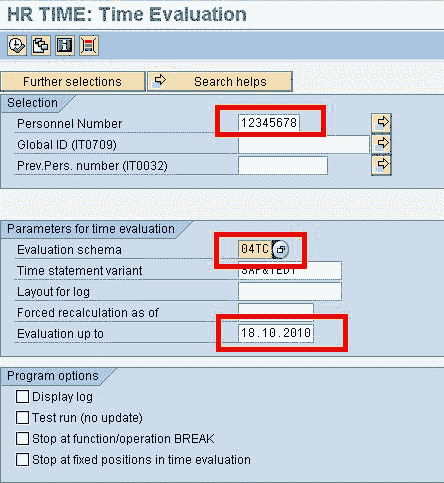
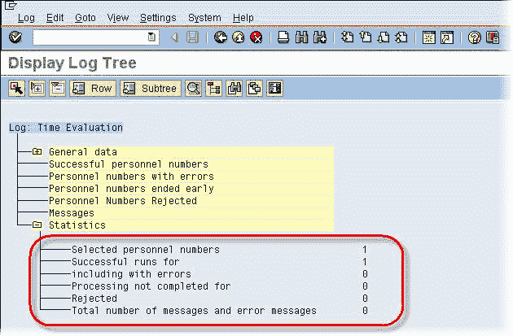

# 如何进行运行时评估：SAP PT60

> 原文： [https://www.guru99.com/how-to-run-sap-hr-time-evaluation.html](https://www.guru99.com/how-to-run-sap-hr-time-evaluation.html)

时间评估处理员工的出勤和缺勤情况，以确保他们得到相应的报酬。

*   它评估员工的实际工作时间和缺勤时间。
*   它计算与时间有关的付款。
*   它更新缺勤配额。
*   它生成时间工资类型，这些时间工资类型将传输到[薪资](/sap-payroll.html)程序。

在执行薪资计划之前，需要通过时间评估计划成功处理所有员工，但是需要为相关员工进行时间评估。 一些员工人群可能没有时间评估要求。

**步骤 1）**要运行时评估，请在 SAP 交易代码框中输入 PT60

**步骤 2）**在下一个 SAP 屏幕中

1.  输入人员编号
2.  输入评估方案
3.  输入最新评估（评估时间数据的日期）

**步骤 3）**如果需要，输入任何其他选择字段。 点击执行

**步骤 4）**应该评估时间，并且必须显示日志。

您可以使用事务 **PT66** 查看生成的时间结果