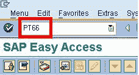
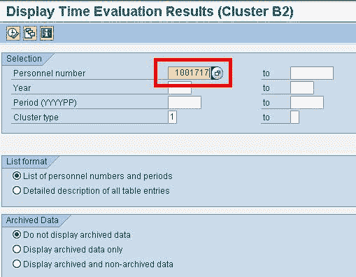
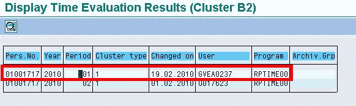
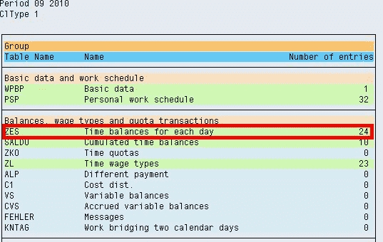
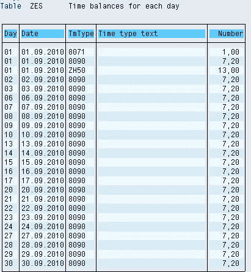

# SAP PT66：如何检查时间评估结果 RPTIME

> 原文： [https://www.guru99.com/how-to-check-time-evaluation-results.html](https://www.guru99.com/how-to-check-time-evaluation-results.html)

SAP 将通过执行 RPTIME 生成的时间评估结果存储在群集 B2 中。

**步骤 1）**要查看结果，请在 SAP 命令提示符下输入事务 **PT66**

**步骤 2）**在下一个 SAP 屏幕中，输入您想要查看其结果的人员编号

**步骤 3）**在下一个 SAP 屏幕中，双击要查看其结果的期间。

**步骤 4）**在下一个 SAP 屏幕中，双击要查看其结果的表

结果显示-

