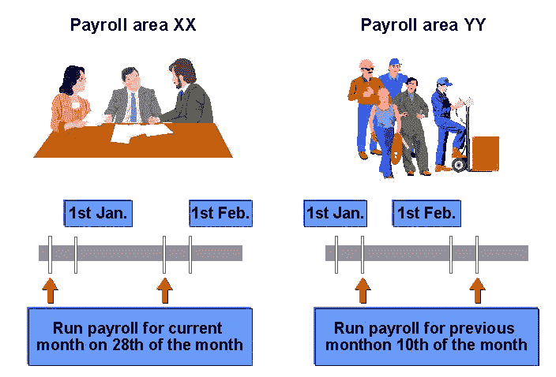

# SAP 中的工资核算流程概述

> 原文： [https://www.guru99.com/overview-of-payroll-process.html](https://www.guru99.com/overview-of-payroll-process.html)

薪资是计算组织的长期和临时雇员的薪水和工资的过程。 [薪资](/sap-payroll.html)计算会考虑员工的出勤，奖金，加班费，税法和其他信息，以生成该员工的薪水单。 工资可以每天，每周，每两周，每月运行，具体取决于组织的工资周期。

以下流程图描述了 SAP HR 工资核算流程以及每个阶段中控制记录的状态。

**已发布工资单：**

*   在此阶段，薪资控制记录设置为“薪资发放”。
*   过去和现在的 HR 主数据已针对这些特定员工锁定。 但是，SAP 系统允许将来对主数据进行过时的更改。
*   如果工资单从“退出”阶段下达，系统将滚动到下一个工资单期间，在“工资单控制记录”中将工资单区域期间编号增加 1（例如，从期间 01/2008 到 02/2008）。

**起始薪资：**

*   在薪资控制记录中定义的薪资期间，为一个薪资区域执行薪资运行。
*   如果发生错误，您将获得在工资核算期间被拒绝的员工的列表。 系统将工资核算期间被拒绝的员工存储在称为“ Matchcode W”的代码中。

**更正：**

*   在此阶段，薪资控制记录设置为“已发布以进行更正”。
*   现在已解锁这些特定员工的过去和现在的 HR 主数据，以进行更正。
*   您应该进行适当的更正以更正工资错误。
*   进行适当的更正后，您需要使用**匹配代码** **W** 来**下达薪资**和**开始薪资**，这只会选择员工 在上一次工资核算期间被拒绝的订单。
*   您可以根据需要在“更正”和“已发放工资”阶段之间进行多次循环。

**退出工资：**

*   在此阶段，薪资控制记录设置为**退出薪资**。
*   这些特定员工的过去和现在的 HR 主数据现在已在您的 SAP 系统中解锁。
*   在特定期间内，工资核算运行关闭。 您不能落后于薪水结果。

## 工资区

*   通常，组织有各种不同的员工类型，他们以不同的薪酬频率领薪。 例如，蓝领工人每周支付一次，白领员工每月支付一次，兼职员工通常每两周支付一次。
*   薪资区将员工按相同的薪资运行频率（半个月，每月等）分组。
*   在执行特定工资核算区域的工资核算时，将处理属于该工资核算的所有员工。 这样就避免了以相同频率支付薪水的员工需要单独运行薪资单

## 工资核算期间

*   员工前几个月的薪资记录始终被存储用于税收，审计和追溯目的。 假设当前月份为 2010 年 10 月，并且您要参考 2010 年 1 月当月薪资雇员的薪水结果。 查找该数据肯定很容易。 但是，如果将员工配置为每 9 天支付一次，而您想知道他当前财政年度的第 16 张工资单，该怎么办？ 您如何搜索这些数据？ 是不方便吗？ 好，输入工资核算期间。
*   工资核算期间代表定期工资核算的期间。
*   它由期间编号和工资核算年份标识。

*   工资核算期间包括“开始日期”，“结束日期”。 在上面的示例中，工资核算区域 xx 的期间 01 的开始日期为 01/01，结束日期为 01/31
*   对于每个工资核算区域，都会生成当前和未来年份的工资核算期间。
*   在生成工资核算期间时，期间号取决于期间参数（半月，月度等）和会计年度的开始。 例如，对于财务年度为 4 月开始的国家，工资核算期“ 01 2010”表示 2010 年 4 月的工资核算期。

## 发薪日：

*   薪金贷记到员工银行帐户的日期。
*   工资日因组织而异。 一些公司按当月的最后一种工作方式支付薪资。有些公司在当月的 10 号支付上个月的薪水。

