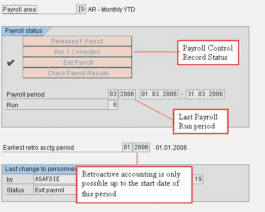
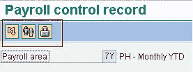

# SAP PA03：薪资控制记录教程

> 原文： [https://www.guru99.com/all-about-payroll-control-record.html](https://www.guru99.com/all-about-payroll-control-record.html)

[薪资](/sap-payroll.html)控制记录定义了当前薪资周期和过去的薪资，以进行追溯核算。

*   它将锁定 SAP-HR 主数据以防止在工资核算期间发生更改，这适用于过去的工资核算和当前的工资核算。 影响未来的变化仍然是可能的。
*   它定义了最早的追溯[会计](/accounting.html)期间。

**薪资控制记录屏幕分为 4 个部分：**

*   **薪资范围：**此部分指示薪资控制记录适用的薪资范围。 对于每个工资核算区域，一次只能存在一个工资核算控制记录。
*   **工资核算状态：**此部分以绿色勾号指示当前正在运行工资核算的阶段。它还定义了具有确切日期的当前工资核算期间，并指示已运行工资核算的次数。
*   **最早的追溯期：**此部分指示追溯会计的最早的薪酬期。
*   **人事控制记录的最后更改：**强>此部分指示谁触发了薪资控制记录的更改，更改的时间和发生的原因。

**在“薪资控制记录”屏幕中，您可以使用以下按钮：**

*   **错误。 否：**单击此按钮以获取在上一次工资核算期间被拒绝的 SAP HR 中的雇员列表。
*   **列出人员编号：**单击此按钮以获取薪资区域中包括的员工列表。
*   **锁定的人。 否：**单击此按钮以获取 SAP HR 中的员工列表，该员工列表已锁定信息类型 0003（工资状态）中的工资，从而停止了为其执行工资运行的功能。

