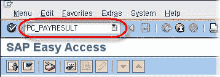
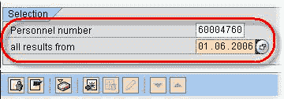
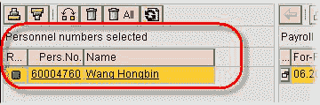
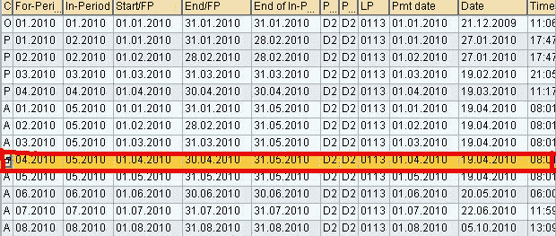
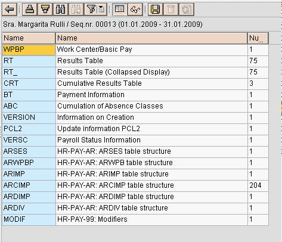
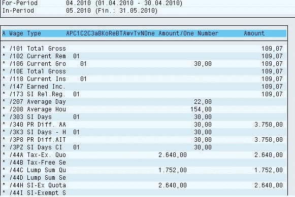

# 如何在 SAP 中使用 PC_PAYRESULT 检查工资结果

> 原文： [https://www.guru99.com/how-to-check-payroll-results.html](https://www.guru99.com/how-to-check-payroll-results.html)

在执行[薪资](/sap-payroll.html)运行时，您需要检查薪资结果以确保正确地向员工付款。 在执行“开始薪资”之后，并且一定要在 SAP 系统中执行银行转帐之前，应该随时执行此操作。

可以使用事务 **PC_PAYRESULT 和**来显示 SAP 中所有与薪资相关的表。

**PC_PAYRESULT** 的主要特征：-

*   它包括**客户工资类型**和**技术工资类型**。
*   执行“开始薪资”后，将为选定的员工创建薪资结果。
*   在模拟过程中不会创建薪资结果。
*   您一次只能显示一个特定雇员的薪水结果。

**步骤 1）**在 SAP 事务代码框中键入 **PC_PAYRESULT** 。

**步骤 2）**选择**，
下的**

*   输入您要查看工资结果的员工的**人员编号**。
*   输入您希望查看**的**日期**，来自**的所有结果

**步骤 3）**按下 Enter 键

**** 

**步骤 4）**在**人员编号中选择**部分

*   **在要查看其工资核算结果的**人员编号**上单击**

现在，在**工资核算结果概述**部分中，您可以查看为此雇员执行的所有工资核算运行，包括由追溯[会计](/accounting.html)和非周期工资核算处理引起的任何工资核算运行。

**步骤 5）**双击要查看其表的**薪资结果**行项目

**步骤 6）**双击要查看的工资核算程序表（即 RT，RT_，CRT，BT 等）。

**步骤 7）**现在将显示该特定工资核算运行的选定工资核算程序表。

