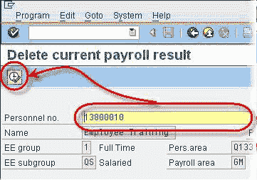
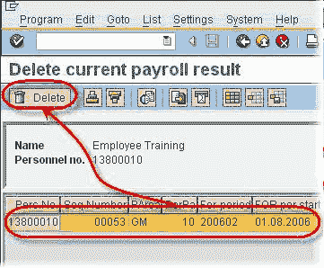

# 如何在 SAP 中删除工资核算结果：PU01

> 原文： [https://www.guru99.com/how-to-delete-payroll-results.html](https://www.guru99.com/how-to-delete-payroll-results.html)

您可能会遇到需要删除[薪资](/sap-payroll.html)结果的情况。 例如，您不小心用完了员工的周期付款。 如果工资单尚未过账到总帐科目，则以下过程将从 SAP 系统中删除该雇员的最新工资单结果。

**步骤 1）**在 SAP 命令提示符下，输入事务 **PU01**

**步骤 2）**输入员工人员编号。 单击执行。

**步骤 3）**突出显示薪资结果。 单击执行。

**步骤 4）**您将收到一条确认消息，表明最近的工资核算结果已成功删除。

您也可以使用 PROGRAM- **RPUDEL20** 同时删除许多员工的多个薪资结果。