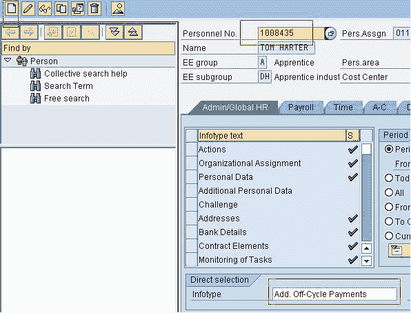
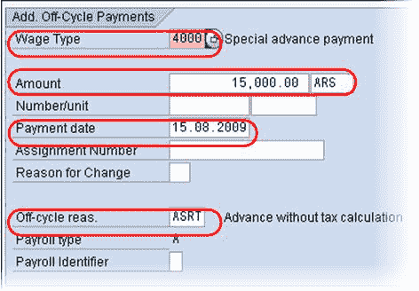
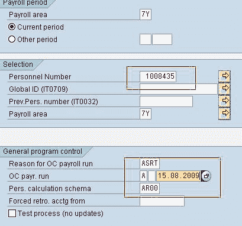
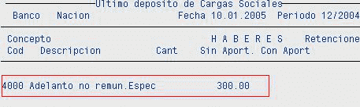

# 什么是非周期工资？ SAP IT267

> 原文： [https://www.guru99.com/what-is-off-cycle-payroll.html](https://www.guru99.com/what-is-off-cycle-payroll.html)

周期外[工资](/sap-payroll.html)运行用于在常规工资运行之外进行付款，例如一次性奖金。 工资核算控制记录必须处于退出工资核算阶段，必须在常规工资核算运行的支付日期之后执行关闭周期运行。

例如，如果当前工资核算期为 2010 年 7 月 1 日至 2010 年 7 月 31 日，且付款日期为 2010 年 7 月 20 日，则可以在 2010 年 7 月 21 日至您的日期之间执行非周期工资核算运行 释放薪资控制记录以进行下一个薪资运行。

**SAP 中有 3 种主要的非周期薪资运行类型**：

*   **离线奖金支付（类型 A）**：被认为是一次性奖金支付，它也可以用于偿还雇员的费用报销。 通过信息类型 0267（附加的非周期付款）输入数据。 执行“开始薪资”时，需要根据所需的计算类型输入“薪资理由”字段。

*   **周期更正记帐（类型 B）**：被视为调整运行，用于延迟加班或未纳入常规工资核算的任何项目。 输入数据的方式与常规工资核算运行相同（即 IT2001，IT2010，IT0014，IT0015）。 执行“开始薪资”时，需要输入带有相应原因类型的“薪资理由”字段。

*   **非周期圣诞节奖金支付或 SAC（类型 S** ）：圣诞节奖金（SAC）可以通过定期付款（六月和十二月）或在常规付款之前的特殊薪资发放来支付。 系统根据付款日期和表 T511K 和 V_T7AR75 中的配置自动计算数据。

让我们考虑非周期付款类型 A-
**步骤 1）创建 IT267**
转到事务 PA30

1.  输入一个 Pernr
2.  选择信息类型 267
3.  点击创建

输入

1.  工资类型
2.  量
3.  非周期运行的付款日期-（非周期付款的天数将记入员工银行帐户）
4.  停产原因
5.  点击保存

**STEP 2）在循环薪资**
在薪资[会计](/accounting.html)程序中，输入

1.  工资区
2.  佩尔纳
3.  离职原因
4.  停产类型和日期
5.  薪资模式
6.  点击执行

检查结果

执行了非周期工资核算运行后，您还需要：

*   执行非周期银行转帐。
*   将非周期结果发布到 GL

该过程类似于 SAP 中运行的常规薪资的过程