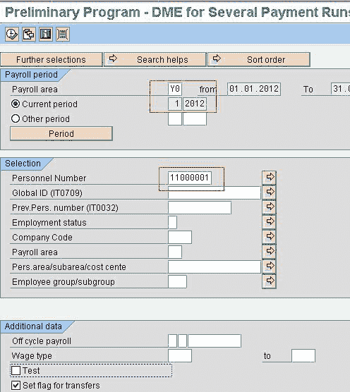
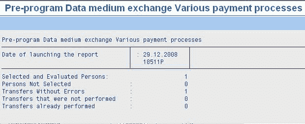
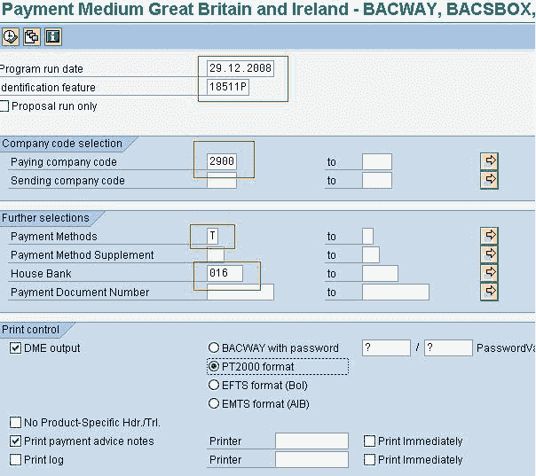
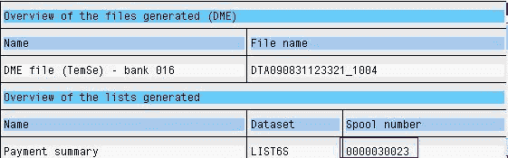
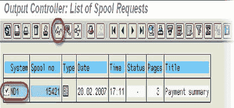
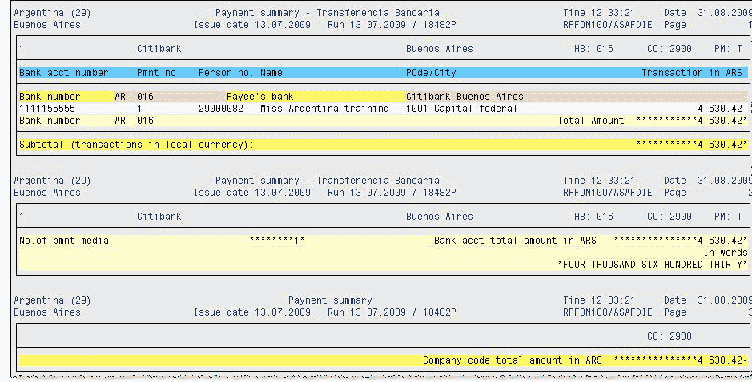
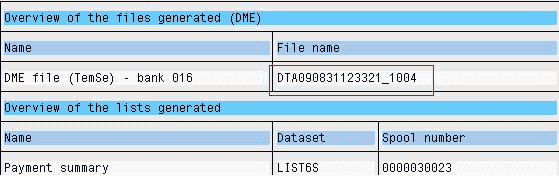
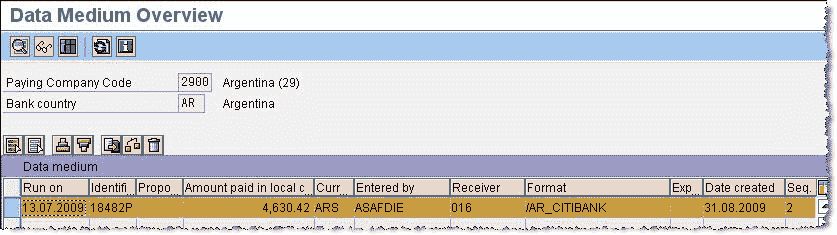

# 使用 SAP DME 文件进行银行转帐

> 原文： [https://www.guru99.com/all-about-sap-bank-transfer-dme.html](https://www.guru99.com/all-about-sap-bank-transfer-dme.html)

在执行[薪资](/sap-payroll.html)之后，SAP DME 流程会将付款金额转移到员工的银行帐户中。 要执行银行转账，您需要完成 2 个步骤

**步骤 1）**运行初步 DME 程序。

交易：PC00_M **XX** _CDTA，XX =国家/地区 Molga

概述：-

*   该程序为 DME（数据介质交换）流程准备工资核算结果

*   它使用来自 HR 主数据的信息（信息类型 0001、0002、0006、0009）和来自薪资结果的信息（薪资计划表 WPBP 和 BT）。

*   它创建一个文件，其中包含符合银行法规的数据。

*   如果值不正确，则需要更正错误并重新运行初步的 DME 程序

*   如果值正确，则将使用该文件作为创建银行转帐 txt 文件的输入。

程序输入画面

输入薪资区域&人员编号。 休息选择标准可以保留为默认值。 单击执行

输出

记下程序运行日期和识别功能

**STEP 2）**创建 DME 文件

交易：PC00_MXX_FFOT，XX = Molga

概述：

*   该程序使用由初步 DME 程序创建的成功文件。

*   它为每个付款银行生成一个付款摘要，一个 DME 随附表和一个 DME 文件（按公司代码）。

*   DME 文件可能需要上传到指定的软件中，该软件可以在您的公司和付款银行之间进行银行转帐。

程序输入画面

输入从 DME 之前的程序获得的程序运行日期和识别功能，付款公司代码，付款方式，房屋银行，帐户 ID，货币。 执行

输出：

双击阀芯编号

选择一个订单项，然后点击

查看输出

返回到“输出概述”屏幕，然后双击 TEMSE 文件。

审核输出